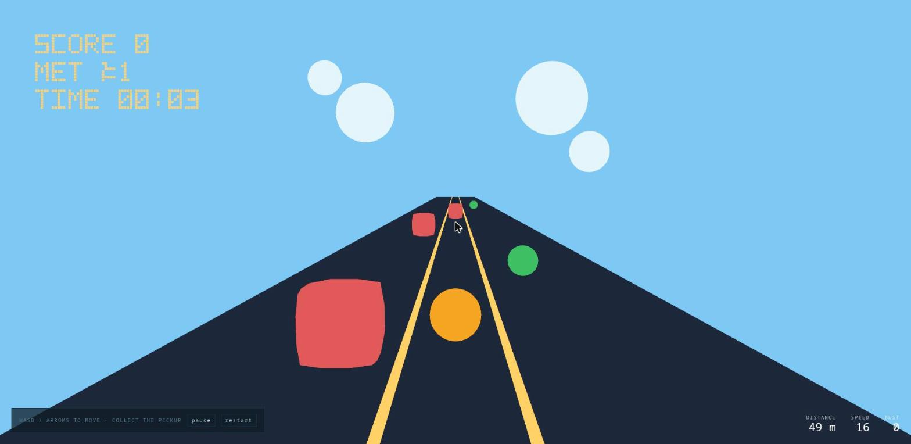

# Adopter pilot — building an endless runner in the bare sandbox, 2026-08-14

**This is not the stranger test, and it does not close [PRD-080](../PRDs/BLOCKED/requires-external-person/PRD-080-five-minute-stranger-test.md).**
The subject was an agent that has read this repository, which is the opposite of the external
person that PRD names. It is a **pilot run of the adopter protocol**: one build, in the bare
sandbox, recorded while it happened. Its value is the friction list, not a verdict.

Everything below was executed. No mobile-readiness, device, or iOS claim is made — the run was
browser-only, on this host, in the user's Chrome.

- **Sandbox:** `/home/joao/projects/threenative-sandbox` (`pnpm sandbox --bare --genre endless-runner`),
  sealed proof SHA-256 `4e985122c5fdd62a5b8d36c2acc7d1a6c7d0b49aa1583f47dbf721c5c46764db`
- **Game:** `dashline`, three lanes, jump, obstacles, collectibles, crash-restarts-without-reload
- **Repo commit the framework tarballs were packed from:** `6ec0317`
- **Not archived to `docs/benchmark/sweeps/`.** The round-4 kill switch is recorded and holds;
  this is an adopter pilot, not a benchmark arm, and filing it in the sweep corpus would put a
  non-protocol run where the protocol's readers look.




## What was measured

| Measure | Value | How |
|---|---|---|
| User source in the finished project | **1,146 LOC**, 21 files, 39,658 bytes | `pnpm sweep:measure /home/joao/projects/threenative-sandbox/dashline` |
| Of which authored in this run | **458 LOC** across 8 files, plus 3 playtest scenarios | `wc -l` on the files rewritten |
| Of which inherited and left alone | ~688 LOC — the starter's `render/` helpers and `ui/` shell | difference of the two above |
| Framework reach | **38.1%**, 14 exports used | same measurement |
| Files touching the framework vs Three.js only | 8 vs 10 | same measurement |
| First line of game code | sandbox tool call **16** | manual count of this session's calls after `pnpm sandbox` |
| Wall clock | roughly 50 minutes, including the install failures below | — |

## Gates run

| Gate | Result |
|---|---|
| `pnpm typecheck` in the scaffolded project | **green** |
| `playtests/dash.playtest.json` — ArrowLeft changes `GameState.lane` to 0 | **pass**, exit `0` |
| `playtests/jump.playtest.json` — Space drives `GameState.peak` ≥ 1.2 | **pass**, exit `0` |
| `playtests/run.playtest.json` — distance ≥ 20 and speed ≥ 16 after 180 ticks | **pass**, exit `0` |
| The 9 scenarios the scaffold shipped | **deleted or failed** — see finding 2 |
| Anything native | **not run.** No desktop or device build was attempted |

## Findings

### 1. The scaffold cannot install — two dependencies are pinned to a registry that does not have them

`./scaffold.sh dashline` fails at `pnpm install`:

```
ERR_PNPM_FETCH_404  GET https://registry.npmjs.org/@threenative%2Fstudio: Not Found - 404
```

and after removing that one, again:

```
ERR_PNPM_FETCH_404  GET https://registry.npmjs.org/create-threenative: Not Found - 404
```

Checked directly: `npm view @threenative/core version` → `0.1.0`; `npm view @threenative/studio version`
→ 404; `npm pack create-threenative@0.1.0` → 404. So `core`, `physics`, `ui` and `playtest` are
published and `studio` and `create-threenative` are not, while every template's `package.json`
lists both — `"@threenative/studio": "0.1.0"` and `"create-threenative": "0.1.0"` — as registry
specifiers. `pnpm sandbox --bare` rewrites only the four published ones to local tarballs, so the
two unpublished names fall through to npm and 404.

**Layer: engine.** It is the template's dependency set plus the sandbox packer, not anything a game
wrote. **Blast radius today is the sandbox lane only** — nothing is published, so there is no user
in the wild hitting it — but it means the harness the project uses to measure itself is broken
until someone deletes a dependency by hand, and it will become the first thing a real adopter hits
the moment `create-threenative` is published.

Workaround used during the run: delete the `@threenative/studio` devDependency and its `studio`
script, repoint `create-threenative` at the packed tarball.

**Fixed the same day.** `make-sandbox.ts` now packs `studio` alongside the other four packages,
records the `create-threenative` tarball, and passes `--studio-package` and `--cli-package`;
`assertTemplateSourcesCovered` refuses to build a sandbox whose template declares any workspace
package the sweep did not pack, naming the offenders. Proved by rebuilding the sandbox and
scaffolding to a clean install — `./scaffold.sh proof` ends at *"Created starter project"* with
`file:` specifiers for both. Both new tests were observed red with the fix reverted.

### 2. Building a different game means deleting most of the scaffold, and the type system finds it before you do

The starter scaffolds a platformer-shaped game: `Crate`, `Player`, `pick.ts`, and a 10-field
`GameState` with `coyoteJumps`, `peakRise`, `hovered`, `entityCount`. Rewriting `state.ts` for a
runner turned `src/pick.ts` into six type errors, and the 9 committed scenarios assert the
starter's gameplay — `monitoring` and `restart` failed with `TN_PLAYTEST_RESOURCE_TRANSITION_ASSERTION_FAILED`
on a `score` transition that belongs to a crate that no longer exists.

**This is the harness being right**, and it is worth saying so plainly: nothing passed vacuously.
It is still the shape of the default tax — the first act of building was deleting three source
files and nine scenarios.

### 3. The trivial-assertion guard fired, unprompted, on my first scenario

```
TN_PLAYTEST_ASSERTION_TRIVIAL: Assertion 'resource.GameState' at path 'distance' was already
satisfied before the scenario ran (value 15.98519999999999).
```

I had asserted `distance >= 5` on a game whose distance climbs on its own — an assertion that
would have reported green while proving nothing. The harness refused it and named the fix. This is
the one claim in the repository's verification story that I can say I saw work on my own mistake
rather than in a test written to demonstrate it.

### 4. Semantic assertions resolve entities by their registry id, and nothing says so where you look

`visibility` and `movement` assertions failed with `TN_PLAYTEST_VISIBILITY_FAILED` for entity
`player` until the runner was registered as `ctx.entities.add("player", runner)`. The generated
`AGENTS.md` describes the registry as the thing that disposes entities on scene exit; that it is
also the namespace a scenario's `subject` resolves against is discoverable only from the failure.
One sentence in the generated docs closes it.

### 5. The runner needs no physics, and the physics plugin is hard to remove anyway

A lane hop is a spring and a jump is one integration of gravity; a solver would add tunnelling and
a WASM dependency for nothing visible. But dropping `rapier()` from `defineGame` means changing
`Scene<GameState, IPhysicsContext>` and `ICtx<GameState, IPhysicsContext>` in every scene file,
so the unused dependency shipped. **Recorded, not fixed** — it is framework type ergonomics, and a
game working around it would be the wrong layer.

### 6. `scene.background = null` renders black, and no gate could see it

The first build was a correct endless runner on a black void: flat fills, no lights, and a null
background that reads as "unlit black" rather than "the page behind it". `typecheck`, `lint` and
every playtest passed on it. One screenshot found it in about ten seconds. **Game bug, mine**, and
the clearest possible restatement of the rule that only eyes on a frame close the visual loop.

### 7. A background browser tab is not a reliable observer, and it cost the run twenty minutes

With the window unfocused, Chrome throttled the frame loop to roughly 40% of real time — five
seconds of wall clock produced two seconds of game time. Screenshots taken between key presses
therefore showed a player that never moved, and I concluded the lane binding was broken. It was
not: `dash.playtest.json` passed on the first run and proved `lane` changes on `ArrowLeft`. **The
harness was right and the screenshots were misleading**, which is the reverse of finding 6 and
worth holding both ways: use the playtest for state, the screenshot for pixels, and neither for
the other.

## The score

Scored with [`.claude/skills/score-build-experience`](../../.claude/skills/score-build-experience/SKILL.md).
**The framework column is from this run. The vanilla column is an estimate of the same game built
in plain Three.js — it was not run, n=1, and it must not be cited as a measurement.**

**Framework: 74/100. Vanilla (estimate): 66/100.**

| Axis (weight) | Framework | Vanilla (est.) | Why |
|---|---|---|---|
| Setup → first frame (15) | 6 | 13 | Two `ERR_PNPM_FETCH_404` failures and two hand-edits before anything installed |
| Authoring the look (20) | 18 | 18 | Identical by design — camera, materials and geometry were plain Three.js |
| Gameplay plumbing (20) | 16 | 12 | `ctx.goto("play")` is the whole crash-restart; against it, an unremovable `rapier()` the runner never used |
| Proving it works (25) | 22 | 8 | 3 scenarios green at exit `0`, and `TN_PLAYTEST_ASSERTION_TRIVIAL` caught a vacuous assertion I wrote |
| Iteration speed (10) | 7 | 7 | HMR reset the run on every edit; a background tab ran at ~40% of real time on both sides |
| Cognitive load (10) | 5 | 8 | 437-line generated `AGENTS.md`, ~688 lines of wrong-genre scaffold deleted, one contract found only in a failure |
| **Total** | **74** | **66** | |

**Swing test — without the proof axis: framework 52, vanilla 58.** The framework's entire margin
in this run is the playtest harness. Everything else it supplied for a 458-line runner was
replaceable in 20–60 lines, which is the 20-line rule pointing back at the framework.

Two things the run never exercised, and the score is smaller than it looks because of them:
assets, save/load, hot-reload state preservation and any native target were all untouched, and a
~450-line game is the worst case for a framework — the fixed cost is paid and none of the scale
benefits are.

## What this pilot says about PRD-080

- The **player** experiment is unaffected by any of this: it needs a hosted web build and a
  stranger, and neither exists yet.
- The **adopting developer** experiment would have hit finding 1 in its first two minutes and
  ended there. That is worth knowing before a person is invited, and it is the concrete argument
  for fixing the template's dependency set before the adopter half of PRD-080 is scheduled.
- Nothing here substitutes for either experiment. The subject was an agent with prior knowledge of
  this repository, the session was not pre-registered, and no consent, recording, or transcript
  exists because there was no person in it.
