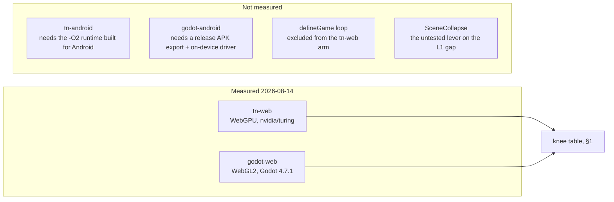

# Engine load test — ThreeNative vs Godot 4.7.1, browser arms

2026-08-14. Execution record for PRD-117. Two of the four arms in that document ran; the two
Android arms did not. Every number below came out of a run on this machine on this date, and
the raw run reports are in `artifacts/engine-load-test/`.

**Product-to-product.** Each arm is what that engine actually ships to a browser tab.
ThreeNative renders through WebGPU; Godot's web export renders through WebGL2, because Godot
4.7.1 has no WebGPU backend. Nothing below is a graphics-API comparison, and no line
generalises past the one machine that ran.

---

## 1. The result

The **knee** is the largest object count whose 95th-percentile wall-clock frame interval stays
at or below 20 ms. 1280×720, three repeats per rung, 480 samples per repeat after 120 discarded
warm-up frames.

| mode | ThreeNative | Godot 4.7.1 | who holds more |
|---|---|---|---|
| **L1** — one node per cube | **1 024** | **4 096** | Godot, by 4× |
| **L2** — one batched node | **16 384** | **4 096** | ThreeNative, by 4× |

Frame-time p95, same scene, same frame indices:

| mode | N | ThreeNative | Godot | ratio |
|---|---|---|---|---|
| L1 | 256 | 2.60 ms | 1.84 ms | 1.41× |
| L1 | 1 024 | 9.30 ms | 5.94 ms | 1.57× |
| L1 | 4 096 | 34.10 ms | 19.29 ms | 1.77× |
| L1 | 16 384 | 116.40 ms | 63.69 ms | 1.83× |
| L2 | 256 | 2.30 ms | 1.03 ms | 2.22× |
| L2 | 1 024 | 2.70 ms | 2.72 ms | 0.99× |
| L2 | 4 096 | 2.00 ms | 7.14 ms | 0.28× |
| L2 | 16 384 | 8.10 ms | 27.36 ms | 0.30× |

The PRD's ladder stops at 16 384, which is below ThreeNative's L2 knee, so an extended L2-only
ladder was run to find it:

| N | ThreeNative L2 | Godot L2 | ratio |
|---|---|---|---|
| 16 384 | 7.00 ms | 22.12 ms | 0.32× |
| 65 536 | 25.50 ms | 73.86 ms | 0.35× |
| 262 144 | 129.30 ms | 332.48 ms | 0.39× |

**What a reader can now state.** In a browser tab on this desktop, a game that gives every
cube its own node sustains 50 fps at about 1 000 cubes on ThreeNative and about 4 000 on
Godot. A game that batches sustains about 16 000 on ThreeNative and about 4 000 on Godot. The
ratio between the two engines is stable across a 16× range of object counts in both modes, so
neither number is a single-point artefact.

---

## 2. Findings

### 2.1 ThreeNative's per-object cost is the whole L1 gap, and it is not an engine bug

At 16 384, ThreeNative issued **fewer** draws than Godot (9 809 vs 10 246 — it culls slightly
more aggressively) and still cost 1.8× the frame time. Per visible draw that is ~11.9 µs
against Godot's ~6.2 µs.

Naming the layer, as the repo requires: **this is not a defect in `packages/`.** The measured
path is vanilla `three/webgpu`'s renderer, which the framework ships underneath rather than
wraps, so the per-object bookkeeping is three.js's and V8's, not ThreeNative's. Sending someone
to fix framework code would send them to code that is not wrong.

It is also not a fixed ceiling. L2 proves the GPU and the batched path are healthy — the same
scene at the same object count is 3–4× *cheaper* than Godot's once it stops being one node per
cube. So the L1 gap is per-object CPU work, which is exactly what `packages/core/src/collapse.ts`
(`SceneCollapse`) targets, and which no plain scene of meshes currently gets. The honest label
is **an unmeasured framework opportunity**, and closing it is a different PRD.

Not measured, and worth saying plainly: nobody profiled where those ~11.9 µs go. The
attribution above is inference from draw counts, not from a profile.

### 2.2 The tn-web arm does not run through `defineGame`

The arm drives `three/webgpu` directly. That measures ThreeNative's render path but excludes
the framework's own loop, scene system, and plugins. **Every ThreeNative number here is
therefore a floor, not the number a game would see** — running the same ladder through
`defineGame` can only move it up. This is the single largest gap between what this document
measures and what the PRD's adoption question asks.

### 2.3 The repo's standard WebGPU browser flags silently fall back to a software rasteriser

`WEBGPU_BROWSER_ARGS` in `packages/playtest/src/runner/browser.ts` begins with
`--ozone-platform=x11`. With that flag on this machine, `navigator.gpu.requestAdapter()`
returns **`google / swiftshader`** — CPU rendering — in both Playwright's bundled Chromium and
a system Chromium. Without it, the same browser returns `nvidia / turing`.

Had this gone unnoticed, the benchmark would have compared ThreeNative on a software
rasteriser against Godot's WebGL2 on the same, and published it. The measured tn-web arm
records `nvidia / turing` in its run report, and the scorer now refuses to compare an arm whose
adapter names a software rasteriser against one that does not.

This has a scope beyond this PRD: any existing evidence produced under those flags describes
SwiftShader, not the GPU. Whether that matters for the screenshot gates that use them (which
care about pixels, not speed) is a separate question this document does not answer.

### 2.4 three.js resets `renderer.info` on its own rAF, so a custom loop reads zero draws

`Renderer.start()` calls `this.info.reset()` on every `requestAnimationFrame` tick when
`info.autoReset` is true — which it is by default, and which happens even when no animation
loop is registered. A harness that renders, yields a frame, then reads `renderer.info` reads
zeros. The first cut of this benchmark reported `drawCalls: 0` and `triangles: 0` for every
rung, which would have disabled the draw-call half of the equivalence gate entirely while the
gate still reported pass.

Fixed by setting `renderer.info.autoReset = false` and reading the counters before yielding.
Anything else in this repo that samples `renderer.info` from its own loop has the same trap.

### 2.5 The equivalence gate had a hole that hid a diverged scene

The first cut keyed one rung per ladder step (`new Map(rungs.map(...))`), so of three repeats
only the last survived, and a `positionHash` that diverged on repeat 0 or 1 was invisible. A
hand-edited report proved it: the gate published a comparison it should have refused. Found by
running the refusal proof, not by reading the code.

Fixed by grouping every repeat and requiring the hash set to be a single value both within an
arm and across the two. There is a regression test.

### 2.6 Run-to-run variance is 10–30% on p95, and the knee is stable anyway

The tn-web ladder was run twice, ~15 minutes apart, same code, same machine:

| rung | run 1 p95 | run 2 p95 | drift |
|---|---|---|---|
| L1 @ 1 024 | 6.40 ms | 9.30 ms | +45% |
| L1 @ 4 096 | 26.20 ms | 34.10 ms | +30% |
| L1 @ 16 384 | 107.20 ms | 116.40 ms | +9% |
| L2 @ 16 384 | 5.80 ms | 8.10 ms | +40% |

**Both runs produce the same knee in both modes** (L1 1 024, L2 16 384). This is the argument
for the knee that the PRD makes, arriving as evidence rather than as a prediction: the ladder
step is coarse enough to survive noise that would swamp a p95 ratio quoted to two decimals.
Treat the individual millisecond figures in §1 as ±30%, and the knee as the finding.

The second run is the published artifact; the desktop was not otherwise idle during either.

### 2.7 The PRD contradicts itself on vsync, and this run deviates from it deliberately

The PRD pins a 60 Hz display and builds the knee around vsync-locked `requestAnimationFrame`,
then tells the Godot arm to set `Engine.max_fps = 0` and disable vsync. Both cannot hold.

Resolved by disabling vsync on **both** arms — Chromium gets `--disable-gpu-vsync
--disable-frame-rate-limit`, Godot gets `VSYNC_DISABLED` — because under vsync a frame needing
17 ms of work presents at 33 ms, and the knee would then report which side of a 16.7 ms
boundary an engine landed on rather than what it cost. `display.vsync` was added to the run
report and the gate refuses two arms that disagree on it, so the deviation cannot be applied to
one arm only.

### 2.8 Godot's `visibleObjects` and ThreeNative's are not the same quantity

Godot reports 2 objects in frame for an L2 rung of 16 384 instances; ThreeNative reports 16 384.
Each engine's counter means what that engine means by it. The gate compares draw calls and
triangles, never this field, and the PRD already files it under numbers that decide nothing.

---

## 3. Why this is a fair comparison

### 3.1 Both arms rendered the same scene, and the hashes say so

The lattice is generated by the same integer LCG written twice — TypeScript in
`examples/engine-load-test/src/workload.ts`, GDScript in `benchmark/godot-load-test/load_test.gd`
— and each arm hashes its first eight cube positions independently. Quantised to millimetres and
kept to 32 bits so neither language's float printing or integer width can drift:

| rung | ThreeNative | Godot |
|---|---|---|
| N = 256 | `94e73aef` | `94e73aef` |
| N = 1 024 | `78812d31` | `78812d31` |
| N = 4 096 | `e9a32f01` | `e9a32f01` |
| N = 16 384 | `3acfd9c3` | `3acfd9c3` |

The camera is a pure function of frame index in both arms, so frame 317 frames the same cubes
on the slow arm and the fast one.

### 3.2 Each arm named its own backend

Read from the engine at runtime, never assumed from documentation:

| arm | driver | adapter | build |
|---|---|---|---|
| `tn-web` | `three/webgpu WebGPURenderer` | `nvidia / turing` | release |
| `godot-web` | `gl_compatibility / opengl3` | `WebKit WebGL / OpenGL ES 3.0 (WebGL 2.0 (OpenGL ES 3.0 Chromium))` | release |

Both exported and ran release: the Godot arm is built with `--export-release` against release
templates, which is the trap PRD-066 measured at 5.5× on the same phone with the same source.

Caveat: Chromium masks the WebGL renderer string, so the Godot arm's adapter line cannot be
inspected for a software fallback the way the WebGPU arm's can. It was driven in the same
browser process family with the same flags as the hardware-confirmed WebGPU arm, which is
evidence but not proof.

### 3.3 The floor control

An `N = 0` rung isolates the harness from the load:

| arm | L1 @ 0 | L2 @ 0 |
|---|---|---|
| `tn-web` | 1.50 ms | 2.50 ms |
| `godot-web` | 0.91 ms | 0.71 ms |

Both floors sit far under the 20 ms line, and every 4× ladder step raises p95 in both modes on
both arms, so the ladder is reaching the renderer rather than measuring the driver loop.

### 3.4 The gate refuses, and was observed refusing

Four hand-edited reports, four refusals, exit 1 each, each naming its field:

```
TN_BENCH_NOT_EQUIVALENT: L2@256 positionHash (repeats disagree within an arm): tn-web=94e73aef,deadbeef godot-web=94e73aef
TN_BENCH_NOT_EQUIVALENT: - display.refreshHz: tn-web=120 godot-web=60
TN_BENCH_NOT_EQUIVALENT: - build.type: tn-web=debug godot-web=release
TN_BENCH_NOT_EQUIVALENT: L1@4096 drawCalls (left arm auto-batched L1): tn-web=1 godot-web=2582
```

The unedited pair exits 0 and publishes. Fourteen unit tests cover the scorer, including the
empty-series rejection, the missing-driver rejection, and the repeat-divergence hole of §2.5.

---

## 4. What did not run



**Android: UNMEASURED.** A Pixel 8 (`37251FDJH0037Z`, shiba) is attached and NDK 27 plus the
Android SDK are present, so the arms are no longer blocked — they are simply not built. The
Godot Android arm needs a release APK export and an on-device transport for the run report; the
ThreeNative Android arm needs the native runtime compiled for the device first. Until both run,
this document claims nothing about any phone, any chip, or thermal behaviour.

**iOS: not attempted.** No Apple hardware here, and a simulator frame rate is not a device
frame rate.

**Desktop native: not run.** The PRD makes it conditional on the Android arms needing
attribution, and the Android arms have not run.

Against the PRD's acceptance criteria: the browser statement exists, the refusals are pasted
above, every published number carries its driver, and `pnpm typecheck`, `pnpm lint`,
`pnpm budgets` are green with the benchmark opt-in and nothing in `pnpm test` requiring Godot.
The Android criterion reads **UNMEASURED — arms not built**, so **PRD-117 stays open.**

---

## 5. How to reproduce

```sh
pnpm bench:engines --arm tn-web        # writes artifacts/engine-load-test/tn-web.json
pnpm bench:engines --arm godot-web     # exports release, serves cross-origin-isolated, drives
pnpm bench:engines:report              # equivalence gate, then the knee table
```

Both arms need a display and a system Chromium with hardware WebGPU; `BENCH_BROWSER_BIN`
overrides which binary. `--out <name>` keeps a diagnostic run from overwriting the ladder a
published comparison is built from — a floor-control run silently clobbered the first tn-web
ladder before that flag existed. The Godot arms need `godot` on `PATH` with 4.7.1 export
templates installed; nothing in the default repo gate does.

Artifacts: `tn-web-ladder.json`, `godot-web-ladder.json`, `*-floor.json`, `*-l2ext.json`, and
the full stdout of each run in `artifacts/*.log`.
