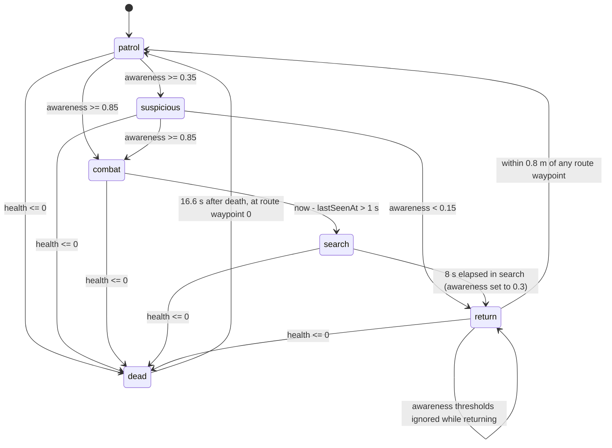

# FPS legacy requirements

Functional specification of the game at `/home/joao/projects/threejs-to-bevy/starters/fps-kit-arena-starter`,
written 2026-08-17 as an input to PRD-137. Every path in a citation is relative to that
directory unless it names the reference screenshot. Every numeric constant carries a
`file:line` citation; a value that could not be located in source is marked *not found in
source*.

---

## 1. What the game is

A single-player, single-level first-person shooter set in a bright outdoor greybox shooting
range under a cloudy sky. The player stands at a firing line at one end of a 34 m × 34 m
walled yard, facing a row of red rectangular paper targets on steel stands at varying
distances and heights, with concrete barricades, a round barrier, two dark lockers, a ramp
and an elevated walkway between them. The player holds a rifle viewmodel (gloved hands, iron
sights) and shoots with hitscan raycasts; hitting a target scores points, drops the target
below its stand and respawns it a moment later. One armed enemy soldier patrols a fixed
six-waypoint route through the range, sees and hears the player, closes to an engagement
range, strafes and fires three-round bursts back, takes localised damage, ragdolls when
killed and respawns. The run is a 60-second timer with a goal of 12 scoring hits; running out
of time or health ends the run, and `Enter` restarts it.

---

## 2. Player

### 2.1 Movement

| Property | Value | Citation |
| --- | --- | --- |
| Walk speed | 5.6 m/s | `src/scripts/fps.ts:444` |
| Sprint speed | 8.2 m/s | `src/scripts/fps.ts:444` |
| Aimed speed | 3.1 m/s | `src/scripts/fps.ts:74` |
| Speed while aim is partially blended | `lerp(sprint?8.2:5.6, 3.1, aimBlend)` | `src/scripts/fps.ts:444` |
| Sprint requires aim fully released | `aimBlend <= 0.001` | `src/scripts/fps.ts:439` |
| Declared controller speed | 5.6 | `content/scenes/arena.scene.json:1570` |
| Declared controller max speed | 5.6 | `content/environment/sky.outdoor-cloudy.environment.json:21` |
| Slope limit | 30° | `content/scenes/arena.scene.json:1569` |
| Step offset | 0.32 m | `content/scenes/arena.scene.json:1571` |
| Grounding | raycast | `content/scenes/arena.scene.json:1566` |
| Blocking (collides with world) | true | `content/scenes/arena.scene.json:1565` |
| Per-frame delta clamp | `min(1/30, max(0, delta))` | `src/scripts/fps.ts:375` |

Movement is direct velocity: the stick/keys give a 2-vector, it is normalised only when its
length exceeds 1 (`src/scripts/fps.ts:429-431`), rotated by camera yaw
(`src/scripts/fps.ts:432-437`), and handed to the character controller at the speed above.
There is **no acceleration, no ground friction, and no air control** in the script; the
`acceleration: 36` declared at `content/environment/sky.outdoor-cloudy.environment.json:9` is
never read by any script in `src/scripts/`. There is no jump, no crouch and no explicit
gravity constant — vertical placement is entirely the controller's raycast grounding.

### 2.2 Camera

| Property | Value | Citation |
| --- | --- | --- |
| Hip-fire vertical FOV | 70° | `src/scripts/fps.ts:70`, `content/scenes/arena.scene.json:1629` |
| Aimed vertical FOV | 22° | `src/scripts/fps.ts:70` |
| Near plane | 0.03 | `content/scenes/arena.scene.json:1631` |
| Far plane | 100 | `content/scenes/arena.scene.json:1628` |
| Projection | perspective | `content/scenes/arena.scene.json:1630` |
| Eye height above player origin | 1.66 m | `src/scripts/fps.ts:453`, `content/scenes/arena.scene.json:1623` |
| Look sensitivity (hip) | 0.0024 rad per pointer delta unit | `src/scripts/fps.ts:421`, `content/environment/sky.outdoor-cloudy.environment.json:24` |
| Aimed look multiplier | 0.5 | `src/scripts/fps.ts:72` |
| Pitch clamp | −1.15 rad to +1.25 rad | `src/scripts/fps.ts:423-426`, `content/environment/sky.outdoor-cloudy.environment.json:22` |
| Yaw | unbounded, `yaw -= LookX * sensitivity` | `src/scripts/fps.ts:422` |
| Pointer lock | required | `content/environment/sky.outdoor-cloudy.environment.json:23` |

Pitch clamp in degrees: −1.15 rad = −65.89°, +1.25 rad = +71.62° (computed from
`src/scripts/fps.ts:423-426`).

### 2.3 Collision shape

Capsule, `height` 1.72 m, `radius` 0.32 m, centre offset `[0, 0.86, 0]`, layer `player`,
mask `["world"]` (`content/scenes/arena.scene.json:1573-1586`). Rigid body is `kinematic`
(`content/scenes/arena.scene.json:1589`). The environment document repeats the height as 1.72
(`content/environment/sky.outdoor-cloudy.environment.json:11`).

### 2.4 Spawn

Player entity spawns at `[0, 0.02, 13]` with no authored rotation
(`content/scenes/arena.scene.json:1610-1615`); the script's fallback position when the entity
is missing is the same `[0, 0.02, 13]` (`src/scripts/fps.ts:447`). The camera entity spawns
at `[0, 1.68, 13]` with rotation `[0, 0, 0]`
(`content/scenes/arena.scene.json:1636-1645`); 0.02 + 1.66 = 1.68. Controller yaw and pitch
both start at 0 (`src/scripts/fps.ts:384-385`), so the player faces −Z, down the range toward
the targets and the backstop.

### 2.5 Health

| Property | Value | Citation |
| --- | --- | --- |
| Starting health | 100 | `src/scripts/fps.ts:354`, `content/scenes/arena.scene.json:1756` |
| Damage per enemy round | 9 | `src/scripts/enemy.ts:69`, `content/prefabs/enemy.prefab.json:40` |
| Health floor | 0 | `src/scripts/fps.ts:583` |
| Death threshold | health reaches exactly 0 → phase `failed` | `src/scripts/fps.ts:590` |

There is no armour, no shield, no regeneration and no healing pickup. Health is restored only
by the retry reset (`src/scripts/fps.ts:524`). One full enemy burst of 3 rounds
(`src/scripts/enemy.ts:65`) × 9 damage (`src/scripts/enemy.ts:69`) = 27, which is why the
legacy playtest asserts health 73 after one burst
(`playtests/enemy-search-and-return.playtest.json:152`).

Damage direction is classified into one of four labels — `DAMAGE FRONT`, `DAMAGE BEHIND`,
`DAMAGE <`, `DAMAGE >` — by projecting the incoming direction into camera-yaw space
(`src/scripts/fps.ts:146-156`), and it is displayed for 0.6 s after the last hit
(`src/scripts/fps.ts:688`).

---

## 3. Weapon

One weapon, always equipped, no switching, no secondary.

### 3.1 Fire and ammunition

| Property | Value | Citation |
| --- | --- | --- |
| Fire mode | one round per press edge (`input.pressed("fire")`) | `src/scripts/fps.ts:468` |
| Rate of fire | not limited by any cooldown in source — *no rate-of-fire constant found in source* | `src/scripts/fps.ts:611-682` |
| Magazine size | 30 | `src/scripts/fps.ts:347` |
| Reserve ammunition | 90 | `src/scripts/fps.ts:366`, `content/scenes/arena.scene.json:1762` |
| Base damage per round | 10 | `src/scripts/fps.ts:130` |
| Headshot multiplier | 4× (normalised hit height ≥ 0.88) | `src/scripts/fps.ts:137` |
| Torso multiplier | 1× (normalised hit height ≥ 0.35) | `src/scripts/fps.ts:138` |
| Limb multiplier | 0.7× (below 0.35) | `src/scripts/fps.ts:139` |
| Reference body height for the multiplier | 1.8 m | `src/scripts/fps.ts:129` |
| Damage falloff with distance | none — *not found in source* | `src/scripts/fps.ts:654` |
| Maximum hitscan range | 60 m | `src/scripts/fps.ts:628` |
| Raycast layer mask | `["target", "world"]`, ignoring `player` | `src/scripts/fps.ts:626-627` |
| Gunshot noise radius broadcast to enemies | 26 m | `src/scripts/fps.ts:133` |

Hit-height bands in metres, computed from `src/scripts/fps.ts:135-140` with the 1.8 m
reference at `src/scripts/fps.ts:129`: head band ≥ 0.88 × 1.8 = 1.584 m above the enemy
origin; torso band ≥ 0.35 × 1.8 = 0.63 m; anything lower is a limb.

Rounds to kill an enemy of 36 health (`src/scripts/enemy.ts:78`): 1 headshot
(10 × 4 = 40 ≥ 36), 4 torso rounds (10 × 4 = 40 ≥ 36), 6 limb rounds
(0.7 × 10 × 5 = 35 < 36 ≤ 0.7 × 10 × 6 = 42).

### 3.2 Reload

Pressing reload transfers `min(magazineSize − ammo, reserve)` from the reserve into the
magazine **on the same frame**, with no lockout on firing
(`src/scripts/fps.ts:603-609`). The status line becomes `RELOADED`, `OUT OF AMMO` or
`MAGAZINE FULL` (`src/scripts/fps.ts:608`). Two separate cosmetic timers exist:

| Timer | Value | Citation |
| --- | --- | --- |
| Reload pose / aim lockout window | 0.7 s | `src/scripts/fps.ts:471`, `src/scripts/fps.ts:477` |
| Reload viewmodel clip hold | 1.65 s | `src/scripts/fps.ts:11` |

Aim is suppressed while `now < reloadUntil` (`src/scripts/fps.ts:413-414`), so holding aim
through a reload drops the sights for 0.7 s.

### 3.3 Spread and recoil

The player's shot is a raycast along the exact camera forward axis
(`src/scripts/fps.ts:623`). There is **no spread cone, no bloom and no recoil kick applied to
the camera** — *not found in source*. Recoil is viewmodel-only: a `recoil` scalar is set to 1
on fire and decays at 8 per second (`src/scripts/fps.ts:470`, `src/scripts/fps.ts:472`),
pushing the weapon back along local Z by `recoil × 0.08` m
(`src/scripts/fps.ts:490`) and pitching it by `recoil × 0.09` rad
(`src/scripts/fps.ts:500`).

### 3.4 Aim down sights

Aim is **held, not toggled** (`src/scripts/fps.ts:414`). Everything below is driven by one
blend value `aimBlend`, a smoothstep of a linear 0→1 ramp
(`src/scripts/fps.ts:416-420`).

| Property | Hip | Sights | Citation |
| --- | --- | --- | --- |
| Vertical FOV | 70° | 22° | `src/scripts/fps.ts:70` |
| Move speed | 5.6 / 8.2 m/s | 3.1 m/s | `src/scripts/fps.ts:444`, `src/scripts/fps.ts:74` |
| Look sensitivity multiplier | 1.0 | 0.5 | `src/scripts/fps.ts:72`, `src/scripts/fps.ts:421` |
| Viewmodel rest position (camera space) | `[0.16, −0.32, −0.1]` | `[−0.05272, −0.23145, −0.3]` | `src/scripts/fps.ts:87` |
| Muzzle origin (camera space) | `[0.145, −0.245, −1.2]` | `[0, −0.062, −1.2]` | `src/scripts/fps.ts:76` |
| Weapon bob scale | 1.0 | 0.28 | `src/scripts/fps.ts:483` |
| Weapon cant | full (`cant = 1 − aimBlend`) | none | `src/scripts/fps.ts:496-503` |
| Sprint | allowed | disabled | `src/scripts/fps.ts:439` |

Transition time hip↔sights is 0.14 s (`src/scripts/fps.ts:77`). The zoom ratio 70 / 22 = 3.18×
is described in the source comment as "~3.2x" (`src/scripts/fps.ts:69`). The camera FOV is
only patched when it actually changes by more than 0.001 (`src/scripts/fps.ts:460`).

### 3.5 Shot feedback

Six pooled effect entities, all parked at `[0, −50, 0]` and hidden when idle
(`src/scripts/fps.ts:106`, `content/scenes/arena.scene.json:1460-1561`):
`fx.muzzle.flash`, `fx.muzzle.smoke`, `fx.tracer`, `fx.impact`, `fx.enemy.flash`,
`fx.enemy.tracer` (`src/scripts/fps.ts:119-126`).

| Effect | Geometry | Material | Lifetime | Citation |
| --- | --- | --- | --- | --- |
| Muzzle flash | cone, radius 0.08, height 0.28 | `#ffd489` base, emissive `#ffab33` at intensity 9 | 0.055 s | `content/meshes/arena.meshes.json:33`, `content/materials/arena.materials.json:85-91`, `src/scripts/fps.ts:103` |
| Tracer | box `0.018 × 0.018 × 1`, scaled to the shot length on Z | `#ffe7b0` base, emissive `#ffc24d` at intensity 6 | 0.075 s | `content/meshes/arena.meshes.json:34`, `content/materials/arena.materials.json:92-99`, `src/scripts/fps.ts:103` |
| Impact spark | sphere radius 0.055, pushed 0.04 m back along the shot | `#ffcf95` base, emissive `#ff8a2b` at intensity 7 | 0.16 s | `content/meshes/arena.meshes.json:35`, `content/materials/arena.materials.json:100-107`, `src/scripts/fps.ts:261-263`, `src/scripts/fps.ts:103` |
| Muzzle smoke | sphere radius 0.09, spawned 0.24 m ahead of the muzzle, scale 0.35 → 1.50, opacity 0.24 → 0 | `#c2c6cb`, blend, opacity 0.24 | 0.32 s | `content/meshes/arena.meshes.json:36`, `src/scripts/fps.ts:274`, `src/scripts/fps.ts:276`, `src/scripts/fps.ts:326-327`, `content/materials/arena.materials.json:108-115` |

Smoke scale expression: `0.35 + life × 1.15` on all three axes, so it ends at
0.35 + 1.15 = 1.50 (`src/scripts/fps.ts:326`); opacity is `0.24 × (1 − life)`
(`src/scripts/fps.ts:327`).

The tracer runs from the muzzle to the raycast hit point, or 60 m along the shot if nothing
was hit (`src/scripts/fps.ts:238-242`). Enemy fire uses its own flash and tracer entities so
neither side's timer cancels the other's beam (`src/scripts/fps.ts:184-210`); only the newest
incoming round is drawn (`src/scripts/fps.ts:396-405`).

A hit marker `X` is shown for 0.15 s after a confirmed enemy hit
(`src/scripts/fps.ts:687`, `src/scripts/fps.ts:667`).

### 3.6 Viewmodel

`assets/models/player-viewmodel.glb`, rendered from the entity `viewmodel.player`
(`content/scenes/arena.scene.json:1668-1694`). It is parented procedurally: each frame the
script computes a camera-space offset, rotates it by the camera rotation and writes an
absolute world pose (`src/scripts/fps.ts:492-512`). The GLB is authored with the barrel along
+Z, so a half-turn yaw of π is applied (`src/scripts/fps.ts:481`).

Procedural motion:

| Motion | Expression | Citation |
| --- | --- | --- |
| Bob frequency | `elapsed × 8` walking, `elapsed × 13` sprinting | `src/scripts/fps.ts:474` |
| Bob amplitude X | `sin(bobPhase) × 0.012 × moving × bobScale` | `src/scripts/fps.ts:486` |
| Bob amplitude Y | `abs(cos(bobPhase)) × 0.012 × moving × bobScale` | `src/scripts/fps.ts:488` |
| Reload dip | `−sin(reloadProgress × π) × 0.05` on Y | `src/scripts/fps.ts:489` |
| Reload roll | `−sin(reloadProgress × π) × 0.08` rad | `src/scripts/fps.ts:502` |
| Hip cant | pitch −0.04, yaw +0.03, roll −0.02 rad, all × `cant` | `src/scripts/fps.ts:500-502` |

Clip table (`src/scripts/fps.ts:8-14`), resolved against the asset's clip declarations
(`content/assets/player-viewmodel.assets.json:12-43`):

| Clip id | Source clip | Loop | Hold | Playback speed | Citation |
| --- | --- | --- | --- | --- | --- |
| `idle` | `Idle` | yes | 0 | 1 | `src/scripts/fps.ts:10`, `content/assets/player-viewmodel.assets.json:13-18` |
| `walk` | `Walk` | yes | 0 | 1 | `src/scripts/fps.ts:13`, `content/assets/player-viewmodel.assets.json:19-24` |
| `run` | `Run` | yes | 0 | 1.1 | `src/scripts/fps.ts:12`, `content/assets/player-viewmodel.assets.json:25-30` |
| `fire` | `Shoot` | no | 0.15 s | 1 | `src/scripts/fps.ts:9`, `content/assets/player-viewmodel.assets.json:31-36` |
| `reload` | `Reload` | no | 1.65 s | 1 | `src/scripts/fps.ts:11`, `content/assets/player-viewmodel.assets.json:37-42` |

Selection order: reload press > fire press > an unexpired one-shot > idle when
`moving <= 0.05` > run when sprinting > walk (`src/scripts/fps.ts:31-37`). Loop-to-loop
blends take 0.12 s; one-shots snap with 0 blend and restart on every press
(`src/scripts/fps.ts:50-58`).

---

## 4. Enemy state machine

Six states: `patrol`, `suspicious`, `combat`, `search`, `return`, `dead`
(`src/scripts/enemy.ts:5`). Exactly one enemy instance exists,
`enemy.terrorist.01` (`content/scenes/arena.scene.json:1725-1745`).

### 4.1 Diagram

### 4.2 Transitions

| From | To | Trigger | Citation |
| --- | --- | --- | --- |
| any live state | `combat` | `awareness >= 0.85` | `src/scripts/enemy-behaviour.ts:50` |
| `patrol` / `suspicious` | `suspicious` | `awareness >= 0.35` | `src/scripts/enemy-behaviour.ts:52` |
| `suspicious` | `return` | `awareness < 0.15` | `src/scripts/enemy-behaviour.ts:54` |
| `combat` | `search` | `now − lastSeenAt > 1 s` | `src/scripts/enemy-behaviour.ts:19`, `src/scripts/enemy-behaviour.ts:83-85`, `src/scripts/enemy-behaviour.ts:241` |
| `search` | `return` | 8 s in `search`; awareness forced to 0.3 | `src/scripts/enemy.ts:100`, `src/scripts/enemy.ts:101`, `src/scripts/enemy-behaviour.ts:245-249` |
| `return` | `patrol` | within 0.8 m of any waypoint on its route | `src/scripts/enemy-behaviour.ts:262` |
| any | `dead` | `health <= 0` | `src/scripts/enemy-behaviour.ts:119` |
| `dead` | `patrol` | `now >= respawnAt`, i.e. death + 15 + 1.6 = 16.6 s | `src/scripts/enemy-behaviour.ts:18`, `src/scripts/enemy-behaviour.ts:167`, `src/scripts/enemy-behaviour.ts:187` |

`combat` deliberately does **not** exit through the awareness thresholds — it only exits
through the 1 s lost-sight grace (`src/scripts/enemy-behaviour.ts:46-49`). Entering `combat`
randomises the reaction delay into the range 0.35 s – 0.6 s, seeded from the entity id
(`src/scripts/enemy-behaviour.ts:270`). A state change plays a procedural bark at volume 0.1:
`enemy.bark.contact` on combat entry, `enemy.bark.lost` on search entry, `enemy.bark.clear`
on return (`src/scripts/enemy-behaviour.ts:35-42`).

### 4.3 Perception

| Property | Value | Citation |
| --- | --- | --- |
| Sight range | 32 m (planar) | `src/scripts/enemy.ts:89`, `content/prefabs/enemy.prefab.json:72` |
| Vision cone | 105° total, i.e. 52.5° half-angle | `src/scripts/enemy.ts:88`, `src/scripts/enemy-perception.ts:86` |
| Eye height | 1.6 m above the enemy origin | `src/scripts/enemy.ts:73`, `src/scripts/enemy-perception.ts:88` |
| Aim point on the player | player origin + 1.1 m (chest) | `src/scripts/enemy-perception.ts:89` |
| Line-of-sight ray mask | `["world", "player"]`, ignoring itself | `src/scripts/enemy-perception.ts:96-97` |
| Line-of-sight ray length | exact distance + 0.05 m | `src/scripts/enemy-perception.ts:98` |
| Visible only if the ray's first hit is the player | strict equality | `src/scripts/enemy-perception.ts:101` |
| Awareness gain per second | `0.8 × (1 − min(1, distance/32) × 0.72)` | `src/scripts/enemy.ts:63`, `src/scripts/enemy-perception.ts:107-110` |
| Awareness decay per second when occluded | 0.22 | `src/scripts/enemy.ts:61`, `src/scripts/enemy-perception.ts:112` |
| Awareness clamp | 0 to 1 | `src/scripts/enemy.ts:242` |
| Hearing radius | 22 m | `src/scripts/enemy.ts:74` |
| Gunshot noise radius published by the player | 26 m | `src/scripts/fps.ts:133` |
| Effective audible radius | `min(22, 26)` = 22 m | `src/scripts/enemy-perception.ts:39` |
| Gunshot alert window | 8 s | `src/scripts/enemy-perception.ts:27` |
| Awareness a live gunshot holds | 0.42 | `src/scripts/enemy-perception.ts:30` |

Awareness gain at point blank is 0.8 /s (`src/scripts/enemy-perception.ts:107-110` with
distance 0), and at 32 m it is 0.8 × (1 − 0.72) = 0.224 /s. Only a *visible* player updates
`lastKnownPosition` and `lastSeenAt`; a heard gunshot updates `lastKnownPosition` alone
(`src/scripts/enemy-perception.ts:115-119`). Footsteps and other player noise are **not**
stimuli — only gunshots.

### 4.4 Locomotion

| Property | Value | Citation |
| --- | --- | --- |
| Patrol speed | 1.45 m/s | `src/scripts/enemy.ts:83` |
| Combat approach speed | 2.4 m/s | `src/scripts/enemy.ts:68` |
| Combat strafe speed | 2.4 × 0.55 = 1.32 m/s | `src/scripts/enemy-locomotion.ts:235`, `src/scripts/enemy.ts:68` |
| Search speed heading to the last known position | 2.4 m/s | `src/scripts/enemy-locomotion.ts:210`, `src/scripts/enemy.ts:68` |
| Search speed at sampled points | 1.45 m/s | `src/scripts/enemy-locomotion.ts:210`, `src/scripts/enemy.ts:83` |
| Controller speed on the prefab | 2.4 | `content/prefabs/enemy.prefab.json:121` |
| Turn rate | 210 °/s | `src/scripts/enemy.ts:94` |
| Turn-in-place threshold | yaw error > 100° | `src/scripts/enemy.ts:146` |
| Movement stalls above yaw error | 20° | `src/scripts/enemy-locomotion.ts:51` |
| Arrive slowing distance | 1.1 m in patrol, 1.8 m elsewhere | `src/scripts/enemy-locomotion.ts:252` |
| Patrol waypoint arrival radius | 0.65 m | `src/scripts/enemy-locomotion.ts:179` |
| Patrol dwell at a waypoint | 0.8 s | `content/scenes/arena.scene.json:1704` |
| Settle-clip window on arrival | `min(0.5, dwellSeconds)` = 0.5 s | `src/scripts/enemy-locomotion.ts:185`, `content/scenes/arena.scene.json:1704` |
| Search point arrival radius | 0.75 m | `src/scripts/enemy-locomotion.ts:211` |
| Search dwell at a point | 0.9 s | `src/scripts/enemy-locomotion.ts:214` |
| Search sample region | circle radius 3 m about the last known position, 3 sample indices | `src/scripts/enemy-locomotion.ts:96-104` |
| Obstacle sidestep offset | 3 m perpendicular | `src/scripts/enemy-locomotion.ts:115-116` |
| Obstacle sidestep hold | 2.4 s | `src/scripts/enemy-locomotion.ts:307` |
| Combat engagement range | 9 m | `src/scripts/enemy.ts:84` |
| Combat strafe radius | 3 m | `src/scripts/enemy-locomotion.ts:232-233` |
| Combat strafe direction flip period | every 2 s | `src/scripts/enemy-locomotion.ts:228` |
| Slope limit | 38° | `content/prefabs/enemy.prefab.json:120` |
| Step offset | 0.35 m | `content/prefabs/enemy.prefab.json:122` |

Grounding: a live enemy that is not being moved this tick still calls the character
controller with speed 0 purely to resolve the surface under it
(`src/scripts/enemy-locomotion.ts:63-67`). A dead enemy is skipped entirely so the ragdoll
owns its pose (`src/scripts/enemy-locomotion.ts:157-159`).

Patrol route `arena.patrol.primary`, loop true, dwell 0.8 s
(`content/scenes/arena.scene.json:1703-1715`):

| # | Waypoint | Citation |
| --- | --- | --- |
| 0 | `[-6.5, 0, -9.5]` | `content/scenes/arena.scene.json:1708` |
| 1 | `[-10.2, 0, -7.8]` | `content/scenes/arena.scene.json:1709` |
| 2 | `[-9.2, 0, 2.2]` | `content/scenes/arena.scene.json:1710` |
| 3 | `[5.2, 0, -2.5]` | `content/scenes/arena.scene.json:1711` |
| 4 | `[2.8, 0, -12.4]` | `content/scenes/arena.scene.json:1712` |
| 5 | `[10.5, 4.4, -9.8]` | `content/scenes/arena.scene.json:1713` |

Waypoint 5 is on the elevated walkway, so the route climbs the ramp. There is **no navmesh
and no path search**: steering is a direct `arrive` toward the current target point plus a
crude perpendicular sidestep when the controller reports being blocked during the first leg
of a search (`src/scripts/enemy-locomotion.ts:239-254`, `src/scripts/enemy-locomotion.ts:295-308`).

Animation selection, in priority order (`src/scripts/enemy-locomotion.ts:314-326`):
`hit` while `now − hitAt < 0.45 s` (`src/scripts/enemy-locomotion.ts:29`), then `fire` while
`now − lastShotAt < 0.4 s` (`src/scripts/enemy-locomotion.ts:36`), then `settle`, then `idle`
when the measured speed is below 0.08 m/s (`src/scripts/enemy-locomotion.ts:322`), then
`advance` in combat, else `walk`. Locomotion clips are speed-matched to the ground:
`walk` has a reference speed of 1.45 (`content/assets/enemy.assets.json:65`) and `advance`
1.25 (`content/assets/enemy.assets.json:72`); playback is quantised to 1/20 steps and floored
at 0.45 (`src/scripts/enemy-locomotion.ts:26`, `src/scripts/enemy-locomotion.ts:42`).

### 4.5 Combat

| Property | Value | Citation |
| --- | --- | --- |
| Burst length | 3 rounds | `src/scripts/enemy.ts:65` |
| Interval within a burst | 0.14 s | `src/scripts/enemy.ts:66` |
| Cooldown between bursts | random 0.75 s – 1.25 s | `src/scripts/enemy.ts:63-64`, `src/scripts/enemy-combat.ts:190-197` |
| Damage per round | 9 | `src/scripts/enemy.ts:69` |
| Reaction delay after entering combat | 0.45 s default, randomised 0.35–0.6 s on entry | `src/scripts/enemy.ts:85`, `src/scripts/enemy-behaviour.ts:270` |
| Spread on the first burst after acquisition | 8° | `src/scripts/enemy.ts:90`, `src/scripts/enemy-combat.ts:23` |
| Spread when fully settled | 1.4° | `src/scripts/enemy.ts:91` |
| Settle time to minimum spread | 2 s on target | `src/scripts/enemy-combat.ts:24` |
| Fire ray range | 32 m (the sight range) | `src/scripts/enemy-combat.ts:166`, `src/scripts/enemy.ts:89` |
| Aim point | last known position + 1.1 m | `src/scripts/enemy-combat.ts:146` |
| Muzzle socket offset (entity space) | `[0.126, 1.457, 0.74]` | `content/prefabs/enemy.prefab.json:189-194` |
| Freshness required to keep firing | player seen within the last 0.12 s | `src/scripts/enemy-combat.ts:107` |
| Concurrent attackers | 1 (`attackTokens`) | `src/scripts/fps.ts:352`, `content/scenes/arena.scene.json:1754` |
| Attack-token hold | 4 s | `src/scripts/enemy-combat.ts:121` |
| Re-eligibility delay after losing a token | 0.25 s | `src/scripts/enemy-combat.ts:93` |

Spread interpolation: `8 + (1.4 − 8) × min(1, timeOnTarget/2)`
(`src/scripts/enemy-combat.ts:24-25` with the bounds at `src/scripts/enemy.ts:90-91`). Each
round's direction is jittered by an independent yaw and pitch drawn from ±spread, seeded from
the entity id (`src/scripts/enemy-combat.ts:41-50`). Enemy fire is a raycast against
`["world", "player"]`; damage is emitted only when the first hit is the player
(`src/scripts/enemy-combat.ts:180-186`), and a tracer message is sent whether or not it hit
(`src/scripts/enemy-combat.ts:169-179`). The enemy withholds fire entirely if no attached
muzzle-socket entity exists, and emits a one-shot diagnostic instead
(`src/scripts/enemy-combat.ts:126-134`).

### 4.6 Damage, death and ragdoll

Enemy health is 36 / maxHealth 36 (`src/scripts/enemy.ts:78`, `src/scripts/enemy.ts:82`).
On a player hit the script records the hit time, the incoming direction, whether it was a
headshot, and the raycast point (`src/scripts/fps.ts:657-663`).

Death variant selection (`src/scripts/enemy-behaviour.ts:58-66`):

| Variant | Condition | Clip id | Source clip | Citation |
| --- | --- | --- | --- | --- |
| 2 | headshot | `death-headshot` | `DeathHeadshot` | `src/scripts/enemy-behaviour.ts:59`, `content/assets/enemy.assets.json:104-109` |
| 0 | shot from the front (facing · toward-shooter < 0) | `death-front` | `DeathFront` | `src/scripts/enemy-behaviour.ts:65`, `content/assets/enemy.assets.json:92-97` |
| 1 | shot from behind | `death-back` | `DeathBack` | `src/scripts/enemy-behaviour.ts:65`, `content/assets/enemy.assets.json:98-103` |

Ragdoll activation impulse (`src/scripts/enemy-behaviour.ts:68-81`):
`[hitDirection.x × 6, headshot ? 1.5 : 0.5, hitDirection.z × 6]`, applied at the exact
raycast point. The ragdoll profile `enemy.default` has 15 bodies and a total mass of 75 kg
(`content/assets/enemy.assets.json:30-50`), concurrent budget 1 and a settle time of 1 s
(`content/prefabs/enemy.prefab.json:86-91`).

On death the attached rifle is detached and given its own collider
(`0.064 × 0.233 × 0.88` m, centre `[−0.008, 0.018, 0.176]`) and a dynamic body of mass 3.5 kg
with velocity `hitDirection × 0.6` (`content/prefabs/enemy.prefab.json:196-208`,
`src/scripts/enemy-behaviour.ts:136-158`). On respawn the collider and body are removed and
the weapon is re-attached to the stored bone (`src/scripts/enemy-behaviour.ts:220-236`).

### 4.7 Spawn and placement

One instance at `[-6.5, 0, -9.5]`, yaw 3.141593 rad, uniform scale 0.67
(`content/scenes/arena.scene.json:1725-1744`). The 0.67 scale takes the 2.686 m model bounding
box to a 1.800 m standing height (`content/prefabs/enemy.prefab.json:214`). Its capsule is
height 1.8 m, radius 0.4 m, centre `[0, 0.9, 0]`, layer `target`, mask `["world", "player"]`
(`content/prefabs/enemy.prefab.json:92-106`). On respawn the enemy is placed at waypoint 0 of
its route (`src/scripts/enemy-behaviour.ts:196-198`); on a *retry* it is placed at its
`lastKnownPosition` instead (`src/scripts/fps.ts:547`).

The rifle is attached to `mixamorig:RightHand_035` with an attachment scale of 33.751616
(`content/prefabs/enemy.prefab.json:163-180`), and a left-arm IK chain pins the support hand
to a target offset of `[1, −4.7, 32.9]` in weapon-local units
(`content/prefabs/enemy.prefab.json:124-139`).

---

## 5. Arena

### 5.1 Shell

| Element | Size (m) | Position | Citation |
| --- | --- | --- | --- |
| Floor | `34 × 0.2 × 34` | `[0, −0.1, 0]` | `content/meshes/arena.meshes.json:6`, `content/scenes/arena.scene.json:25-29` |
| Back wall | `34 × 5.5 × 0.4` | `[0, 2.65, −17]` | `content/meshes/arena.meshes.json:7`, `content/scenes/arena.scene.json:55-59` |
| Front wall | `34 × 5.5 × 0.4` | `[0, 2.65, 17]` | `content/meshes/arena.meshes.json:7`, `content/scenes/arena.scene.json:85-89` |
| Left wall | `0.4 × 5.5 × 34` | `[−17, 2.65, 0]` | `content/meshes/arena.meshes.json:8`, `content/scenes/arena.scene.json:115-119` |
| Right wall | `0.4 × 5.5 × 34` | `[17, 2.65, 0]` | `content/meshes/arena.meshes.json:8`, `content/scenes/arena.scene.json:145-149` |

The playable footprint is therefore 34 m square with 5.5 m walls. The left wall uses the dark
structure material and the other three the mid-grey wall material
(`content/scenes/arena.scene.json:105`, `content/scenes/arena.scene.json:135`).

### 5.2 Range furniture and cover

| Element | Size (m) | Position | Rotation | Citation |
| --- | --- | --- | --- | --- |
| Backstop | `34 × 3.4 × 2.6` | `[0, 1.5, −14.9]` | `[−0.2, 0, 0]` | `content/meshes/arena.meshes.json:16`, `content/scenes/arena.scene.json:175-184` |
| Backstop lip | `34 × 0.24 × 0.6` | `[0, 3.4, −13.98]` | `[−0.2, 0, 0]` | `content/meshes/arena.meshes.json:17`, `content/scenes/arena.scene.json:198-207` |
| Bench top | `15 × 0.14 × 0.75` | `[0, 0.95, 13.9]` | — | `content/meshes/arena.meshes.json:10`, `content/scenes/arena.scene.json:233-237` |
| Bench skirt | `15 × 0.82 × 0.16` | `[0, 0.47, 14.28]` | — | `content/meshes/arena.meshes.json:11`, `content/scenes/arena.scene.json:251-255` |
| 6 stall dividers | `0.1 × 2.1 × 1.4` | x = −11.25, −6.75, −2.25, 2.25, 6.75, 11.25 at `y 1.05, z 14.5` | — | `content/meshes/arena.meshes.json:12`, `content/scenes/arena.scene.json:281-285`, `:311-315`, `:341-345`, `:371-375`, `:401-405`, `:431-435` |
| Firing line | `23 × 0.04 × 0.18` | `[0, 0.02, 12.7]` | — | `content/meshes/arena.meshes.json:15`, `content/scenes/arena.scene.json:448-452` |
| 6 lane lines | `0.1 × 0.03 × 27` | same six x values at `y 0.02, z −2` | — | `content/meshes/arena.meshes.json:13`, `content/scenes/arena.scene.json:465-469` and the five siblings through `:553` |
| 3 distance marks | `23 × 0.03 × 0.12` | `z = −1.0, −7.0, −12.0` at `y 0.02` | — | `content/meshes/arena.meshes.json:14`, `content/scenes/arena.scene.json:567-571`, `:584-588`, `:601-605` |
| Round barrier | cylinder r 1.6, h 1.6 (collider `3.2 × 1.6 × 3.2`) | `[−12.6, 0.8, 4.5]` | — | `content/meshes/arena.meshes.json:18`, `content/scenes/arena.scene.json:631-636` |
| Barricade | `4.2 × 1.5 × 2` | `[−6.6, 0.75, 0.6]` | — | `content/meshes/arena.meshes.json:20`, `content/scenes/arena.scene.json:661-666` |
| Locker (mid) | `2.4 × 3.2 × 2.4` | `[7, 1.6, −2.5]` | — | `content/meshes/arena.meshes.json:19`, `content/scenes/arena.scene.json:691-696` |
| Locker (right) | `2.4 × 3.2 × 2.4` | `[13.4, 1.6, 3.5]` | — | `content/meshes/arena.meshes.json:19`, `content/scenes/arena.scene.json:721-726` |
| Ramp | `5.2 × 0.35 × 7` | `[2.8, 1.15, −10.2]` | `[−0.3, 0, 0]` | `content/meshes/arena.meshes.json:22`, `content/scenes/arena.scene.json:751-760` |
| Walkway deck | `12 × 0.35 × 4` | `[10.5, 4.2, −9.8]` | — | `content/meshes/arena.meshes.json:23`, `content/scenes/arena.scene.json:786-790` |
| Walkway supports | `1 × 4.2 × 1` | `[6.5, 2.1, −9.8]` and `[14.3, 2.1, −9.8]` | — | `content/meshes/arena.meshes.json:24`, `content/scenes/arena.scene.json:815-819`, `:845-849` |
| Walkway rail | `12 × 0.12 × 0.12` | `[10.5, 5.05, −7.9]` | — | `content/meshes/arena.meshes.json:25`, `content/scenes/arena.scene.json:861-865` |

### 5.3 Targets

Five shootable targets, each a `1.05 × 1.4 × 0.18` collider on layer `target` around a
`1 × 1.34 × 0.06` plate (`content/meshes/arena.meshes.json:27`,
`content/scenes/arena.scene.json:870-878`), with a steel frame `1.16 × 1.5 × 0.05`, two legs
`0.08 × 1 × 0.08` and a base `1.24 × 0.12 × 0.55` (`content/meshes/arena.meshes.json:28-30`).

| Target id | Home | Score value | Citation |
| --- | --- | --- | --- |
| `target.center.near` | `[0, 1.62, −3.0]` | 100 | `content/scenes/arena.scene.json:889-895` |
| `target.left.mid` | `[−4.5, 1.62, −7.0]` | 150 | `content/scenes/arena.scene.json:1011-1017` |
| `target.right.mid` | `[4.5, 1.62, −7.0]` | 150 | `content/scenes/arena.scene.json:1133-1139` |
| `target.center.far` | `[−9.0, 1.62, −12.0]` | 250 | `content/scenes/arena.scene.json:1255-1261` |
| `target.high` | `[10.5, 3.15, −9.5]` | 300 | `content/scenes/arena.scene.json:1377-1383` |

`target.high` is mounted on rods rather than legs (`content/meshes/arena.meshes.json:31`,
`content/scenes/arena.scene.json:1416-1458`) and sits above the walkway deck.

On a hit the plate switches material to `mat.target.hit`, drops 0.45 m below its home, and is
re-enabled 1.4 s later back at its home
(`src/scripts/fps.ts:637-639`, `src/scripts/fps.ts:348`, `src/scripts/fps.ts:555-562`).

### 5.4 Materials

| Material | Colour | Metalness | Roughness | Other | Citation |
| --- | --- | --- | --- | --- | --- |
| `mat.arena.floor` | `#d0d0cf` | 0.02 | 0.88 | grid texture | `content/materials/arena.materials.json:6-12` |
| `mat.arena.wall` | `#59616a` | 0.03 | 0.90 | grid texture | `content/materials/arena.materials.json:13-19` |
| `mat.arena.structure` | `#202a34` | 0.05 | 0.84 | grid texture | `content/materials/arena.materials.json:20-26` |
| `mat.range.concrete` | `#b6b4ad` | 0.02 | 0.92 | grid texture | `content/materials/arena.materials.json:27-33` |
| `mat.range.dark` | `#272c33` | 0.16 | 0.78 | — | `content/materials/arena.materials.json:34-39` |
| `mat.range.steel` | `#8a9199` | 0.72 | 0.42 | — | `content/materials/arena.materials.json:40-45` |
| `mat.range.hazard` | `#c08f2c` | 0.05 | 0.66 | emissive `#5c3f06` × 0.12 | `content/materials/arena.materials.json:46-53` |
| `mat.arena.accent` | `#f5f5f3` | 0.05 | 0.70 | emissive `#d8e3ef` × 0.25 | `content/materials/arena.materials.json:54-61` |
| `mat.weapon` | `#79838a` | 0.76 | 0.28 | — | `content/materials/arena.materials.json:62-67` |
| `mat.target.face` | `#ffffff` | 0 | 0.94 | target texture | `content/materials/arena.materials.json:68-74` |
| `mat.target.hit` | `#ffffff` | 0 | 0.90 | hit texture, emissive `#2fbf6a` × 1.1 | `content/materials/arena.materials.json:75-83` |
| `mat.enemy-terrorist` | `#a76f50` | 0.02 | 0.82 | — | `content/materials/enemy.materials.json:6-11` |

The one shared surface texture is repeated 8 × 6 with mip filtering
(`content/assets/arena.assets.json:10-17`).

### 5.5 Lighting, sky, fog, tonemapping

The scene itself contains exactly **one light entity**: a point light at `[−5, 8.5, 7]`,
colour `#e8f2ff`, intensity 16, range 34
(`content/scenes/arena.scene.json:1650-1664`). Everything else comes from the environment
document (`content/environment/sky.outdoor-cloudy.environment.json`):

| Element | Value | Citation |
| --- | --- | --- |
| Sun colour | `#fff7e8` | `content/environment/sky.outdoor-cloudy.environment.json:43` |
| Sun direction | `[−0.42, −0.79, 0.45]` | `content/environment/sky.outdoor-cloudy.environment.json:44` |
| Sun intensity | 5.2, casts shadow | `content/environment/sky.outdoor-cloudy.environment.json:45-46` |
| Ambient | `#d8e8ff` at 2.1, constant | `content/environment/sky.outdoor-cloudy.environment.json:48-52` |
| Fog | exponential, `#b9d2ed`, density 0.002 | `content/environment/sky.outdoor-cloudy.environment.json:53-58` |
| Sky colours | zenith `#3f73bd`, horizon `#c5dcf2` | `content/environment/sky.outdoor-cloudy.environment.json:59-62` |
| Environment map | `sky.outdoor-cloudy`, equirect, intensity 1.35, used for reflection and irradiance | `content/environment/sky.outdoor-cloudy.environment.json:2-7` |
| Skybox | same asset, equirect | `content/environment/sky.outdoor-cloudy.environment.json:34-37` |
| Tone mapping | ACES | `content/environment/sky.outdoor-cloudy.environment.json:67` |
| Exposure | 1.22 | `content/environment/sky.outdoor-cloudy.environment.json:64` |
| Output colour space | sRGB | `content/environment/sky.outdoor-cloudy.environment.json:65` |
| Shadow map size | 2048 | `content/environment/sky.outdoor-cloudy.environment.json:71` |
| Shadow bias / normal bias | −0.0002 / 0.025 | `content/environment/sky.outdoor-cloudy.environment.json:72-73` |
| Shadow cascades | 2, max distance 55 m | `content/environment/sky.outdoor-cloudy.environment.json:74-75` |

The sun direction vector has length `hypot(0.42, 0.79, 0.45) = 1.0015`, so it descends
`asin(0.79 / 1.0015) = 52.1°` below horizontal and arrives on a compass bearing of
`atan2(−0.42, 0.45) = −43.0°` — from the −X +Z quadrant (all three computed from
`content/environment/sky.outdoor-cloudy.environment.json:44`). Shadows therefore fall toward
+X −Z: to the player's right and away down the range.

Post-processing and renderer settings differ between the two runtime documents:

| Setting | Default | Web | Citation |
| --- | --- | --- | --- |
| Antialiasing | MSAA 4× | TAA | `content/runtime/default.runtime.json:6`, `content/runtime/runtime.web.runtime.json:4` |
| Render look profile | `cinematic` | `balanced` | `content/runtime/default.runtime.json:9`, `content/runtime/runtime.web.runtime.json:19` |
| Bloom | not declared | enabled, intensity 0.2, threshold 0.85 | `content/runtime/runtime.web.runtime.json:5-9` |
| Contrast override | — | +0.08 | `content/runtime/runtime.web.runtime.json:13` |
| Exposure override | — | 1.0 (overriding the 1.22 above) | `content/runtime/runtime.web.runtime.json:15` |
| Environment intensity override | — | 1.0 (overriding the 1.35 above) | `content/runtime/runtime.web.runtime.json:14` |
| Saturation override | — | 1.0 | `content/runtime/runtime.web.runtime.json:16` |
| Shadow quality | — | high | `content/runtime/runtime.web.runtime.json:17` |
| Fixed timestep | 1/60 s | 1/60 s | `content/runtime/default.runtime.json:13`, `content/runtime/runtime.web.runtime.json:26` |
| Window | 1280 × 720 | 1280 × 720 | `content/runtime/default.runtime.json:16-18`, `content/runtime/runtime.web.runtime.json:30-31` |

---

## 6. Win / lose

### 6.1 Objective

Register 12 scoring hits before a 60-second timer expires
(`src/scripts/fps.ts:353`, `src/scripts/fps.ts:372`). Both a target hit and an enemy kill
increment the same counter (`src/scripts/fps.ts:636`, `src/scripts/fps.ts:665`).

### 6.2 Score model

| Event | Score delta | Citation |
| --- | --- | --- |
| Hit an active target | that target's `value` (100 / 150 / 250 / 300) | `src/scripts/fps.ts:635`, `content/scenes/arena.scene.json:895`, `:1017`, `:1139`, `:1261`, `:1383` |
| Hit a living enemy without killing it | +100 | `src/scripts/fps.ts:664` |
| Kill an enemy | +300 | `src/scripts/fps.ts:664` |
| Miss | 0 | `src/scripts/fps.ts:673` |

Score is displayed zero-padded to four digits (`src/scripts/fps.ts:713`).

### 6.3 End conditions

| Outcome | Trigger | `phase` | Status text | Citation |
| --- | --- | --- | --- | --- |
| Win | `targetsHit >= goal` (12) | `complete` | `RANGE CLEAR · PRESS ENTER TO REPLAY` | `src/scripts/fps.ts:641-643` |
| Lose (timer) | `timeRemaining` reaches 0 | `failed` | `TIME · PRESS ENTER TO RETRY` | `src/scripts/fps.ts:596-600` |
| Lose (killed) | `health` reaches 0 | `failed` | `DOWN · PRESS ENTER TO RETRY` | `src/scripts/fps.ts:590-591` |

The timer only runs while `phase === "playing"` (`src/scripts/fps.ts:595`), and enemy damage
is ignored once the phase has left `playing` (`src/scripts/fps.ts:582`).

### 6.4 Retry

Pressing `retry` while `phase !== "playing"` (`src/scripts/fps.ts:523`) resets the whole game
state to its initial values, reactivates and re-homes every target, resets every enemy to
`patrol` at full health with awareness 0, and clears all shot effects
(`src/scripts/fps.ts:524-552`). Enemy health on retry is `maxHealth`
(`src/scripts/fps.ts:142-144`). The legacy playtest asserts the post-retry state as
`phase = playing`, `score = 0`, `ammo = 30`, `targetsHit = 0`
(`playtests/acceptance-retry-path.playtest.json:37-40`).

### 6.5 Controls

| Action | Bindings | Citation |
| --- | --- | --- |
| Move left / right | `KeyA`/`ArrowLeft`, `KeyD`/`ArrowRight` | `content/input/arena.input.json:6-7` |
| Move forward / back | `KeyW`/`ArrowUp`, `KeyS`/`ArrowDown` | `content/input/arena.input.json:8-9` |
| Sprint | `ShiftLeft`, `ShiftRight` | `content/input/arena.input.json:10` |
| Fire | `pointer.0`, `Space` | `content/input/arena.input.json:11` |
| Aim | `pointer.2`, `KeyQ` | `content/input/arena.input.json:12` |
| Reload | `KeyR` | `content/input/arena.input.json:13` |
| Retry | `Enter` | `content/input/arena.input.json:14` |
| Pause | `Escape` — bound but never read by any script | `content/input/arena.input.json:15` |
| Look | `pointer.deltaX`, `pointer.deltaY` | `content/input/arena.input.json:28-29` |

---

## 7. Asset manifest

| Path | Bytes | Used for | Provenance / licence |
| --- | --- | --- | --- |
| `assets/models/enemy-terrorist.glb` | 3,757,604 | The patrolling enemy body and its nine animation clips | "Cs2 Terrorist" by Toast, Sketchfab, **CC-BY-4.0** (`assets/models/enemy-terrorist.provenance.json:3-8`); Mixamo rifle clips retargeted in, royalty-free for games (`assets/models/enemy-terrorist.provenance.json:9-27`) |
| `assets/models/weapon-ak47.glb` | 11,751,004 | The rifle held by the enemy; `Fire` and `Reload` clips | "Ak47" by styloo, Fab, **CC0-1.0** (`assets/models/weapon-ak47.provenance.json:2-7`); 15,527 triangles (`assets/models/weapon-ak47.provenance.json:15`) |
| `assets/models/player-viewmodel.glb` | 7,495,528 | First-person hands and rifle; `Idle`, `Walk`, `Run`, `Shoot`, `Reload` | **user-provided; upstream pack terms unverified** (`assets/models/player-viewmodel.provenance.json:3`); derived from `animated_fps_hands_rifle_animation_pack.glb` (`assets/models/player-viewmodel.provenance.json:4-9`) |
| `assets/textures/ue-test-surface.jpg` | 321,573 | Base colour for floor, walls, structure and concrete, tiled 8 × 6 | *no provenance file in source* |
| `assets/textures/range-target-face.png` | 239,057 | Undamaged target plate | Generated by `tools/generate-range-target-textures.py`; *no licence recorded* |
| `assets/textures/range-target-face-hit.png` | 240,077 | Struck target plate | Generated by `tools/generate-range-target-textures.py`; *no licence recorded* |
| `assets/imported/polyhaven/sky.outdoor-cloudy/environment.jpg` | 150,695 | Skybox and image-based lighting | Poly Haven `kloofendal_38d_partly_cloudy_puresky`, **CC0-1.0**, Greg Zaal and Jarod Guest, retrieved 2026-07-27 (`assets/imported/polyhaven/sky.outdoor-cloudy/provenance.json:4-16`); derived as a 2048 px JPEG from the tonemapped source (`assets/imported/polyhaven/sky.outdoor-cloudy/provenance.json:35-45`) |
| `assets/generated/player-viewmodel-clean.glb` | 4,277,724 | **Not referenced by any content or script file** | — |
| `playtests/baselines/enemy-no-weapon.png` | — | Frame-diff baseline for the enemy-weapon-visibility playtest | `playtests/enemy-weapon-visible.playtest.json:63` |

Audio is three procedurally synthesised tones, not files: a 330 Hz square wave for 0.18 s at
volume 0.12, a 0.14 s noise burst at 0.1, and a 180 Hz sine for 0.24 s at 0.1
(`content/audio/enemy-barks.audio.json:5-26`). All byte sizes are from the filesystem listing.
Asset budget cap is 12,582,912 bytes per asset (`content/targets/fps-arena.target.json:3`).

---

## 8. Visual target

Reference: `/home/joao/projects/threejs-to-bevy/.worktrees/standalone-playtest/fps-final-local-runtime.png`,
1536 × 1024 px.

### 8.1 What is on screen

A first-person view down a bright concrete range. The lower 45% of the frame is a large pale
grey tiled floor receding to a vanishing point slightly left of centre, ruled by long white
painted lines running away from the camera and one white cross-line near the bottom edge. The
far end of the yard is closed by low, very dark navy-black walls; the sky above them fills the
top 35% of the frame with heavy grey-white cloud over a deeper blue zenith band.

Five bright red-coral rectangles are distributed across the mid-ground at different distances
and heights: one large one on the far left in front of a curved pale barrier, one mid-frame
just behind a grey concrete block, a small distant one near the centre, and one high on the
right sitting on top of a dark elevated structure with a thin white rail. A small dark-clothed
humanoid figure stands to the left of centre on the floor, roughly one-tenth of the frame
height, casting a short shadow to its right.

The bottom-right quadrant is dominated by the first-person weapon: a black rifle carried
canted, muzzle up-left, held by a bare forearm and a black gloved hand entering from the
bottom edge. Flip-up iron sights are visible on the receiver.

### 8.2 Palette (sampled from the reference)

| Region | Sampled hex |
| --- | --- |
| Sky, zenith band | `#2e4973` |
| Sky, cloud mass | `#878d9d` → `#a0a1a4` |
| Floor, near | `#b8b6b6` |
| Floor, far | `#76787c` |
| Painted line / rail highlight | `#f1f1f2` / `#e9ebec` |
| Back wall | `#252b33` |
| Side wall and lockers (darkest) | `#101317` – `#06090e` |
| Concrete barrier / bench | `#9d9c9c` / `#797b80` |
| Target plate | `#f65a52` |
| Enemy clothing | `#27100e` |
| Weapon body | `#2f2e2e` |
| Bare forearm | `#c38b6c` |
| Health text | `#7dffb0` |

### 8.3 Camera, light and framing

- Camera height 1.68 m, pitch 0: the crosshair pixel at the exact frame centre is pure white
  (`#fffefe`), and the floor–wall junction sits below centre while the 5.5 m wall tops sit
  above it, which is what a level 70° lens gives at that eye height.
- Sunlight arrives from the upper left and slightly behind, throwing short shadows down and to
  the right of the enemy and the target stands.
- Silhouette scale: the enemy occupies roughly 90 px of the 1024 px frame height. Its
  distance from the spawn camera is `13 − (−9.5) = 22.5 m` along Z
  (`content/scenes/arena.scene.json:1613`, `content/scenes/arena.scene.json:1731`), so this is
  an unmistakably human 1.8 m figure (`content/prefabs/enemy.prefab.json:214`) rather than a
  large one.
- Prop density is low and deliberate: eight or nine large readable blocks between the camera
  and the back wall, with wide clean floor between them. Nothing is small-scale set dressing.
- Mood: flat, bright, cold-neutral. High key, low contrast in the mid-tones, near-black
  structural masses, one saturated hue (target red) doing all the visual signalling.

### 8.4 HUD as shown

| Element | Position in the reference | Content | Colour |
| --- | --- | --- | --- |
| Score | top-left | `SCORE 0000` | white |
| Health | under the score | `HEALTH 100` | mint `#7dffb0` |
| Time | top-right, clipped at the frame edge | `TIME 58` | amber |
| Status | top-centre | `CLICK TO LOCK · HIT 12 TARGETS` | pale blue-white |
| Crosshair | exact centre | small thin `+` | white |
| Ammunition | right side, roughly two-thirds down, clipped at the frame edge | `30 / 90` | white |
| Control hint | bottom-left, rounded dark pill | `WASD Move · Mouse 1 Fire · R Reload · Enter Retry` | amber keys on grey labels |

Authored HUD nodes and their styles are at `content/ui/hud.ui.json:5-55`: score 18 px bold
white at left 24 / top 20, time 18 px bold `#ffbf59`, health 15 px bold `#7dffb0` at top 48,
ammo 24 px bold white at top 658, status 16 px bold `#dceeff` at top 84, hitmarker 28 px bold
at top 344, damage direction 16 px bold `#ff6b57` at top 112. These layouts are authored
against a 1280-wide viewport (`content/ui/hud.ui.json:18`, `content/ui/hud.ui.json:32`), which
is why the right-anchored time and ammo strings are clipped in the 1536-wide reference.

Two discrepancies a builder should know about rather than chase: the reference's control pill
has no "Mouse 2 Aim" chip, while the overlay source does
(`overlay/game-ui/src/App.tsx:36-37`); and the reference shows no kill-feed or
damage-direction text because neither had fired at capture time.

---

## 9. Candidate observable assertions

Each candidate is an input sequence plus a game-state fact. None names an engine API, a class
or a legacy file path. "Frame" means one simulation step at the 1/60 s fixed timestep
(`content/runtime/default.runtime.json:13`).

1. **Cold-start state.** Let the game run 8 frames from load with no input. Ammunition reads
   30 in the magazine and 90 in reserve, health reads 100, score reads 0, hits-registered
   reads 0, and the remaining time is strictly less than 60 and strictly greater than 59.
   *Derived from* `playtests/fps-movement.playtest.json` and the initial resource block.
   *Easy to observe.*

2. **One press, one round.** From the cold start, press and release fire once. The shots-fired
   counter increases by exactly 1 and the magazine count is exactly 29. Holding the button for
   a further 30 frames without releasing does not decrease it below 29.
   *Derived from* `playtests/acceptance-launch-or-push.playtest.json:14-15`. *Easy to observe;
   the "holding does not repeat" half is an added check on the edge-triggered fire model.*

3. **Aimed shot scores the target ahead.** From the cold start, without moving or turning,
   fire once. Score increases by exactly 100 and hits-registered becomes 1.
   *Derived from* `playtests/acceptance-score-updates.playtest.json:14-15`. *Depends on the
   spawn pose and the near target both being where §2.4 and §5.3 put them; any implementation
   that reproduces those positions satisfies it.*

4. **Struck target drops and returns.** From the cold start, fire once at the target ahead.
   Within 2 frames that target's vertical position is at least 0.2 m lower than it was, and it
   can no longer be scored. Approximately 1.4 s later its position is back within 0.01 m of
   its original height and it can be scored again.
   *Derived from* `playtests/acceptance-target-displacement.playtest.json:13-19`. *Easy to
   observe.*

5. **Reload refills from reserve.** Fire once, then press reload. The magazine reads 30 and
   the reserve reads 89; the sum of the two is unchanged from the pre-reload total.
   *Derived from* `playtests/fps-reload.playtest.json:14-16`. *Easy to observe.*

6. **Strafing translates the player and the camera follows.** Hold the strafe-right input for
   6 frames. The player's position on the world X axis increases by at least 0.1 m, and the
   camera's horizontal position stays within 2 m of the player's throughout.
   *Derived from* `playtests/fps-movement.playtest.json:12-16`. *Easy to observe.*

7. **Aiming zooms and un-zooms.** Hold the aim input for 30 frames. Within 0.2 s of the press
   the camera's vertical field of view is 22°; it was 70° before the press. Release, and
   within 0.2 s it is 70° again.
   *Derived from* `playtests/fps-aim-down-sights.playtest.json:12-22`. *Easy to observe; a
   builder who implements aim as a different focal-length parameter must expose an equivalent
   scalar.*

8. **Aimed movement is slower but still movement.** From rest, hold forward for 24 frames and
   record the distance travelled. Repeat with aim held throughout. Both distances are greater
   than 0.1 m, and the aimed distance is between 50% and 60% of the hip-fire distance
   (3.1 at `src/scripts/fps.ts:74` divided by 5.6 at `src/scripts/fps.ts:444` = 0.554).
   Firing once during the aimed run still increases the shots-fired counter.
   *Derived from* `playtests/fps-move-while-aimed.playtest.json` and
   `playtests/fps-aim-then-fire.playtest.json:14-15`. *Easy to observe.*

9. **Twelve hits complete the run, and retry resets it.** Fire at scoring targets, waiting
   about 0.5 s between shots for respawns, until hits-registered reaches 12. The run's phase
   changes from its playing value to a completed value and the timer stops decreasing. Press
   retry: the phase returns to playing, score is 0, magazine is 30, hits-registered is 0 and
   the remaining time is back above 59.
   *Derived from* `playtests/acceptance-retry-path.playtest.json:10-40`. *Easy to observe,
   though it names a "phase" string; any implementation exposing win/lose as an observable
   discrete state satisfies it.*

10. **The timer ends the run.** With no input at all, let 61 s elapse. The phase changes to a
    failed value, the remaining time reads 0, and further fire input does not change the
    score. Press retry: the phase returns to playing with the remaining time above 59.
    *Derived from* the timer branch of the game loop; no legacy playtest covers it. *Easy to
    observe.*

11. **The enemy patrols a fixed loop and faces where it walks.** Place the player 50 m away
    from the enemy and let 360 frames pass with no input. The enemy's horizontal position has
    moved at least 2 m from where it started, its facing is within 20° of its instantaneous
    movement direction, its facing is at least 30° away from the direction to the player, its
    behaviour state is still the patrolling state, and it has advanced at least two waypoints
    along its route.
    *Derived from* `playtests/enemy-patrol-route.playtest.json:31-58`. *The waypoint-index half
    is hard to observe without an implementation that exposes a route index; a portable
    substitute is "the enemy has come within 1 m of at least three of the six route points".*

12. **Occlusion holds the enemy back; exposure escalates it to combat, and combat costs
    health.** Place the player behind cover, in the enemy's sight range but with no clear line
    to it, and fire one shot. Within 5 s the enemy's behaviour state is the suspicious value
    and its alert level is above 0.35 but below 0.85. Step the player into the open. Within
    2.5 s the state is the combat value and the alert level has reached 1. Within a further
    2 s the player's health has decreased by exactly 27 (three rounds of 9).
    *Derived from* `playtests/enemy-line-of-sight.playtest.json:73-109` and
    `playtests/enemy-search-and-return.playtest.json:141-155`. *The alert-level thresholds are
    hard to observe without a numeric awareness scalar; the state names and the −27 health step
    are portable.*

13. **Losing the player sends the enemy to search and then home.** From the combat state, break
    line of sight and stay hidden. Within 1.5 s the state is the searching value and the enemy
    moves to within 2 m of the position where it last saw the player. Eight seconds later the
    state is the returning value, and once the enemy is within 1 m of any route point the state
    is the patrolling value again.
    *Derived from* `playtests/enemy-search-and-return.playtest.json:106-131`. *Easy to observe
    given a state string; the exact "last known position" is implementation-visible only if the
    builder records it.*

14. **Localised damage: head kills in one, torso in four.** With the enemy stationary and
    exposed, fire four rounds into the middle of its body: after the first three its health has
    decreased by exactly 10 each time, and the fourth brings it to 0 and its state to the dead
    value. Reset, and fire one round into the top 12% of its standing height: its health goes
    from full to 0 in that single round, and the score increases by 300.
    *Derived from* `playtests/enemy-headshot.playtest.json:92-113` and
    `playtests/enemy-ragdoll.playtest.json:126-153`. *Easy to observe as health numbers;
    the ragdoll settle assertions in the legacy scenarios are not portable and are deliberately
    excluded here.*

---

## 10. What is NOT in the source

Things a reader might expect and that genuinely are not present anywhere in the starter.

**Player**
- No jump, no crouch, no lean, no slide, no vault.
- No explicit gravity, terminal velocity, acceleration or friction constant used by movement —
  the `acceleration: 36` at `content/environment/sky.outdoor-cloudy.environment.json:9` is
  never read.
- No armour, shields, health regeneration, medkits or damage-over-time.
- No stamina — sprint is unlimited.
- No footstep audio and no player voice.

**Weapon**
- No weapon switching, no second weapon, no melee, no grenade.
- No fire-rate cooldown: one round per input edge, with no minimum interval.
- No player spread, bloom, recoil pattern or camera kick affecting where the round goes.
- No damage falloff with distance and no penetration.
- No ammunition pickups: the 90-round reserve is finite for the run and is replenished only by
  a retry.
- No reload cancel, no chambered-round bookkeeping.
- No shot audio, impact audio, ricochet or bullet-hole decal.

**Enemy**
- Only one enemy instance exists, although the attack-token system is written for several.
- No navmesh, no path search, no waypoint graph beyond the single six-point route — obstacle
  handling is a 3 m perpendicular sidestep held for 2.4 s.
- No cover selection, no suppression, no flanking, no squad coordination beyond the single
  attack token.
- No enemy grenade, melee, or reload — the enemy has unlimited ammunition.
- No footstep or proximity hearing: only player gunshots are audible stimuli.
- No enemy waves, no spawn scaling, no difficulty tiers.

**Game structure**
- No menu, no pause screen, no settings screen, and no handler for the bound `pause` action.
- No level select, no second level, no checkpoints, no persistence between runs.
- No leaderboard or high-score storage.
- No music.

**Presentation and repository**
- No directional light entity in the scene — the sun exists only in the environment atmosphere
  document; the scene's only light entity is the single fill point light.
- No authored crosshair geometry or crosshair source file. The HUD's hit marker is a text node
  that shows `X`, and the crosshair visible in the reference has no owner in `content/`. The
  selector `[data-testid="fps-crosshair"]` asserted at
  `playtests/fps-aim-down-sights.playtest.json:27` does not exist in
  `overlay/game-ui/src/App.tsx`.
- No touch, gamepad or mobile bindings — keyboard and pointer only.
- No `dist/` or built bundle checked in.
- `assets/generated/player-viewmodel-clean.glb` exists on disk but is referenced by nothing.
- Several paths referenced by the project's own documents are absent from the starter:
  `AGENT_GAME_PLAN.md` (`README.md:55`, `starter.json:14`), `.claude/skills/`
  (`AGENTS.md:4`), `scripts/` (referenced by three provenance files, e.g.
  `assets/models/enemy-terrorist.provenance.json:26`), and `docs/reference/target.png`
  (`threenative.config.json:252`).
