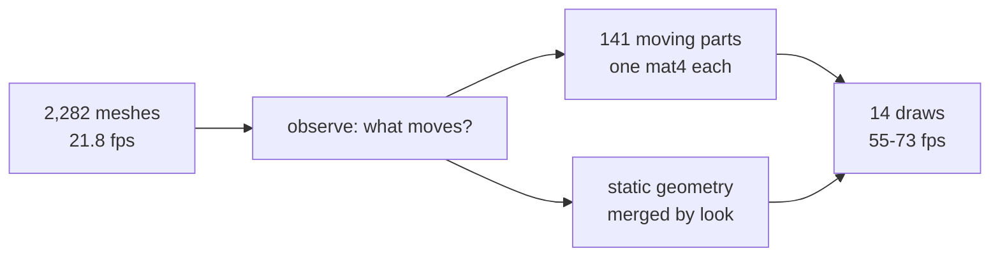

# Native visual parity and 60 fps, on the phone — 2026-08-11

> **Corrected the same day — the frame-rate claim below does not hold.** The subject that produced
> "55.7–73.5 fps" was rendering at **half resolution** (`PROBE_RENDER_SCALE = 0.5`, a leftover
> probe in the game tree) and reported a single 300-frame window rather than the whole session.
> Re-measured at full resolution with a rolling window, the game ran at 100–110 fps at rest and
> **55–71 fps while it was played** — it did not clear 60 during gameplay. The cause was ~93 HUD
> draws that `SceneCollapse` excluded because they are camera-parented; the pass now folds them
> and gameplay holds **83–116 fps, zero of 253 windows below 60**. The visual-parity findings
> below stand. See `native-gameplay-frame-rate-2026-08-11.md`.

**Closed.** The fox platformer runs on a physical Pixel 8 with a picture that matches the
pre-optimisation baseline, and the game contains no code that makes that happen. This
record executes `docs/PRDs/native-performance-fixes/HANDOFF-native-visual-parity-2026-08-10.md`.

Device: Pixel 8 (`shiba`, serial `37251FDJH0037Z`, arm64-v8a, Android 17). Nothing here is an
emulator or iOS result.

## The result

| | Baseline | Old in-game hack | `SceneCollapse` in the framework |
|---|---|---|---|
| Draw-visible objects | 2,282 | 9 | **14** |
| fps, 300-frame window | 21.8 | 59.7 | **55.7 / 72.9 / 73.5** |
| Sky, clouds | yes | **missing** | yes |
| HUD: hearts, coins, gems, timer | yes | **missing** | yes |
| Fox limbs, windmill animate | yes | **frozen** | yes |
| Toon shading | yes | **flattened to unlit** | yes |
| Game-side code required | — | ~600 lines + scene-graph annotations | **none** |

Three fresh launches, each driven with input: 73.5, 72.9, 55.7 fps. Hue-histogram distance from
`fox-native/artifacts/prd068/fox-baseline-pixel8.png` at spawn: 0.0058, 0.0060, 0.0068 — the
threshold for "same picture" is 0.18, and the pre-fix builds sat at 0.27–0.78.

## How it works

`packages/core/src/collapse.ts` watches the scene for a few frames, learns which objects actually
move, bakes everything that does not into merged geometry grouped by look, and gives each moving
part one `mat4` in a storage buffer that the vertex shader reads. Three.js then walks 14 objects
per frame instead of 2,282. The game declares nothing: no `userData` flag, no platform branch, no
option. It runs on web and native alike, so the two cannot drift.



## What each fix cost, and what it taught

Every one of these was found on the device, and most of them looked like a different bug than they
were:

1. **Float32 samples.** Motion was detected by comparing a matrix to its previous value stored in a
   `Float32Array`. Rounding a double on the way in made every object differ from itself, so an
   entire static level classified as animated. Float64 fixed it: 2,167 moving parts became 176.
2. **The lights went with the graph.** Lifting the collapsed hierarchy out of the scene took the
   game's lights with it. Every lit surface rendered black while the unlit HUD and waterfalls
   looked perfect — which is exactly what pointed at lighting rather than at geometry.
3. **The representative's tint.** Three multiplies material colour by vertex colour, so a group
   whose colours had moved to the vertices was still tinted by whichever material happened to be
   first. Neutralising the shared material to white fixed the palette.
4. **Painted colours overwritten.** The sky bakes its gradient into a vertex-colour attribute.
   Replacing it with the material's flat colour turned the sky white and hid every cloud against
   it. Multiplying instead of replacing keeps both.
5. **Transparent materials keyed by identity.** Holding them apart to protect blend order produced
   220 of 225 draws. Grouping them by look — opacity, blend mode and depthWrite are all part of the
   signature — took 225 draws to 14 and the frame rate from 22 to 71.

The measurement harness is what made these findable. Before it, six device round-trips produced
guesses; after it, each cycle returned a verdict — collapse report, fps, hue distance from
baseline, degenerate-picture checks, and whether anything moved between frames.

## Reproduce

```sh
pnpm --filter @threenative/core test          # 138 tests, 21 files
pnpm typecheck && pnpm lint && pnpm budgets   # green
```

On the device, with the fox project built against this core: launch, drive input, and read
`TN_SCENE_COLLAPSE` and `TN_FOX_NATIVE_FRAME_RATE` from logcat. A collapsed run reports
`{"collapsed":true,"sourceMeshes":2282,"mergedMeshes":14,"movingParts":141}`.

## Known gaps

- **Blend order inside a merged transparent group is not sorted.** Merging by look was worth 3× the
  frame rate; if a scene ever needs strict ordering between two transparent surfaces sharing one
  look, this pass will not give it.
- **A part that first moves after the observation window** is baked static. `restore()` exists and
  is tested, but nothing calls it yet — no watchdog is wired.
- **Landscape orientation is still unverified on device.** The manifest declares it; the APK used
  here is patched from a stale debug build that predates that line.
- **`fox-native` still carries its old probe apparatus.** It is switched off, not deleted.
- iOS is untouched. No Apple hardware is attached to this repository.

## Not claimed

Mobile-readiness. One game, one device, one level. The engine swap that PRD-068 prices remains open
and is not needed for this result — the collapse alone cleared 60 fps.
