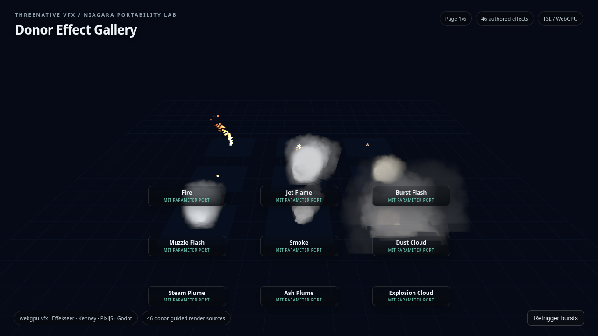
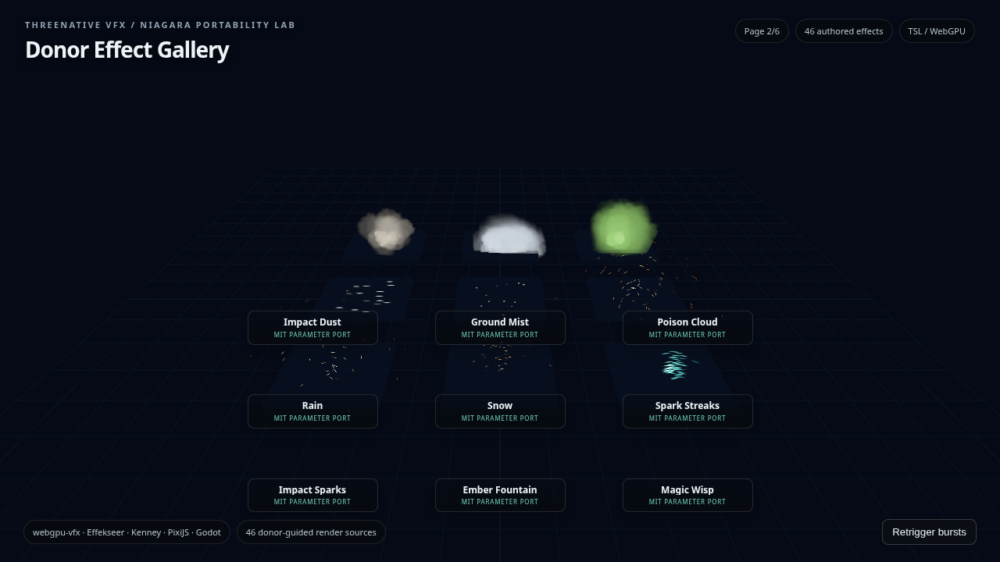
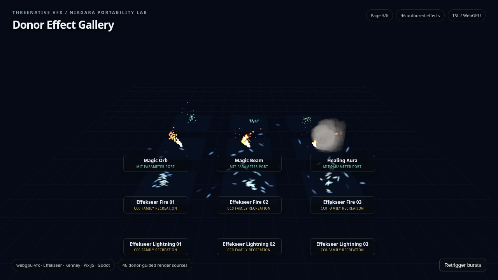
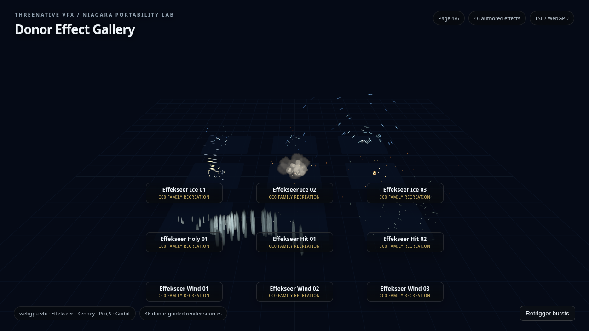
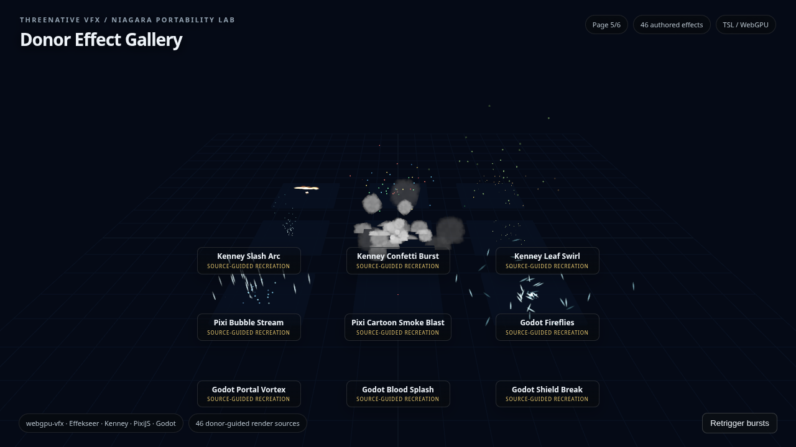
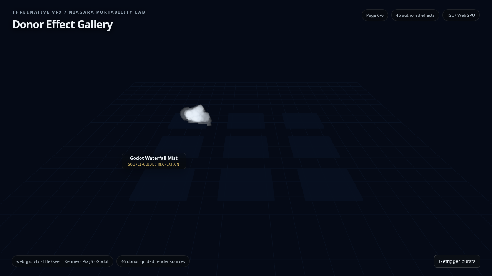

# PRD-316 implementation closeout — 2026-09-01

## Donor fidelity and ownership

The archive was inspected read-only and fingerprinted as
`6554c40f862f0ab1b977417d1a01716f76dc3937a3ecb507bedfa230ab6cac0a`.
The 46 gallery rows retain the donor layer capacities, lifetimes, curves, forces, shapes, colours,
blend styles, and source pins in `scripts/fixtures/vfx-niagara-46-effects.json`:

- 21 `webgpu-vfx` rows from commit `cac6e799d06e0dc756479d747700b16556ebd9dc`.
- 15 `Effekseer` rows from commit `8bf8edfedb51ac09af3d4cf788cb81746ea75a82`.
- 10 extras from the pinned Kenney, Pixi, and Godot sources.

The animation and appearance code lives in `examples/vfx-gallery/src/render/` and the two template
`src/render/vfx.ts` files as direct TSL/Three.js source. The gallery uses the existing
`GPUParticles3D` mechanism for particle dispatch and lifetime, and the portal ribbon uses the
existing `IComputeDriven` seam. No donor runtime code, binary effect asset, new VFX package, public
VFX export, archive IR, backend, or preset catalog was added. The only framework change is the core
timestamp resolver now resolving the separate compute query pool, which prevents long-lived GPU
particle pages from exhausting it.

## Gallery and integration result

`pnpm test:vfx-gallery` passed on the NVIDIA/Turing WebGPU adapter:

- 46/46 authored IDs evaluated and visible.
- Six page captures were produced under `artifacts/vfx-gallery/`.
- The report recorded 39,594 changed pixels and `changedPixelRatio=0.04296223958333333`.
- The final scenario state recorded GPU capacity `2762`, seven visited pages including the return
  page, one portal-ring dispatch, and four portal-ribbon dispatches.
- Browser assertions passed for coverage, page traversal, burst commands, portal ring dispatch,
  portal ribbon dispatch, and the compute-updated signal.

The shooter and action-RPG templates call donor-derived muzzle, impact, attack-arc, hit-burst, and
Arcane Surge effects from their game-owned render modules. The focused action-RPG template rerun
passed after preserving the original combat timing steps while retaining the VFX assertions.

## Visual proof

These are the six final browser captures. Pages 1–4 show the webgpu-vfx and Effekseer donor rows;
pages 5–6 show the Kenney, Pixi, and Godot donor rows, including the portal and waterfall effects.

| pages 1–2 | pages 3–4 |
| --- | --- |
|   |   |

| pages 5–6 |
| --- |
|   |

The direct-source line audit was:

```text
1961 examples/vfx-gallery/src/render/archivePresets.ts
  32 examples/vfx-gallery/src/render/combat.ts
  40 examples/vfx-gallery/src/render/extras.ts
 474 examples/vfx-gallery/src/render/fireSmokeWeather.ts
  60 examples/vfx-gallery/src/render/magic.ts
 169 examples/vfx-gallery/src/render/portalVortex.ts
 215 packages/create-threenative/templates/shooter/src/render/vfx.ts
 257 packages/create-threenative/templates/action-rpg/src/render/vfx.ts
3208 total
```

The generic `scripts/count-loc.ts` check passed; it has no VFX-specific comparison mode, so no
VFX-specific kill-switch percentage is claimed.

## Verification ledger

| check | result |
| --- | --- |
| `pnpm typecheck` | PASS after rebasing onto current local `main`. |
| `pnpm lint` | PASS; Biome reported warnings only. |
| `pnpm test` | SETUP-BLOCKED, exit 1; the native package suite reported 90 files / 663 tests passed, 6 failed, and 34 skipped because the optional CMake test executables were not built. |
| targeted VFX/core tests | PASS, 10 tests across 3 files. |
| `pnpm budgets` | PASS; capability manifest fresh and 46 rows accounted with pinned provenance and binary/runtime reuse disabled. |
| `pnpm sync:agents` | PASS; mirrors current. |
| `pnpm test:playtest` | PASS on NVIDIA WebGPU. |
| `pnpm test:templates` | PASS; all eight scaffolded template matrices passed, including the action-RPG combat/VFX and shooter VFX scenarios. |
| isolated desktop `vfx-compute` conformance | PASS for the selected row; see native evidence record. |
| `pnpm quality` | PASS, exit 0; 120 findings were reported as new, grown, inherited, or waived, and no VFX file caused a fatal quality finding. |
| full `pnpm parity` | NOT CLAIMED; the broad run was interrupted after partial matrix execution (exit 130), with unrelated baseline failures/blocked rows. |

## Fail-closed negative controls

Both controls mutate only in-memory values and intentionally exit 1. The checked-in fixture and
capture remain untouched.

Coverage control:

```text
TN_VFX_NEGATIVE_COVERAGE:
expected exactly 46 effects; received 45
missing effect id(s): godot-waterfall-mist
extras requires 10 rows; received 9
negative-control-exit=1
```

Visual control:

```text
TN_VFX_GALLERY_TILE_EMPTY:godot-portal-vortex
negative-control-exit=1
```

These controls prove that a missing authored row and an empty rendered tile fail closed instead of
being silently accepted.

## Target boundary

The browser gallery and shared desktop compute mechanism are evidenced. The full six-page gallery
has not been executed on desktop native, Android hardware, or an iOS simulator, so those targets
remain unclaimed by this record. The PRD itself remains open for those target-specific gallery
claims.
