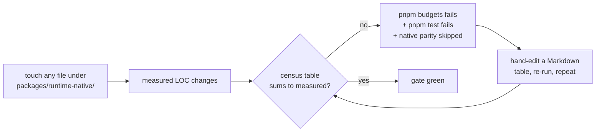

# ThreeNative — technical debt & friction audit

Run 2026-08-20 against `main` @ `d75f4644`. Every number below was measured on that date; where a
gate was run, its output is quoted. Working-tree sizes and session-log figures come from one
operator machine and are recorded here as orders of magnitude, not as repository facts.

---

## Do this first

1. Fix the red suite: update the `tests/` row in `docs/verification/native-runtime-census-2026-08-16.md` from `9,468` to `9,516`.
2. `git worktree prune && rm -rf .worktrees/*` — reclaims ~119 GB and un-poisons every repo-wide grep.
3. Delete `packages/core/src/collapse.ts` and its 5 spec files — 2,943 dead lines, and it clears the framework LOC trigger.

Everything else is ranked below.

---

## 1. `pnpm test` is red on main, and one Markdown table is the cause

```
FAIL packages/physics/__tests__/actuation.spec.ts > PRD-116 verification evidence
     > keeps the native census and final test counts tied to committed gate output
  ❯ packages/physics/__tests__/actuation.spec.ts:274:18
      "tests/",
-     9468,
+     9516,
 Test Files  1 failed | 160 passed (161)
      Tests  1 failed | 1499 passed (1500)
```

No production code is broken. A hand-maintained row in a Markdown table drifted by 48 lines.

**Blast radius is larger than the one test.** `scripts/run-test-suite.sh` runs
`pnpm -r --workspace-concurrency=1 --if-present run test`, sequentially and fail-fast. The failure
lands in `@threenative/playtest`, so `@threenative/runtime-native`'s test script — which also runs
`pnpm native:physics:parity` — **never executes**. One stale number silently skips the native parity
gate.

## 2. The native census gate is the anti-pattern, not the symptom

`docs/verification/native-runtime-census-2026-08-16.md` holds a table whose rows must sum *exactly*
to a number computed by walking the filesystem. It is enforced twice:

- `scripts/check-budgets.ts:511-553` (`nativeCensusErrors`)
- `packages/physics/__tests__/actuation.spec.ts:274`



Cost already paid, from the session logs:

- An overnight Linchpin run halted on it: *"PRD154 budget still fails: census 77,107 vs measured 77,209 … Blocked; not squashed to main."* The operator's next message asked why the run was still stuck on it.
- 12 of the last ~40 commits touch this one file (`git log -- docs/verification/native-runtime-census-2026-08-16.md`).
- The file is **already stale in its own ungated section**: "Current gate summaries" claims `78,289/50,000` while `pnpm budgets` measured `78,347` this morning. The part nobody gates has drifted; the part that is gated costs a commit every time.

The census exists to force a KEEP/DELETE judgement per area — that intent is good. The arithmetic is
not what carries the judgement.

**Fix:** generate the `Lines` column and the total from the same walk `check-budgets.ts` already
does, and gate on the *verdicts* (every counted area has an owner, a live caller, an alternative
considered, and a KEEP/DELETE) rather than on a sum a human retypes.

## 3. `.worktrees/` — 119 GB, and it breaks search for every agent

| Measure | Value |
|---|---|
| `.worktrees/` on disk | **119 GB** (project total: 126 GB) |
| Abandoned worktrees | 58 (`git worktree list` → 60 entries) |
| `node_modules` trees inside them | 58 |
| Stale `linchpin/*` branches | 61 of 67 total branches |
| Oldest / newest lane | 2026-08-17 / 2026-08-20 |
| `.linchpin/` scratch | 501 MB, 881 files |
| `artifacts/` | 256 MB |

The disk is the small problem. The real cost is that **an agent that greps the repo root gets 34×
noise**:

```
grep -rl "SceneRenderProjection" .          → 138 files   (4 are real)
find . -name AGENTS.md                      → 1636 files  (29 are real)
find . -name CLAUDE.md                      → 1541 files  (16 are real)
```

A cold agent told to "read the closest `AGENTS.md`" has a 98% chance of landing in a dead lane from
three days ago. Nothing in `AGENTS.md` warns about `.worktrees/`.

**Fix:** (a) prune after every Linchpin batch — `git worktree prune`, `git branch -D` merged lanes;
(b) add `.worktrees/` to `.gitignore` for tooling that honours it; (c) one line in root `AGENTS.md`:
*"`.worktrees/` holds other agents' lanes — never search it, never read its AGENTS.md."*

## 4. 2,943 lines of dead engine code, still charged to the LOC budget

`packages/core/src/collapse.ts` (2,063 lines, `SceneCollapse`) was superseded by
`SceneRenderProjection` under PRD-152. Current state:

- `packages/core/src/game.ts:449` constructs `SceneRenderProjection`. Nothing constructs `SceneCollapse`.
- `SceneCollapse` is **not exported** from `packages/core/src/index.ts`.
- Its only importers are 5 spec files (`collapse.spec.ts` 880 lines, plus `collapse-picking`, `collapse-semantics`, `collapse-baseline`, `palette-scale`) and `examples/native-cpu-load-test/src/main.ts`.

Meanwhile `pnpm budgets` reports:

```
budgets trigger: framework LOC review trigger: 15025 lines (trigger 15000, +25)
```

The framework is 25 lines over its own trigger while carrying a 2,063-line module with no production
consumer. Deleting it puts the framework ~2,000 lines **under** trigger and removes 7 of the repo's
129 complexity warnings. The charter's kill switch already prescribes this: *"an abstraction that
costs more code than plain Three.js is deleted, however much work it took."*

Also note the sandbox FRICTION ledger complained about this module's *observable* behaviour —
"the renderer logs `TN_SCENE_COLLAPSE` decisions on every boot … there is no documentation of what
collapsing does to raycastability" — so the dead code is still emitting console noise into games.

## 5. God modules and complexity that no gate can fail

`pnpm quality` and `pnpm lint` both report, neither fails. `pnpm quality` is documented as *"never
fatal"*; lint emits 235 warnings at warn level.

| File | Lines | Threshold | Note |
|---|---:|---:|---|
| `packages/playtest/src/assertions.ts` | 3,078 | 800 | one 858-line function, cognitive complexity **255** (max 15) |
| `packages/core/src/collapse.ts` | 2,063 | 800 | dead (§4) |
| `packages/playtest/src/runner/runner.ts` | 1,800 | 800 | |
| `packages/playtest/src/scenario.ts` | 1,799 | 800 | |
| `packages/physics/src/simulation.ts` | 1,174 | 800 | |
| `packages/core/src/renderProjection.ts` | 1,078 | 800 | |

Lint warning mix (235 total):

```
129  lint/complexity/noExcessiveCognitiveComplexity
 67  lint/style/noNonNullAssertion
 24  lint/style/useNamingConvention
```

Worst single sites: `assertions.ts:589` (255), `scripts/sweep-pair.ts:197` (134),
`packages/core/src/game.ts:388` `#boot()` (43).

The structural problem is the **`inherited` marker** in `pnpm quality`. A violation present when the
gate was introduced is labelled `inherited` and stays legal forever; only `new` ones are surfaced.
`assertions.ts` at 3,078 lines against a 800 threshold has been permanently exempted by that
mechanism. Nothing ever forces the number down.

**Fix worth considering:** make `inherited` a ratchet — the recorded value may fall but never rise.
Today it is a permanent amnesty.

## 6. Friction the sessions actually recorded

Mined from 25 Claude sessions and 199 Codex sessions whose `cwd` was this repository or a sandbox
game, plus the two sandbox `FRICTION.md` ledgers.

### Already fixed — the loop is working

Worth stating plainly, because it is the strongest signal in the data: nearly every row the
`fps-framework` builder logged was turned into a PRD and closed within 24 h.

| Friction logged | Closed by |
|---|---|
| No relative pointer delta / pointer lock → mouse look was web-only DOM reach | PRD-138 |
| `raycast()` cannot cast a world ray; hits your own viewmodel | PRD-139 |
| `AnimationPlayer` has no loop/once mode, no finished event | PRD-141 |
| No bone sockets — rifle could not be put in a hand | PRD-142 |
| `RigidBody3D` had no `position` (needed a throwaway `Object3D` per static body) | PRD-145 |
| `holdFrames`/`waitFrames` documented but did not advance the fixed-step clock | PRD-146 |
| Assertions had `gte` but no `lte` — a countdown could not be asserted downward | PRD-147 |
| Scaffolded `pnpm test` hard-coded port 4173 ten times, enumerated 10 scenarios by path, omitted `--browser-recipe webgpu` | PRD-148 (verified fixed: the starter script now globs `"playtests/*.playtest.json"`, uses `$PORT`, and passes `--browser-recipe webgpu --headed`) |
| No way to read a model's bounds/axis/clips before placing it | PRD-150 |

### Still open

1. **React state bridge is throttled to ~10 Hz** and it is the only documented scene→HUD channel. `AGENTS.md` says "never subscribe a React component to per-frame data" but names no alternative. The builder worked around it by stretching a hit marker to a 0.42 s decay so the sampler could not miss it.
2. **No "add this mesh as static collision" helper** for level geometry — a 34 m yard's collision was hand-fed box by box from a parallel `colliders: BoxCollider[]` array.
3. **Asset provenance records licence but not scale, orientation, or pivot.** `enemy-terrorist.glb` carries a Sketchfab root at `scale 0.0346, rot -90° X`. Dropped in as-is a viewmodel is either invisible or fills the frame. PRD-150 gave inspection a home; the shipped `.provenance.json` files still do not carry the numbers.
4. **Xvfb display collision under parallel lanes** — `_XSERVTransSocketUNIXCreateListener … server already running` appeared 15× across Codex sessions. `scripts/xvfb.sh` fixes the exit-code trap but lanes still contend for one display number.
5. **Nothing non-visual sees a broken game.** From the vanilla ledger: `pnpm typecheck` passed on the build whose camera faced a wall and rendered near-black, and again on the build whose floor texture was silently black. This is a known and accepted property, but it is the reason `doctor --url` and blind scoring exist — worth keeping them one command away.

### Tool-level friction (not the repo's fault, but it costs runs)

| Signature | Count | Reading |
|---|---:|---|
| `apply_patch verification failed: Failed to find expected lines in …/.worktrees/…` | 38 | Largest single friction. Concurrent agents editing the same paths across lanes. |
| `_XSERVTransSocketUNIXCreateListener … server already running` | 15 | Xvfb contention (§6.4) |
| `ERR_MODULE_NOT_FOUND` | 10 | Sandbox/tarball link state |
| `specifiers in the lockfile don't match … @threenative/core (lockfile: file:…)` | — | Sandbox reinstall after an engine fix; recurred across several sessions |

Human friction is concentrated in one place. Of ~200 user turns mined, the recurring complaints are
(a) work landing in the wrong folder — a whole game written to the sandbox root instead of one
folder per game, (b) a fix applied to `packages/` but never reinstalled into the sandbox project
being tested, so the next screenshot showed the old build, and (c) long stalls on gate bookkeeping
rather than on the game.

## 7. Recurring defect classes the reviewers keep re-finding

Reading the Codex repair-round briefs end to end, the *same five shapes* recur across PRD-138
through PRD-150. This is the highest-leverage item in the report, because each one was caught by a
human-configured reviewer rather than by a gate.

1. **Non-falsifying tests — the "red" was never red.** PRD-139 (world-ray test used the same centre ray as the default screen ray), PRD-146 (fixture's RAF moved the subject every frame, so the test passed with the feature removed), PRD-147 (fixture started inside the interval, so the triviality guard fired rather than the `lte` comparison), PRD-148 (acceptance command pointed at a file that did not contain the new tests). Five separate lanes, one shape.
2. **Evidence citing uncommitted fixtures.** PRD-140 cited `/tmp/prd140-picking.*`; the proof was unreproducible.
3. **`AGENTS.md` edited without regenerating `CLAUDE.md`.** PRD-141. (`pnpm sync:agents --check` catches it — *"agent docs in sync: 16 CLAUDE.md mirrors"* — but only if someone runs it before review.)
4. **Tests importing internal modules instead of the public entry.** PRD-142 — removing the `index.ts` exports would have left the acceptance test green.
5. **Web/native constant drift.** PRD-143 — TypeScript used `Number.EPSILON` where the Rust seam used `f32::EPSILON`, so a `1e-7` axis was accepted on web and rejected on native. Two implementations of one rule with no shared table.

**Fix:** the workflow already says "red-green, bugfixes included, paste the red." What reviewers keep
finding is that the pasted red was produced by the wrong thing failing. Add one line to the PRD
acceptance template: *"state the mutation — which line, reverted — that makes this test fail, and
paste that failure."* Class 5 wants a shared constants table consumed by both the TS seam and the
Rust crate rather than two literals.

## 8. Smaller items

1. **The root test suite runs twice on a green run.** `run-test-suite.sh` does `pnpm -r run test` — and `@threenative/playtest`'s test script is `pnpm --dir ../.. exec vitest run --config vitest.config.ts`, i.e. the whole 161-file root suite — then the script runs `vitest run` again at root. ~25 s duplicated per run, plus a rebuild. Today it is masked because the run dies before the second pass.
2. **Package-level `test` scripts do not test their package.** `core`, `physics`, `ui`, `create-threenative` and `engine-mcp` all define `test` as `pnpm run build && publint --strict`. `pnpm --filter @threenative/core test` proves nothing about core. All 161 spec files hang off the root config and are owned, in the workspace graph, by `playtest`.
3. **342 MB of `docs/` is tracked binaries** — 287 MB in `docs/benchmark`, 52 MB in `docs/verification`. `.git` is 212 MB (pack 147 MB); the largest tracked files are `.glb` models (7.3 MB, 3.7 MB) and ~30 near-identical 1.6 MB `reference.png` copies across `docs/benchmark/sweeps/*`. Clone cost is now dominated by sweep archives, not code.
4. **The doc mirror doubles the review surface.** Every `AGENTS.md` has a generated `CLAUDE.md` twin — 29 and 16 in-tree. It works and the gate passes, but it is the root cause of defect class 7.3 and it doubles the diff on every conventions change.
5. **43 files in `scripts/` behind 39 root `package.json` scripts.** `AGENTS.md`'s "Harnesses that already exist" table documents ~10 of them. The rest (`arm-census`, `sweep-delta`, `capture-guard`, `template-baseline`, `verify-registry-install`, …) are discoverable only by listing the directory.

## 9. What is in good shape

Stated because a debt report that only lists debt gives a false picture of this codebase.

- **Type hygiene is unusually clean**: across 420 TypeScript files there are 3 `any`/`as any`, 1 `@ts-expect-error`, and 2 `biome-ignore`. The `as unknown as` casts flagged by `pnpm quality` are the only escape hatch in real use.
- **The package graph is acyclic and minimal.** `core → three, three-mesh-bvh, zustand`; `physics → rapier, recast-navigation` with `core` as a peer; `ui` and `playtest` carry only peers. Rule 5 ("a package exists only when it carries a dependency the others must not inherit") is actually being obeyed.
- **Doc links are gated and green**: 703 relative links across 480 Markdown files.
- **Blocked work is honestly filed**: 17 PRDs in `docs/PRDs/BLOCKED/`, each in a folder named for the exact missing capability (`requires-physical-device`, `requires-evdev-delivery`, `requires-external-person`), with a README table naming what unblocks each. 131 done.
- **The capability manifest is real**: 113 entries, gated by `pnpm check:docs` and `check-capability-docs.ts` (37 public exports documented across 7 templates), reachable from a scaffolded project over MCP.
- **The friction→PRD→fix loop demonstrably works** (§6). Nine ledger rows became nine closed PRDs inside a day.

---

## Ranked backlog

| # | Item | Effort | Payoff |
|---|---|---|---|
| 1 | Fix the census row; make `pnpm test` green | 2 min | Unblocks the native parity gate |
| 2 | Prune `.worktrees/` + merged `linchpin/*` branches; add the AGENTS.md warning line | 15 min | 119 GB back; repo-wide search stops lying to agents |
| 3 | Delete `collapse.ts` + its 5 specs | 30 min | −2,943 lines; framework LOC back under trigger; −7 complexity warnings |
| 4 | Generate the census table; gate verdicts not arithmetic | ~2 h | Removes the single most expensive recurring gate failure |
| 5 | Add the mutation-statement line to the PRD acceptance template | 10 min | Attacks defect class 7.1, which cost 5 repair rounds in one batch |

Then, when there is an afternoon: split `assertions.ts` (§5), de-duplicate the double root suite run
(§8.1), and either give each package a real `test` script or say plainly in `AGENTS.md` that the
root suite is the only one.
