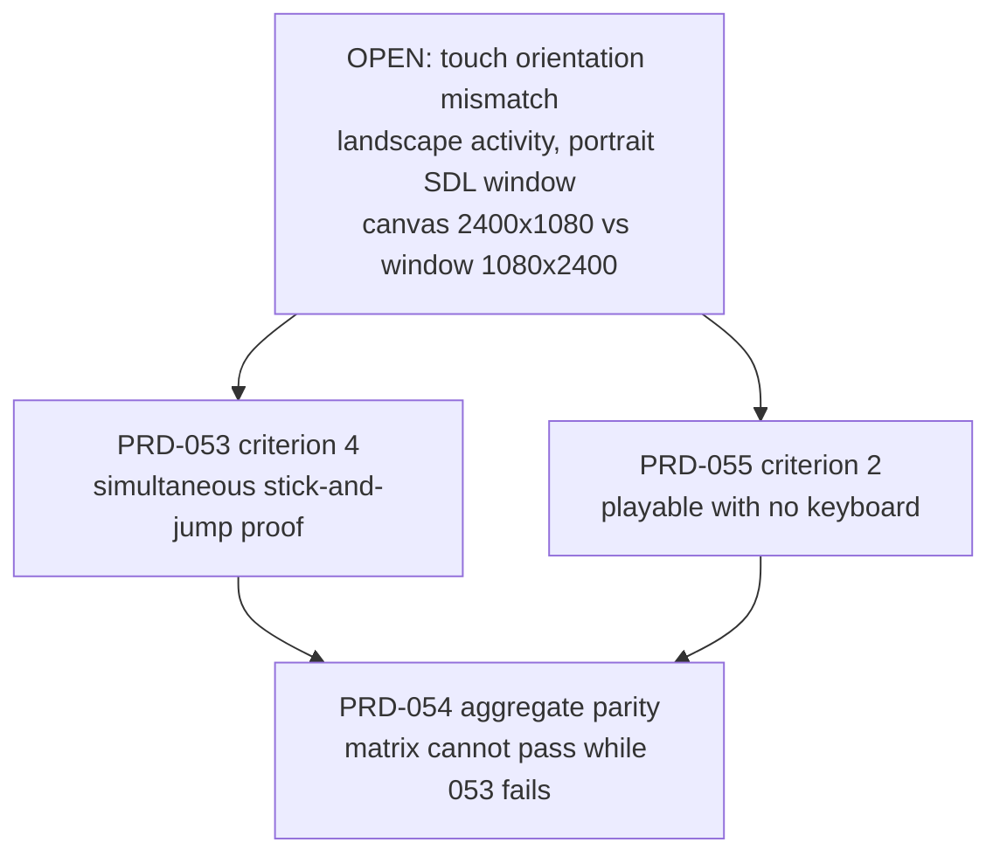

# What the Android touch fixes unblock — 2026-08-09

Derived from the emulator run recorded in
[integration-2026-08-09-six-prds.md](integration-2026-08-09-six-prds.md) and landed in
`e15aab8`. This file answers one question: **what can now be worked on that could not be
before, and in what order.**

## What actually changed

Two bugs are fixed and one capability is now proven on this machine.

| Change | Effect |
|---|---|
| Injector no longer batches `ABS_MT_TRACKING_ID` with `ABS_MT_POSITION_X/Y` | Injected coordinates reach the device at all. Before this, every contact landed at `(0, 0)` and the emulator reported `OK` |
| `setWindowSize` always updates its cache; `dispatchResizeEvent` syncs it | The size that scales SDL's normalized touch into canvas pixels tracks the canvas |
| The Android emulator lane runs end to end here | APK builds with JDK 17, installs, runs 300 frames, clean logcat, non-blank 1080x2400 screenshot |

The third row is the one that changes planning. Anything that needed "run it on the Android
emulator" was previously an assumption; it is now a command that works.

## The single defect gating all three PRDs

Measured on device: contacts at normalized `x = 0.2` and `x = 0.8` arrive at canvas x `216`
and `865`. The half-width is `1200`, so both read as the left half. `processTouchEvent` in
`packages/runtime-native/src/platform/input.cpp` scales `event.x * width` from
`getWindowSize()`, and on a landscape-locked activity that window is still the portrait
display.

**This is one fix.** It is the highest-leverage piece of work in the native lane right now,
because all three PRDs terminate on it.

## PRD-053 — multi-touch input

Criteria 1, 2, 3 and 5 are met in `main`. Criterion 4 moved from *written and unproven* to
**executed and failing on a named defect** — the two fixes were found by running it.

Current device result: `maxPointers: 2` and `movedWithTwoPointers: true` — two simultaneous
contacts genuinely reach the game — with `leftGroundWithTwoPointers` false.

**Do now, in order:**

1. Map touch coordinates through the surface orientation in `processTouchEvent`, rather than
   scaling by the SDL window size.
2. Re-run `pnpm --filter @threenative/runtime-native native:verify:android:multitouch
   --device emulator-5554`. The one-pointer negative control ships with it, so a pass is a
   pass and not a vacuous green.
3. Move the PRD to `docs/PRDs/done/` in the same commit that turns criterion 4 green.

Nothing else in this PRD is outstanding. Section 7 lists `pressure`/`width`/`height`/
`pointerType` as an explicit non-goal — leave it that way.

## PRD-054 — write once, run anywhere

The precondition work landed: desktop provisions itself before a row can fail, an
unprovisionable host reports `blocked` with the command output, `--target android` refuses
physical hardware and reports a missing AVD as a precondition. Criteria 3, 4, 5, 6 and 7 are
addressed in code.

**Unblocked now — does not wait on the orientation fix:**

- **Phase 4 (CI emulator lane).** The lane is proven runnable on this machine, so it can be
  written and exercised locally instead of by pushing to CI. Given the free-plan CI budget,
  that is the difference between doable and not.
- **Phase 2 (`pnpm parity --project <path>`)** against a scaffolded project on the emulator.
  The plumbing exists; it now has a working target to run against.
- **Criterion 1** end to end, minus the clean-checkout claim. The provisioning path can be
  exercised here; only "clean machine" remains unverifiable on this box.

**Still blocked:** aggregate parity, because row `90-multitouch-input` is in the registry as
`implemented` and fails until PRD-053 closes.

## PRD-055 — the HUD hole on native

Criterion 1 (HUD on web, desktop and the Android emulator with no user-authored HUD code) is
**now verifiable** — the portable geometry HUD ships in all three templates and the emulator
lane runs. It has not been executed against the emulator yet; that is a bounded piece of work
worth doing next, independent of the orientation fix.

Criterion 2 needs two separate things, and only one of them is the orientation fix:

1. The orientation fix, so a finger in the right half of the screen registers there.
2. **On-screen touch controls in the shipped template source.** No template currently exports
   anything of the kind — `grep -rn touchControls packages/create-threenative/templates`
   returns nothing. The criterion allows either shipped controls or "the framework's input
   surface plus twenty lines"; whichever is chosen, it belongs in the user's `src/render/`
   under Rule 3, never in a package.

Criterion 4 (React DOM and Tailwind listed in Tier 3 with a reason and an owner) is already
satisfied by the registry exclusion `react-dom-tailwind-hud`, owner PRD-055. The second half
of that criterion — that templates shipping them **say so where a user reads it** — is worth
a check against the template `AGENTS.md` files.

## Suggested order

1. **Touch orientation fix** — unblocks the terminal criterion of 053 and half of 055.
2. **Close PRD-053** with the re-run proof and its negative control.
3. **PRD-055 criterion 1 on the emulator** — a HUD capture from the running APK.
4. **Template touch controls**, then PRD-055 criterion 2.
5. **PRD-054 Phase 4** CI emulator lane, written and exercised locally.
6. **PRD-054 aggregate parity**, which is only meaningful once 053 is green.

## Operational notes for whoever runs this next

- Use AVD **`threenative-prd050`**. `threenative_api35` carried a stale
  `wm size 1280x720` override and produced a 6 KB near-blank screenshot against prd050's
  53 KB one. Check `adb shell wm size` before trusting a result from any other AVD.
- `THREENATIVE_JAVA_HOME=/usr/lib/jvm/java-17-openjdk` is required; the default JDK here is
  26 and `discoverTools` rejects it.
- Boot headless with
  `emulator -avd threenative-prd050 -no-window -no-audio -no-boot-anim -gpu swiftshader_indirect -no-snapshot`.
- `adb emu event send` reports `OK` for events it silently discards. Verify any injection
  change against `adb shell getevent -lt /dev/input/event2` rather than the command's exit
  status.
- Editing `examples/native-smoke/src/game.ts` changes the SHA embedded in the generated
  Android bundle, so `tests/runtime-next-contract.test.mjs` fails until the bundle is
  regenerated. Regenerate by re-running the multitouch verifier.

## Not unblocked by any of this

PRD-056 physical mobile qualification, the iOS lanes, clean-machine and registry release
runs. Those need hardware or infrastructure that is not on this machine, and the owner stated
on 2026-08-09 that they will be validated separately.
