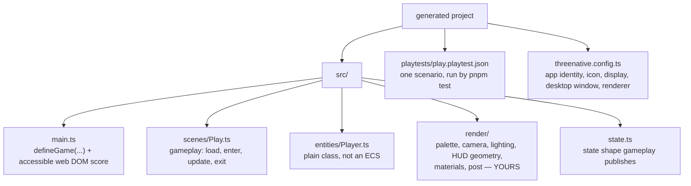

# AGENTS.md — __PROJECT_NAME__

Instructions for the AI agent working in this game. Scaffolded with `create-threenative`
(`minimal` template: no React, no Tailwind). `CLAUDE.md` is a copy of this file; edit this one.

## What the framework owns, and what you own

ThreeNative owns the plumbing: renderer bootstrap and WebGPU fallback, the fixed-step loop,
scene lifecycle, input mapping, asset loading, the physics binding, and the state store.

**You own everything a player sees.** `src/render/`, `src/entities/`, and `src/scenes/` are
ordinary code in this repository. Nothing in `@threenative/*` reads them. Rewrite or delete
any of it.

## Commands

```sh
pnpm dev                       # Vite dev server
pnpm build                     # web build; identical to vite build
pnpm build --target desktop    # native executable; Linux is the only verified host
pnpm test                      # build, start the dev server, and run the committed playtest
```

The normal `@threenative/physics` API selects native Rapier on Android; its source-workspace
APK and emulator scenario are proven without Rapier WASM. A published scaffold still cannot
ship Android or iOS until signed prebuilt runtime assets and their checksum manifest exist,
so those targets fail closed for consumers. Linux desktop is source-machine evidence, not a
clean-machine distribution proof; macOS, Windows, iOS, and physical hardware remain OPEN.

## Keep the game portable to native

`pnpm build --target desktop` runs this same source on a native host with **no browser**.
Three things break there, and none of them fail on the web build:

1. **No real DOM.** `document` exists only as a Three.js compatibility stub. The accessible
   DOM score in `main.ts` remains a web convenience; the generated `src/render/hud.ts` is
   camera-parented Three.js geometry, so its score, counter and clock run with the game.
2. **No dynamic `import()` and no `window.localStorage` reach.** The native build is one
   bundled file; save games go through your own JSON via `ctx.state`.
3. **`.raw` is web-only.** `ctx.physics.world.raw` is a Rapier object in the browser and
   opaque on native. Anything reading it is a web-only code path by contract.

Writing against `ctx`, `three`, and the Godot-named physics nodes keeps all three correct
without thinking about it. If you only ever ship to the web, ignore this section.

## The layout



`threenative.config.ts` is the one game-owned app-shape file. Set the launcher identity and
icon, mobile orientation and display flags, desktop window, renderer preference, and native
entry there. `package.json` may retain only `threenative.nativeEntry` as a compatibility
fallback for older projects.

`src/render/hud.ts` is generated user-owned source, not a framework widget. It uses instanced
plane geometry rather than `CanvasTexture`, and the scene registers it with `ctx.entities` so
native and web dispose it the same way. Rewrite its glyphs, labels, colours or layout freely.
Touch controls are not generated yet: keep keyboard mappings for now, then add the small
pointer-action mapping when the core multitouch surface from PRD-053 is available.

## How to write gameplay here

A scene is a class with optional `load`, `enter`, `update`, `exit`, and `render`. That is
the whole lifecycle — there is nothing else to register.

`ctx` hands you real Three.js objects and backend-neutral physics handles:

```ts
ctx.scene          // THREE.Scene
ctx.camera         // THREE.PerspectiveCamera
ctx.renderer       // the renderer
ctx.physics.world  // PhysicsWorldHandle
player.body        // PhysicsBodyHandle (via CharacterBody3D)
player.mesh        // THREE.Mesh
```

The physics handles expose `.raw` as an explicitly backend-specific escape hatch: Rapier on
web, opaque on native. Code that reads `.raw` is not portable between those targets.

Any Three.js tutorial, StackOverflow answer, or snippet you already know works unchanged
inside a scene. Prefer that over hunting for a framework wrapper — **for anything Three.js
itself does (geometry, materials, lights, math), there is no wrapper and you should write
the Three.js.** The exception is the loop: scene changes, timers and tweens are on `ctx`,
not in an import, so grepping the imports of an existing file will not find them. The
table below is the complete list.

Physics uses Godot's names: `RigidBody3D`, `Area3D`, `CharacterBody3D`, `CollisionShape3D`.
Every node has `dispose()`. Register disposable entities with `ctx.entities`; the framework
clears registered entities, scene objects, and physics nodes when a scene exits. Dispose a
node explicitly only when removing it during play.

`input.vector("move").y` is +up; map it to world-space -z for forward with one explicit
`-move.y` conversion in the player movement code.

`CharacterBody3D.moveAndSlide(dt)` owns gravity through `body.velocity`; keep coyote time
and the jump buffer in `src/entities/Player.ts` so the two templates teach the same motion
API.

## The `ctx` surface — you already have these, do not rebuild them

`ctx` carries six things that get reimplemented by hand in almost every project, because
they are **properties on `ctx`, never imports** — grepping an existing file's imports will
never surface them. This table is the complete list.

| You already have | Rather than | Signature |
|---|---|---|
| `ctx.goto("play")` | a hand-written `#reset()` | `(name: string) => Promise<void>` |
| `ctx.tween(obj, { y: 2 }, 0.4)` | a `Math.sin` / `lerp` accumulator | `(target, props, seconds) => Promise<void>` |
| `ctx.after(0.8, fn)` | `elapsed += dt; if (elapsed > 0.8)` | `(seconds, cb) => ScheduleHandle` |
| `ctx.every(fn)` | a per-frame branch in `update` | `(cb: (dt: number) => void) => ScheduleHandle` |
| `ctx.random.range(-1, 1)` | `Math.random()` | seeded — a replay produces identical results |
| `ctx.raycast()` | `new Raycaster()` + `intersectObject` | `(options?: { screen?, targets? }) => Intersection \| undefined` |

**`ctx.raycast()` is how you pick geometry under the pointer.** It defaults to the current
pointer position and the whole scene, returns the nearest `THREE.Intersection`, and stays
under a millisecond on meshes large enough that a plain `Raycaster` visibly stutters — it
keeps an acceleration structure per geometry and rebuilds it when that geometry's positions
change. Pass `{ targets }` to narrow it, `{ screen }` to test a point that is not the
pointer. Skinned, instanced and morphed meshes fall back to the stock Three.js path
automatically, so the result always matches `Raycaster.intersectObject`.

**`ctx.goto(name)` restarts the current scene.** Calling `ctx.goto("play")` from inside
`Play` tears the scene down and rebuilds it: `exit()` runs, scheduled callbacks are cleared,
registered entities are cleared, the Three scene is emptied, then a fresh instance runs
`load()` and `enter()`. That is your entire restart button, and your entire death-and-retry.

Do **not** write a `#reset()` that walks your entities putting them back. It is ~15 lines
that look right and quietly miss the scheduler and anything you spawned after `enter()`, so
the second playthrough behaves differently from the first — and no gate in this project will
catch that.

**One rule when calling it from a frame function: `goto` and then `return`, immediately.**

```ts
if (player.dead) {
  void ctx.goto("play");
  return;              // ← required. Everything below now runs against a torn-down scene.
}
```

From React, the same call is `game.goto("play")` — use that for a restart button instead of
routing a counter through game state.

**`ctx.tween` is for timing, not for looks.** Use it for the *when* — a pickup rising over
0.4s, a door opening, a hit flash — and keep the *what* (colour, shape, easing feel) in
`src/render/`. Motion driven by a persistent `Math.sin(elapsed)` in `update()` is still the
right tool for a continuous idle bob; `tween` is for anything that starts, runs once, and
finishes.

**`ctx.random` is seeded from `defineGame({ seed })`.** Use it for anything a playtest needs
to reproduce — spawn positions, patrol offsets, level variation. `Math.random()` makes a
scenario that passes once and fails on replay for no visible reason.

## Assets and animation

`AnimationPlayer` is exported by `@threenative/core` for clips from a rigged asset. Put a
`.glb` in `public/`, await `ctx.assets.model("hero.glb")` in `Scene.load()`, then construct
and update the `AnimationPlayer` beside the entity that owns the loaded model. This minimal
template does not ship a rigged asset; adding one belongs in `public/`, not in the framework.

## Finding assets — you have an MCP server for this

**Reach for it when the asset is conventional; build anything custom yourself.**

- **Textures, materials, HDRIs and sound effects — prefer the tools.** Rusted metal, oak
  planks, a studio HDRI, a UI click: these are well-established and a CC0 one beats what you
  would hand-author.
- **Models — only when the thing is conventional.** A car, a plane, a crate, a barrel, a
  tree, a chair. If this game's main character is a car, fetching a compatible `.glb` is the
  right call.
- **Anything specific to this game — write it in `src/render/`.** A downloaded model standing
  in for a bespoke design reads as a weird asset dropped into the scene, and it looks worse
  than a clean composition of primitives. This is the failure the tools make easy.

When in doubt, build it programmatically. A fetched asset has to match what the game needs,
not merely exist.

`.mcp.json` in this project launches `threenative-asset-mcp` from `node_modules`, so your host
lists its tools alongside your own. It advertises 32; these 8 are the loop you will use for
nearly everything:

1. `asset_search_sources` — start here, never at a provider. It returns every catalogued
   source with its license summary, attribution requirement, browse URL, and whether an agent
   can complete a download from it. **That output is the authority on what is reachable** —
   not this file, and not your memory of some other project.
2. `polyhaven_search_assets` (CC0 models, textures, HDRIs), `ambientcg_search_assets` (CC0
   materials and textures), or `audio_search_assets` (Kenney, Sonniss).
3. `polyhaven_list_files` / `ambientcg_list_files` — the license, official URL, byte size and
   md5 of every resolution and format. **Read this before downloading, not after**, and pick a
   sane one: Poly Haven lists 16k PNGs over 1 GB beside 8k JPEGs at 28 MB. A game does not
   need the 16k.
4. `asset_download_file` for textures and models, `audio_download_asset` for audio. Both take
   `acceptLicense: true` — you are asserting you read step 3. **They ignore any path you pass
   and write to the directories `.mcp.json` sets** (`public/assets/<provider>/<sha>/` and
   `public/audio/<source>/<pack>/`); without that config they would write to `~/Downloads` and
   never reach the game.
5. Append the file, its source, its license and its URL to `CREDITS.md` **before the turn
   ends**. Poly Haven requires a visible Poly Haven credit when its API is used, ambientCG is
   CC0 per asset page, and audio and bundle licenses are per pack.

**Never state a license you did not read off a tool result.** If `polyhaven_list_files` or
`ambientcg_search_assets` did not tell you, you do not know it.

**What arrives is usually a ZIP, not a texture.** ambientCG and Kenney ship archives: unpack
one, keep only the maps you actually use (`_Color`, `_NormalGL`, `_Roughness` — not the
`.blend`, `.usdc` or displacement), and put those beside your code under `public/`. A 1K JPEG
set is right for a game; the 8K set of the same material is 200 MB.

Two argument shapes that will bite you, both learned the hard way: `ambientcg_search_assets`
takes lowercase `type` values (`material`, `hdri`, `3d-model`), and the audio catalog is
**pack-level** — `audio_search_assets` matches pack names, so `query: "pickup coin"` returns
nothing while `kind: "sfx"` returns the seven packs that exist. Pick a pack, download it,
unzip it, and choose a file yourself.

The other tools are narrower, and the directory spells out the conditions on each. The Fab
tools talk to a marketplace: the server never purchases anything, and only directly-free files
download. `smithsonian_search_assets` returns museum scans at scan resolution, which this
project has no pipeline to decimate — that geometry is the wrong shape for a game. When in
doubt check `asset_search_sources` first; its `caution` and license fields are the current
truth for the pinned version, and they change between versions.

Load what you downloaded the ordinary way — `ctx.assets.model("crate.glb")`,
`ctx.assets.texture(...)`, `ctx.assets.audio(...)` — and write your own material and lighting
around it in `src/render/`. The framework ships no asset and picks none for you.

## Building what you cannot download — sculpt from a reference

Choose one branch before writing code:

- **Conventional and downloadable** — a crate, an oak plank texture, a click. Use the asset
  tools. Sculpting one of these is slower and worse.
- **Trivial** — a platform, a wall, a pickup ring. Write it. If `BoxGeometry` finishes the
  job in under 20 lines, that is the answer.
- **Bespoke, with a reference image** — an identity-bearing creature, vehicle, hero prop,
  landmark, scenery composition, or environment set piece whose silhouette must match. Use
  the sculpt tools to turn that reference into editable `src/render/` source.
- **Bespoke, without a reference image** — ask for one, or write it and accept that it will
  be generic. Do not invent a reference: comparison without evidence is unguided iteration.

For a full environment, split the decision: sculpt the signature landmark or bounded scene
kit that makes the reference recognisable; use the asset tools for interchangeable trees,
rocks, textures, HDRIs, and sounds around it. Do not sculpt an entire world as one object.

`.mcp.json` launches `threenative-sculpt-mcp` beside the asset server. It does not generate
or ship runtime code; it guides the source you write:

1. Call `sculpt_plan` with the image path and a one-line intent, then read the returned
   grimoire resources.
2. Write the returned object contract and loop on `sculpt_spec_gate` until every named
   region and depth requirement passes. Do not write geometry before this gate is green.
3. For each ordered pass, write or extend one factory in `src/render/`. Capture the real
   frame with `npx @threenative/playtest`; the sculpt server never launches a browser.
4. Call `sculpt_compare` with the reference and captured frame, then give that evidence to
   `sculpt_pass_gate`. Advance only when it says advance; ambiguity means retry.
5. Use `sculpt_grimoire` for a named technique topic. It rejects pages containing concrete
   paste-ready material or shader recipes so the tool never owns this game's look.

A missing or blank capture is a failed run, never a finished model. Add the reference image,
its creator, license, and source URL to `CREDITS.md` before the turn ends.


## Visuals

Edit the six files in `src/render/` directly: `palette.ts`, `camera.ts`, `sky.ts`,
`lighting.ts`, `materials.ts`, and `postprocessing.ts`. They are ordinary Three.js source in
this project, not a framework look or a config option. Keep the palette to six named colours
with one `accent`; import it from materials and sky. Set tonemapping and exposure deliberately,
use a rim light with soft shadows and `normalBias`, derive fog from the sky, and route bloom
through `renderer.setOutputNode()` so midtones remain readable.

`lighting.ts` ships key, bounce, **rim** and ambient with soft shadows. The rim is what
stops silhouettes reading as flat cut-outs against the background; do not delete it while
"simplifying".

Two traps worth knowing before you spend an afternoon on either:

1. **`CanvasTexture` samples black under `WebGPURenderer`.** Painting a canvas and using it
   as a `map` silently produces a black surface. Vary material colours across meshes
   instead. (The `starter` template ships a `shapes.ts` with rounded primitives and a
   seeded RNG for exactly this; copy it in if you want it.)
2. **Import a render module and then call it.** `setupPost` is inert if `Play.ts` only
   imports it, and no gate here will fail.

Nothing in the toolchain can see your game. `pnpm test` proves behaviour, never the look.

## HUD

This template has no React. `main.ts` subscribes a plugin to the store and writes to a DOM
node. `ctx.state.set()` coalesces, so write it from `update()` freely — but never rebuild
the DOM per frame.

If the UI grows past a few readouts, scaffold with the `starter` template instead, which
ships React 19 + Tailwind and `@threenative/ui`.

The start scene owns the initial state in `static initialState`; omit a duplicate
`initialState` literal from `defineGame`. `ctx.state.set({ playerX })` is a partial patch.

For development hot reload, `main.ts` calls `acceptHotUpdate(game, import.meta.hot)`. The
framework carries only JSON-shaped store state; rebuild the scene in `enter()` from the
state values you want to keep. Meshes, physics bodies, audio voices, and renderer objects
are always rebuilt.

## Register entities you want to inspect or test

```ts
ctx.entities.add("player", this.player);
```

A registered entity's `debug()` shows up in `window.__THREENATIVE__` in dev, and in playtest
assertions. That is how a scenario checks game state instead of guessing from pixels.

## Playtests

`playtests/play.playtest.json` drives a real browser through the game. Steps count frames, not
milliseconds — `holdFrames`, `waitFrames` — because the harness drives the fixed-step clock
instead of racing it.

A scenario fails closed: a missing entity, an absent observation, or a scenario with no
assertions is a failure, never a quiet pass. Add the assertion that would catch a feature's
absence, and run it before reporting the feature works.

## Budget real time for the look

Read this as an instruction about **where your effort goes**, not as a style tip.

Every automated gate here — `typecheck`, `lint`, `pnpm test`, every playtest scenario — is
blind to how the game looks. All of them pass on a game that is grey boxes on a black
screen. If you let the gates define "done", that is what you will ship, and the gates will
tell you that you succeeded.

**A feature is not done when its assertion passes. It is done when you have looked at it
and it reads well.** Plan for roughly as much work on presentation as on mechanics.

When you add anything a player sees, do all of these before calling it done:

1. **Look at it.** Boot the game, get it on screen, screenshot, open the screenshot.
   Reading your own diff is not looking at it.
2. **Silhouette first.** Can you tell what it is from its outline? Break up long straight
   edges. A shape that reads at a glance beats a detailed shape that does not.
3. **Give it depth.** Something bright behind it, something dark under it. Contact shadows
   and the rim light make a prop sit in the world instead of floating on it.
4. **Make it move.** Idle bob, squash on impact, a particle on pickup. A few frames of
   motion is the cheapest quality-per-line in the project.
5. **Finish the HUD.** Spacing, hierarchy, a transition on numbers that change.

### How to actually look at it

Run `pnpm dev`, then get eyes on it. In rough order of preference:

1. **Browser automation against the user's real Chrome**, if available — Claude in Chrome
   or an equivalent MCP browser tool. Best option by far: real GPU, so WebGPU works, and
   you can navigate, press keys, screenshot and read the console in one loop. Drive the
   game, do not just load the menu.
2. **Headed Chromium via Playwright**, under a virtual display if there is no screen
   (`xvfb-run -a -s "-screen 0 1600x900x24"`), with
   `--enable-unsafe-webgpu --disable-gpu-sandbox --ignore-gpu-blocklist`.
3. **Ask the user to look**, saying specifically what to check.

What does *not* work: **headless Chromium usually cannot render WebGPU.** The page loads,
the DOM HUD paints, and the 3D canvas comes out blank — which looks exactly like a bug in
your scene and is not. Look for `Instance dropped in popErrorScope` in the console.

If a screenshot comes back black, suspect the capture before you rewrite the scene.

### When you think you are done

Ask honestly: *would a player screenshot this?* If not, you are not finished — and no
command here is going to tell you that.
