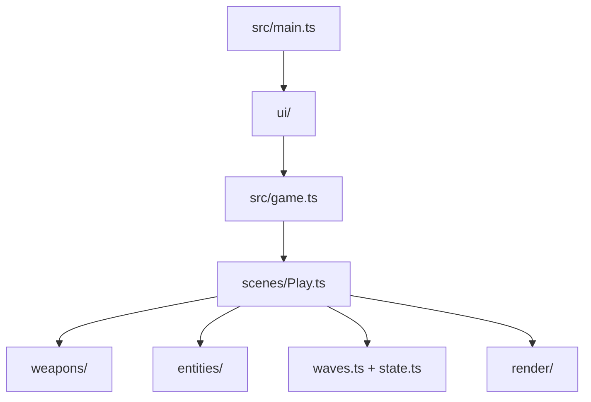

# AGENTS.md — __PROJECT_NAME__ arena shooter

This project is a playable ThreeNative arena shooter. The framework owns the loop, renderer,
input, physics binding, and React bridge. This generated repository owns the arena, weapons,
targets, waves, and every visual decision.

<!-- shared: framework-blocks-you -->
### Before you write a system, ask what already exists

You have `engine_search_capabilities` in your tool list. **Call it before writing any entity
system, movement system, pathfinding, attachment, audio bus, particle system, or measurement
helper** — describe the situation in plain words: *"enemy walks around a wall"*, *"put a weapon
in a character's hand"*, *"keep a character's feet on the floor"*.

The engine's public surface is about twenty classes across four packages, and several are
**subpath imports** like `@threenative/physics/navigation` that no amount of grepping this
project will reveal — nothing imports them yet. The tool is the only complete answer; this file
is a summary and always will be.

Treat the returned constraints as binding. For patrol, chase, obstacle-avoidance, or line-of-sight
movement, import `NavigationAgent3D` from exactly `@threenative/physics/navigation`;
`@threenative/physics` is not a valid import for that symbol. For a weapon held in a hand, import
and call `attachToBone` from `@threenative/core`; do not manually parent, position, or rotate the
rifle. If the stock visual has no skeleton, add a portable Three.js `Bone` named `RightHand`
under the character, then call the helper.

This is not a suggestion about tidiness. A previous game hand-wrote 446 lines of navigation and
bone attachment that were installed and importable at the time, and the hand-written grounding
that came with them ran the game at 9 FPS.

## When the framework blocks you, write plain Three.js

**First rule out your machine and your project**: when a build or a playtest fails for a reason that
is not your game code — a browser that will not launch, a blank screenshot, a device that will not
answer, an import that resolves to nothing — run `npx threenative doctor` and
`npx @threenative/playtest doctor`. They check the project and the machine and name the cause; only
after they come back clean is the framework itself the suspect.

**And when the game runs but looks wrong, ask it what it is:**

```sh
npx @threenative/playtest doctor --url http://127.0.0.1:5173 --text
```

One sample from the running game: how many entities exist and how many are visible, the world
extents they occupy, whether their scale is consistent with one unit being one metre, draw calls,
triangles, frame time and frame rate, the states and animation clips actually advancing, and the
console error count. It is the fastest way to tell "nothing is there" from "everything is there and
off-screen", or a stall from a scene that is simply drawing far too much. It reports only what the
bridge observes and names what it cannot see, so treat a missing line as unobserved, never as zero.

An API in `@threenative/*` that is broken, missing, or does not do what you need is **not
something to wait for or to work around from inside its shape.** Drop to vanilla Three.js —
or to the plain code that does the job — for that one thing and keep building. Your `src/`
is ordinary source; nothing in `@threenative/*` reads it, so a hand-written `THREE.*`
implementation sitting beside a framework API is a supported outcome, not a hack.

1. **Scope the fallback to what actually blocked you.** Keep the loop, scenes, input, entity
   registry and playtest bridge; replacing all of them because one node misbehaved costs far
   more than it saves.
2. **Keep the fallback portable.** Plain Three.js and plain math run on native. `document`,
   `window`, `localStorage`, dynamic `import()`, and a raw physics handle do not — reach for
   one of those and this part of the game is web-only from then on.
3. **Report what blocked you**: the API, what you expected, what happened, and what you
   wrote instead. That is how the gap gets fixed for the next game; a silent workaround
   leaves it in place.

Never contort the game to flatter the framework, and never stall on a framework bug. A
finished game carrying a plain Three.js patch beats a blocked one every time.

### Where the long recipes live

This file and the sections around it are the mandatory inline instructions: the first-use
capability search, the fallback rules, the platform constraints, and the fail-closed playtest
rules. The step-by-step recipes are separate searchable pages shipped into this project under
`agent-docs/` — open the one a pointer names when you need it:

- `agent-docs/finding-assets.md` — the full asset-MCP loop: sources, licenses, downloads, ZIPs.
- `agent-docs/sculpt-from-a-reference.md` — the sculpt gate loop and branch definitions.
- `agent-docs/capture-the-frame.md` — how to screenshot a WebGPU game that actually renders.
- `agent-docs/ctx-cookbook.md` — `ctx.raycast()`, scene rebuild, and seeded-randomness recipes.
- `agent-docs/gameplay-recipes.md` — movement mapping, gamepad bindings, physics-step timing.
- `agent-docs/visual-baseline.md` — the `src/render/` per-file baseline and its traps.
<!-- /shared -->

## Commands

```sh
pnpm dev
pnpm build
pnpm build --target desktop
pnpm test
pnpm typecheck
```

The portable entry is `src/game.ts`; `src/main.ts` is the web-only React mount. The native
bundle does not run React, access the DOM, or load WASM. Keep gameplay in `src/`, and keep
the look in `src/render/`.

## Game contract

- Clear five waves to win.
- Reach zero lives to fail.
- `F` fires the hitscan weapon; `G` fires the projectile weapon.
- `E` tests the radius blast; `C` tests the wall probe.
- `H` takes damage and `X` takes a lethal hit so the loop is easy to playtest.
- `WASD` or the arrow keys move; `R` restarts the arena.

Hitscan, radius damage, and target scans use `ctx.physics.directSpaceState` from
`@threenative/physics`. Do not replace it with `ctx.raycast()`, a mesh raycaster, or a JavaScript
distance scan. The deferred `moveAndSlide(dt)` step-timing rule is in
`agent-docs/gameplay-recipes.md`.

**This template has one HUD, and it is `src/ui/Hud.tsx`.** It previously shipped a
camera-attached geometry HUD as well, and both drew the same numbers on top of each other: a blind
score of the first frame found the upper-left quarter unreadable, with the two sets of glyphs
interleaved letter by letter. Gameplay and state transitions live in the portable scene and reach
the HUD through `ctx.state.set`, so nothing about that is web-only. **A native build therefore has
no HUD until you add one** — write it in your own `src/render/` code, in Three.js rather than DOM,
if your game needs one there.

The state bridge flushes every 100 ms by default, so keep values a human reads — lives, wave, or
health — in `ctx.state`. Per-frame visual feedback belongs in scene-owned Three.js objects; anything
shorter than about 100 ms must not go through React. If an event must appear in the HUD, give it a
decay longer than one flush interval.

## Layout



Edit `src/weapons/` first when changing how the game already plays. Edit `src/render/` when
changing what the screenshot shows. Keep `playtests/` honest: every scenario must observe a
quantity or transition produced by the game.

`playtests/survives.playtest.json` is the durable smoke proof. Keep it when replacing the
shooter gameplay; `shooter.playtest.json` and `fail.playtest.json` are examples for this arena's
combat and terminal behavior.

<!-- shared: playtest-fail-closed -->
## Playtests fail closed

A scenario fails closed: a missing entity, an absent observation, or a scenario with no
assertions is a failure, never a quiet pass. When you add a feature, add the assertion that
would catch its absence, and run the scenario before reporting the feature works.

Every `allowTrivial` waiver must be a reason string with at least 20 non-whitespace characters
explaining why the initial value is intentionally held; `allowTrivial: true` is invalid. A
scenario whose every triviality-eligible assertion is waived fails with
`TN_PLAYTEST_SCENARIO_ASSERTS_NOTHING`, so keep an independent assertion in the scenario.

Steps count fixed-step ticks, not milliseconds — use `holdTicks` and `waitTicks`. The deprecated
`holdFrames` and `waitFrames` aliases remain accepted for compatibility and are treated as ticks
on a fixed-step bridge; `warmupFrames` remains a genuine requestAnimationFrame warmup.

The assertion vocabulary — every kind the validator accepts, its fields, and when to reach for
it — is generated into `agent-docs/assertion-reference.md`; open it before inventing a new
assertion shape. To probe a running game by hand, every bridge global and its shape is
documented in `agent-docs/debug-surface.md`.

The bridge registers exactly one resource id for the JSON-safe game state: `state`; resource
paths address fields from `ctx.state`. (`GameState` is a deprecated compatibility alias kept
until published scenarios migrate.)
<!-- /shared -->

<!-- shared: asset-mcp-loop -->
## Finding assets — you have an MCP server for this

**Reach for it when the asset is conventional; build anything custom yourself.** Textures,
materials, HDRIs, sound effects, and conventional models (a car, a crate, a tree) come from the
tools; anything specific to this game is written in `src/render/` — a downloaded model standing
in for a bespoke design reads as a weird asset dropped into the scene. When in doubt, build it
programmatically.

Installing `@threenative/core` writes the `.mcp.json` that launches `threenative-asset-mcp`, so
your host lists its tools alongside your own. Your host reads that file from the directory it was
launched in: start the session in this project, not in a parent of it. The loop:

1. `asset_search_sources` first, never a provider — its output is the authority on what is
   reachable.
2. `polyhaven_search_assets`, `ambientcg_search_assets`, or `audio_search_assets` to find
   candidates.
3. `polyhaven_list_files` / `ambientcg_list_files` **before downloading** — read licenses and
   pick a sane resolution there (a game does not need the 16k).
4. `asset_download_file` / `audio_download_asset` with `acceptLicense: true`; they write where
   `.mcp.json` points, never where you pass a path.
5. Append file, source, license and URL to `CREDITS.md` before the turn ends.

**Never state a license you did not read off a tool result.**

The full loop — ZIP unpacking rules, the two argument shapes that bite, and the narrower
marketplace tools — is `agent-docs/finding-assets.md`.
<!-- /shared -->

<!-- shared: sculpt-loop -->
## Building what you cannot download — sculpt from a reference

Choose one branch before writing code: conventional and downloadable — use the asset tools;
trivial (a platform, a wall) — write it, `BoxGeometry` under 20 lines is the answer; bespoke
with a reference image — the sculpt tools below; bespoke without one — ask for it, never
invent a reference.

`.mcp.json` launches `threenative-sculpt-mcp`; it does not ship runtime code, it guides the
source you write: plan with `sculpt_plan`, loop on `sculpt_spec_gate` until every named region
passes **before writing geometry**, write one factory per pass in `src/render/`, prove each
pass with `sculpt_compare` plus `sculpt_pass_gate` against a real captured frame (the sculpt
server never launches a browser), and pull technique topics from `sculpt_grimoire`.

A missing or blank capture is a failed run, never a finished model. Add the reference image,
its creator, license, and source URL to `CREDITS.md` before the turn ends. The branch
definitions and environment-splitting guidance are `agent-docs/sculpt-from-a-reference.md`.
<!-- /shared -->

<!-- shared: look-at-it-and-budget-the-look -->
## Budget real time for the look

Read this as an instruction about **where your effort goes**, not as a style tip.

Every automated gate in this project — `typecheck`, `lint`, `pnpm test`, every playtest
scenario — is blind to how the game looks. All of them pass on a game that is grey boxes on
a black screen. So: **a feature is not done when its assertion passes. It is done when you
have looked at it and it reads well.** Plan for roughly as much work on presentation as on
mechanics; it is the majority of what a player experiences and the part nothing else catches.

Before calling anything a player sees done: look at it (a screenshot you actually open, not
your own diff); break up silhouettes; give it depth with contact shadows and rim; make it move;
finish the HUD.

Get eyes on it in rough order of preference: browser automation against the user's real Chrome — Claude in Chrome or an equivalent MCP browser tool, which runs on a real GPU; then
`npx @threenative/playtest <scenario> --browser-recipe webgpu --headed` (the recipe carries the
Chromium flags WebGPU needs including `--enable-features=Vulkan`; without it Chromium serves
SwiftShader and the runner fails the run with `TN_PLAYTEST_SOFTWARE_ADAPTER`); then ask the
user to look, saying what to check.

**Do not use `xvfb-run`:** its failing cleanup kill replaces the real exit status. And
**headless Chromium usually cannot render WebGPU** — if a screenshot comes back black or empty,
suspect the capture before you rewrite the scene.

The capture recipes, virtual-display setup, and the silhouette checklist are
`agent-docs/capture-the-frame.md`. When you think you are done: *would a player screenshot
this?* If no, you are not finished.
<!-- /shared -->

<!-- shared: ctx-surface -->
## The `ctx` surface — you already have these, do not rebuild them

`ctx` carries six things that get reimplemented by hand in almost every project, because
they are **properties on `ctx`, never imports** — grepping an existing file's imports will
never surface them. This table covers only the `ctx` properties; call
`engine_search_capabilities` for imports. The recipes behind this table live in
`agent-docs/ctx-cookbook.md`.

| You already have | Rather than | Signature |
|---|---|---|
| `ctx.goto("<scene-name>")` | a hand-written `#reset()` | `(name: string) => Promise<void>` |
| `ctx.tween(obj, { y: 2 }, 0.4)` | a `Math.sin` / `lerp` accumulator | `(target, props, seconds) => Promise<void>` |
| `ctx.after(0.8, fn)` | `elapsed += dt; if (elapsed > 0.8)` | `(seconds, cb) => ScheduleHandle` |
| `ctx.every(fn)` | a per-frame branch in `update` | `(cb: (dt: number) => void) => ScheduleHandle` |
| `ctx.random.range(-1, 1)` | `Math.random()` | deterministic when `seed` is configured; otherwise `Math.random()` |
| `ctx.raycast()` / `ctx.raycastAll()` | `new Raycaster()` + `intersectObject(s)` | `(options?: { screen?, origin?, direction?, far?, targets?, exclude? }) => Intersection \| undefined` / `readonly Intersection[]` |

Three rules are load-bearing enough to stay here:

- **`ctx.goto(name)` rebuilds the scene without resetting game state.** Values in `ctx.state`
  survive the rebuild; reset your own state explicitly when death-and-retry should start
  fresh:

```ts
if (player.dead) {
  ctx.state.set({ /* copy this game's initial-state shape */ });
  ctx.state.flush();
  void ctx.goto("<scene-name>");
  return;
}
```

- **One rule when calling it from a frame function: `goto` and then `return`, immediately.**
  Everything after the call runs against a torn-down scene.
- From React, `game.goto("<scene-name>")` also rebuilds the scene, but it resets the game's state
  to its declared initial state first — that is the full restart button; `ctx.goto()` is for
  preserving game state across the rebuild.

**`ctx.random` is deterministic only when `defineGame({ seed })` is configured.** Never use
`Math.random()` for a value the scenario must reproduce.
<!-- /shared -->


## Engine capabilities — use the convention before writing a replacement

These public class and function exports are the discoverability index for imports. The `ctx`
conveniences are documented separately; this index covers the public exports scanned from
`@threenative/core` and `@threenative/physics`.

| Import surface | Public class/function exports |
|---|---|
| `@threenative/core` | `AnimationPlayer`, `AudioBus`, `CanvasLayer`, `createRandom`, `defineGame`, `getPlatform`, `GPUParticles3D`, `GroundSnap`, `isMobile`, `isNative`, `isTouchscreenAvailable`, `isWeb`, `measureThreePose`, `parseReplayRecording`, `posedBounds`, `PathFollow3D`, `ScenePicker`, `createReplayDriver`, `replay`, `Scheduler`, `Scene`, `prewarm`, `normaliseToMetres`, `attachToBone`, `skeletonBones`, `softCircleDataTexture`, `TracerPool3D` |
| `@threenative/core/playtest` | `playtest` |
| `@threenative/core/hot` | `acceptHotUpdate` |
| `@threenative/physics` | `Area3D`, `CharacterBody3D`, `CollisionShape3D`, `Joint3D`, `PhysicsDirectSpaceState3D`, `interactionGroups`, `RigidBody3D`, `rapier` |
| `@threenative/physics/navigation` | `recast`, `NavigationAgent3D`, `NavigationObstacle3D`, `NavigationRegion3D` |

`@threenative/physics/navigation` carries WASM and is browser-only under the current native
portability rule; do not import it in a portable game. For browser-only games, navigation agents
calculate a path but never move your object: write the steering velocity and call
`CharacterBody3D.moveAndSlide()`. A `NavigationRegion3D` is static and must be baked from the
world geometry; changing geometry needs an explicit re-bake. `GroundSnap` keeps `clearance`
truthful when `enabled = false`, `normaliseToMetres` measures a skinned crown for height, and
`prewarm` keeps transient meshes renderable with zero opacity so the first-use frame is not a stall.
