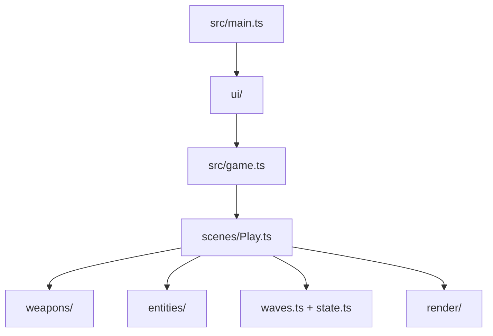

# AGENTS.md — __PROJECT_NAME__ arena shooter

This project is a playable ThreeNative arena shooter. The framework owns the loop, renderer,
input, physics binding, and React bridge. This generated repository owns the arena, weapons,
targets, waves, and every visual decision.

## When the framework blocks you, write plain Three.js

An API in `@threenative/*` that is broken, missing, or does not do what you need is **not
something to wait for or to work around from inside its shape.** Drop to vanilla Three.js —
or to the plain code that does the job — for that one thing and keep building. Your `src/`
is ordinary source; nothing in `@threenative/*` reads it, so a hand-written `THREE.*`
implementation sitting beside a framework API is a supported outcome, not a hack.

1. **Scope the fallback to what actually blocked you.** Keep the loop, scenes, input, entity
   registry and playtest bridge; replacing all of them because one node misbehaved costs far
   more than it saves.
2. **Keep the fallback portable.** Plain Three.js and plain math run on native. `document`,
   `window`, `localStorage`, dynamic `import()`, and a raw physics handle do not — reach for
   one of those and this part of the game is web-only from then on.
3. **Report what blocked you**: the API, what you expected, what happened, and what you
   wrote instead. That is how the gap gets fixed for the next game; a silent workaround
   leaves it in place.

Never contort the game to flatter the framework, and never stall on a framework bug. A
finished game carrying a plain Three.js patch beats a blocked one every time.

## Commands

```sh
pnpm dev
pnpm build
pnpm build --target desktop
pnpm test
pnpm typecheck
```

The portable entry is `src/game.ts`; `src/main.ts` is the web-only React mount. The native
bundle does not run React, access the DOM, or load WASM. Keep gameplay in `src/`, and keep
the look in `src/render/`.

## Game contract

- Clear five waves to win.
- Reach zero lives to fail.
- `F` fires the hitscan weapon; `G` fires the projectile weapon.
- `E` tests the radius blast; `C` tests the wall probe.
- `H` takes damage and `X` takes a lethal hit so the loop is easy to playtest.
- `WASD` or the arrow keys move; `R` restarts the arena.

Hitscan, radius damage, and target scans use `ctx.physics.directSpaceState` from
`@threenative/physics`. Do not replace it with `ctx.raycast()`, a mesh raycaster, or a JavaScript
distance scan. `CharacterBody3D.moveAndSlide(dt)` queues motion for the shared bulk physics step
rather than moving its object immediately. Because `THREE.Vector3` is mutable, use
`const before = mesh.position.clone()` (or copy its `x`, `y`, and `z` scalars) before the call,
then compare `mesh.position.distanceTo(before)` on the next update, after the step. Storing
`mesh.position` itself aliases the live transform and reports zero.

**This template has one HUD, and it is `src/ui/Hud.tsx`.** It previously shipped a
camera-attached geometry HUD as well, and both drew the same numbers on top of each other: a blind
score of the first frame found the upper-left quarter unreadable, with the two sets of glyphs
interleaved letter by letter. Gameplay and state transitions live in the portable scene and reach
the HUD through `ctx.state.set`, so nothing about that is web-only. **A native build therefore has
no HUD until you add one** — write it in your own `src/render/` code, in Three.js rather than DOM,
if your game needs one there.

The state bridge flushes every 100 ms by default, so keep values a human reads — lives, wave, or
health — in `ctx.state`. Per-frame visual feedback belongs in scene-owned Three.js objects; anything
shorter than about 100 ms must not go through React. If an event must appear in the HUD, give it a
decay longer than one flush interval.

## Layout



Edit `src/weapons/` first when changing how the game already plays. Edit `src/render/` when
changing what the screenshot shows. Keep `playtests/` honest: every scenario must observe a
quantity or transition produced by the game.

`playtests/survives.playtest.json` is the durable smoke proof. Keep it when replacing the
shooter gameplay; `shooter.playtest.json` and `fail.playtest.json` are examples for this arena's
combat and terminal behavior.

## Playtest resources

The playtest bridge registers exactly two resource ids for the JSON-safe game state: `state` is the
canonical id, and `GameState` is a compatibility alias for older scenarios. New scenarios,
including the ones shipped here, must use `state`; resource paths address fields from `ctx.state`.
Keep the alias until existing published scenarios have migrated, then remove it in a future
breaking release.

The asset MCP loop is:

1. `asset_search_sources`
2. `ambientcg_search_assets` / `polyhaven_search_assets` / `audio_search_assets`
3. `ambientcg_list_files` / `polyhaven_list_files`
4. `asset_download_file` / `audio_download_asset`
5. Check returned license and attribution fields before committing an asset.
