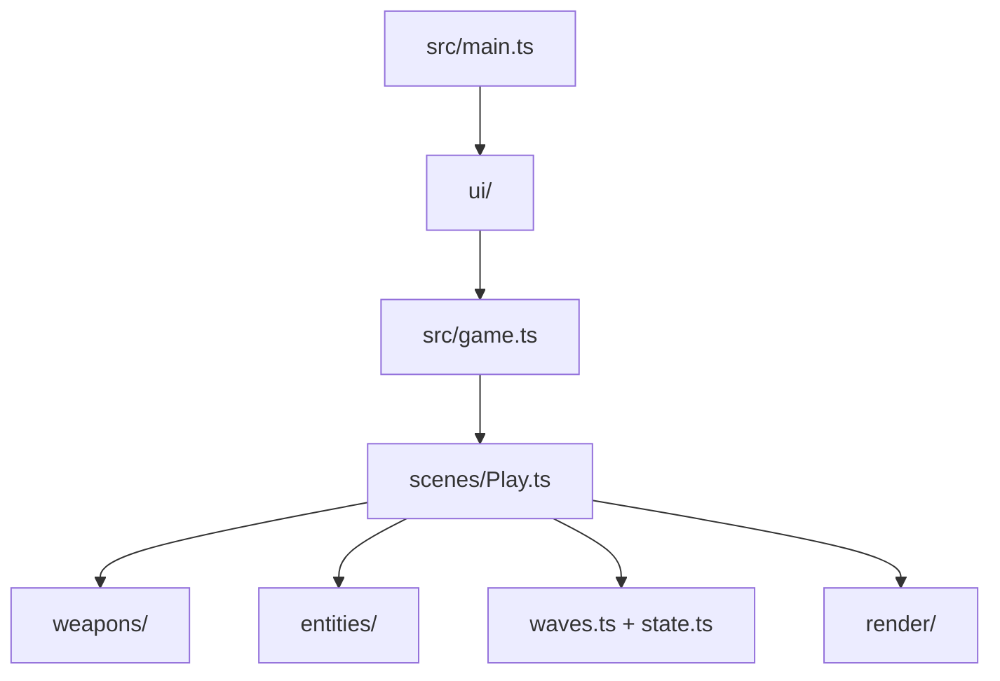

# AGENTS.md — __PROJECT_NAME__ arena shooter

This project is a playable ThreeNative arena shooter. The framework owns the loop, renderer,
input, physics binding, and React bridge. This generated repository owns the arena, weapons,
targets, waves, and every visual decision.

## Commands

```sh
pnpm dev
pnpm build
pnpm build --target desktop
pnpm test
pnpm typecheck
```

The portable entry is `src/game.ts`; `src/main.ts` is the web-only React mount. The native
bundle does not run React, access the DOM, or load WASM. Keep gameplay in `src/`, and keep
the look in `src/render/`.

## Game contract

- Clear five waves to win.
- Reach zero lives to fail.
- `F` fires the hitscan weapon; `G` fires the projectile weapon.
- `E` tests the radius blast; `C` tests the wall probe.
- `H` takes damage and `X` takes a lethal hit so the loop is easy to playtest.
- `WASD` or the arrow keys move; `R` restarts the arena.

Hitscan, radius damage, and target scans use `ctx.physics.directSpaceState` from
`@threenative/physics`. Do not replace it with `ctx.raycast()`, a mesh raycaster, or a JavaScript
distance scan. `CharacterBody3D.moveAndSlide()` owns movement and gravity.

The geometry HUD in `src/render/hud.ts` follows the game onto desktop and mobile. React in
`src/ui/` is a richer web convenience, not a gameplay dependency.

## Layout



Edit `src/weapons/` first when changing how the game already plays. Edit `src/render/` when
changing what the screenshot shows. Keep `playtests/` honest: every scenario must observe a
quantity or transition produced by the game.

`playtests/survives.playtest.json` is the durable smoke proof. Keep it when replacing the
shooter gameplay; `shooter.playtest.json` and `fail.playtest.json` are examples for this arena's
combat and terminal behavior.

The asset MCP loop is:

1. `asset_search_sources`
2. `ambientcg_search_assets` / `polyhaven_search_assets` / `audio_search_assets`
3. `ambientcg_list_files` / `polyhaven_list_files`
4. `asset_download_file` / `audio_download_asset`
5. Check returned license and attribution fields before committing an asset.
