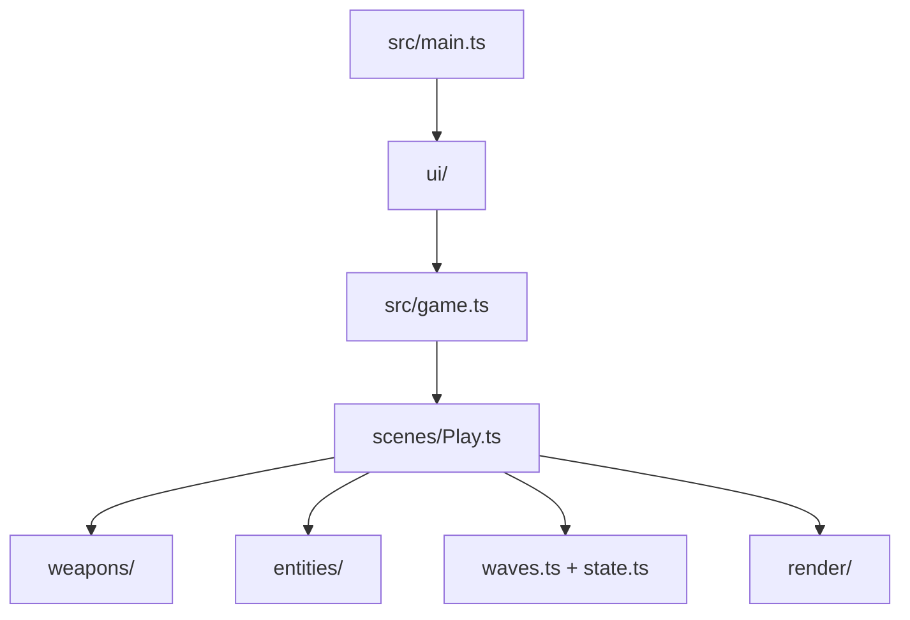

<!-- Generated mirror of AGENTS.md. Do not edit; edit AGENTS.md. -->

# AGENTS.md — __PROJECT_NAME__ arena shooter

## Native React layout — complete subset

Use `View` and `Text` from `@threenative/core/react`; `react-dom` stays web-only. Units are pixels;
children are absolute unless `direction` is `row` or `column`. The complete keys are `left`,
`right`, `top`, `bottom`, `centerX`, `centerY`, `width`, `height`, `padding`, `direction`, `gap`,
`align`, `background`, `color`, `opacity`, `fontSize`, `letterSpacing`, `textAlign`, and `zIndex`.
Unknown keys/glyphs throw. CSS, Tailwind, flex grow/wrap, borders, radius, transforms, images, SVG,
and events do not exist natively. Share components/state; keep appearance in `src/ui/` adapters.

This project is a playable ThreeNative arena shooter. The framework owns the loop, renderer,
input, physics binding, and React bridge. This generated repository owns the arena, weapons,
targets, waves, and every visual decision.

`threenative.config.ts` is the one game-owned app-shape file. Set the launcher identity and
`public/icon.png`, mobile orientation and display flags, desktop window, renderer preference, and
portable native entry there. `package.json` may retain only `threenative.nativeEntry` as a
compatibility fallback for older projects.

<!-- shared: framework-blocks-you -->
### Before you write a system, ask what already exists

You have `engine_search_capabilities`. Discovery is required before planning:

1. Infer concrete mechanics from the request: world, traversal, interaction, simulation, combat,
   camera, audio, and UI. Preserve its distinctive fantasy with the smallest loop using its
   characteristic setting or traversal—not a generic game with themed props. Search implied
   mechanics even when the user omits engine terms. Ask one short question only when two core loops
   remain equally plausible.
2. Search the full mechanical request with `scope: "request"`, then every mechanic with
   `scope: "mechanic"`. Check each returned `matchedSituation`.
3. Before writing replacements, record a capability or no-match for every mechanic.

Repeat before writing entity, movement, navigation, attachment, audio, particle, simulation,
terrain, or measurement systems. Describe situations plainly: *"enemy walks around a wall"*.

The manifest is the complete public surface; grep misses unused subpath exports such as
`@threenative/physics/navigation`. If MCP is unavailable, run doctor and search
`agent-docs/capability-reference.md` per mechanic.

Constraints are binding. Import navigation symbols from the returned subpath. Use `attachToBone`
for held weapons; if needed, add a portable Three.js `Bone` named `RightHand` first. Capability
detail governs platform support: never invent limits it does not report. Reject only for a reported
constraint or a contract that does not fit.

This prevents reimplementing installed systems; one game did so in 446 lines and ran at 9 FPS.

## When the framework blocks you, write plain Three.js

For browser, blank-frame, device, or import failures, first run `npx threenative doctor` and
`npx @threenative/playtest doctor`. They separate project/machine failures from engine bugs. For a
running game that looks wrong, inspect it:

```sh
npx @threenative/playtest doctor --url http://127.0.0.1:5173 --text
```

This reports visibility, scale, draw cost, frame rate, advancing state, and errors. Missing output
means unobserved, never zero.

When an `@threenative/*` API is broken, missing, or does not do what you need, implement only that
piece with portable Three.js/plain code and continue:

1. Keep the existing loop, scenes, input, registry, and playtest bridge.
2. Avoid `document`, `window`, `localStorage`, dynamic `import()`, and raw physics handles.
3. **Report what blocked you**: API, expectation, result, and replacement.

Never stall on a framework bug.

### Where the long recipes live

Open the relevant shipped recipe when needed:

- `agent-docs/finding-assets.md` — asset search, licenses, downloads, and archives.
- `agent-docs/sculpt-from-a-reference.md` — sculpt gates and branches.
- `agent-docs/webview-ui.md` — UI state, intents, and hit regions.
- `agent-docs/capture-the-frame.md` — WebGPU screenshots.
- `agent-docs/ctx-cookbook.md` — raycasts, rebuilds, and seeded randomness.
- `agent-docs/gameplay-recipes.md` — movement, gamepads, and physics timing.
- `agent-docs/visual-baseline.md` — generated render-source conventions.
<!-- /shared -->

## Commands

```sh
pnpm dev
pnpm build
pnpm build --target desktop
pnpm test
pnpm typecheck
```

The portable entry is `src/game.ts`; `src/main.ts` is the web-only React mount. The native
bundle does not run React, access the DOM, or load WASM. Keep gameplay in `src/`, and keep
the look in `src/render/`.

`postprocessing.ts` builds a `WorldEnvironment`: which stages run, in what order, and an honest
report of what ran. It decides no colour and no strength — those are arguments in that file,
yours. `TN_WORLD_ENVIRONMENT` names every stage applied or refused **with a reason**, and an
unknown quality tier throws rather than becoming the default. SSGI and SSR ship desktop-on,
mobile-off; their cost and the one-line enable for godrays, contact AO and vignette are in
`agent-docs/visual-baseline.md`.

## Game contract

- Clear five waves to win.
- Reach zero lives to fail.
- `F` fires the hitscan weapon; `G` fires the projectile weapon.
- `E` tests the radius blast; `C` tests the wall probe.
- `H` takes damage and `X` takes a lethal hit so the loop is easy to playtest.
- `WASD` or the arrow keys move; `R` restarts the arena.

Hitscan, radius damage, and target scans use `ctx.physics.directSpaceState` from
`@threenative/physics`. Do not replace it with `ctx.raycast()`, a mesh raycaster, or a JavaScript
distance scan. The deferred `moveAndSlide(dt)` step-timing rule is in
`agent-docs/gameplay-recipes.md`.

**This template has one HUD, and it is `src/ui/Hud.tsx`.** It previously shipped a
camera-attached geometry HUD as well, and both drew the same numbers on top of each other: a blind
score of the first frame found the upper-left quarter unreadable, with the two sets of glyphs
interleaved letter by letter. Gameplay and state transitions live in the portable scene and reach
the HUD through `ctx.state.set`, so nothing about that is web-only. **A native build therefore has
no HUD until you add one** — write it in your own `src/render/` code, in Three.js rather than DOM,
if your game needs one there.

The state bridge flushes every 100 ms by default, so keep values a human reads — lives, wave, or
health — in `ctx.state`. Per-frame visual feedback belongs in scene-owned Three.js objects; anything
shorter than about 100 ms must not go through React. If an event must appear in the HUD, give it a
decay longer than one flush interval.

## Layout



Edit `src/weapons/` first when changing how the game already plays. Edit `src/render/` when
changing what the screenshot shows. Keep `playtests/` honest: every scenario must observe a
quantity or transition produced by the game.

`playtests/survives.playtest.json` is the durable smoke proof. Keep it when replacing the
shooter gameplay; `shooter.playtest.json` and `fail.playtest.json` are examples for this arena's
combat and terminal behavior.

<!-- shared: see-it-in-numbers -->
## See the game without looking at it

**The playtest harness is your eyes.** A screenshot tells you something looks wrong; it cannot
tell you by how much, and reading one costs far more than reading a number. Measure first. Look
last, and say that you are doing it.

Three tools, in the order you should reach for them:

```sh
# 1. What is actually running: entities, world extents, scale, draw cost, the clip each entity
#    plays, console errors. Run this before forming any theory about a game that looks wrong.
npx @threenative/playtest doctor --url http://127.0.0.1:5173 --text

# 2. What a scenario can assert: movement, visibility, animation, resources, render chain.
npx @threenative/playtest playtests/<name>.playtest.json --browser-recipe webgpu --headed
```

3. **A scene probe, when the question is "where is this relative to that".** `doctor` reports
   entities; it does not know that a keyboard belongs under a pair of hands, or that a camera has
   ended up inside a shoulder. Publish the answer from your own scene and read it from a script:

```ts
// in your scene, web only
if (isWeb()) {
  (globalThis as Record<string, unknown>).__probe = () => ({
    hand: worldPosition(character.getObjectByName("hand_r")),
    keyboard: worldPosition(desk.keyboard),
    // Derive the verdict here, not in the reader: a dump makes you do arithmetic, a check tells
    // you the answer.
    checks: [{ name: "hands-on-keys", ok: Math.abs(hand.y - keyboard.y) < 0.03 }],
  });
}
```

Then drive it with Playwright and print the checks. To tune a value — a bone axis, an offset, a
threshold — set it from a global, re-read the probe, and sweep: five candidates measured in one
run beats five screenshots and a guess. Turn whatever you learn into a playtest assertion so it
stays fixed.

A game whose geometry is only ever checked by eye regresses silently the first time nobody looks.
<!-- /shared -->

<!-- shared: playtest-fail-closed -->
## Playtests fail closed

A scenario fails closed: a missing entity, an absent observation, or a scenario with no
assertions is a failure, never a quiet pass. When you add a feature, add the assertion that
would catch its absence, and run the scenario before reporting the feature works.

Every `allowTrivial` waiver must be a reason string with at least 20 non-whitespace characters
explaining why the initial value is intentionally held; `allowTrivial: true` is invalid. A
scenario whose every triviality-eligible assertion is waived fails with
`TN_PLAYTEST_SCENARIO_ASSERTS_NOTHING`, so keep an independent assertion in the scenario.

Steps count fixed-step ticks, not milliseconds — use `holdTicks` and `waitTicks`. The deprecated
`holdFrames` and `waitFrames` aliases remain accepted for compatibility and are treated as ticks
on a fixed-step bridge; `warmupFrames` remains a genuine requestAnimationFrame warmup.

The assertion vocabulary — every kind the validator accepts, its fields, and when to reach for
it — is generated into `agent-docs/assertion-reference.md`; open it before inventing a new
assertion shape. To probe a running game by hand, every bridge global and its shape is
documented in `agent-docs/debug-surface.md`.

The bridge registers exactly one resource id for the JSON-safe game state: `state`; resource
paths address fields from `ctx.state`. (`GameState` is a deprecated compatibility alias kept
until published scenarios migrate.)
<!-- /shared -->

## Off-screen diffuse light

For light bouncing from a room I cannot see, construct `ProbeVolume` from `@threenative/core`
after the static geometry and lights exist. Add it with `ctx.add()`, request its bake on demand,
and pass `volume.sampleNode(positionWorld, normalWorld)` into a game-owned Three.js material
before the screen-space GI stage. The volume owns no light, material, colour, or falloff.

This is static-lighting-first, not fully dynamic GI: moving lights and relighting require another
explicit bake. `TN_PROBE_VOLUME` reports the unbaked/stale state, probe count, atlas bytes,
progress, and last render-phase bake cost; keep those measurements visible while tuning bounds,
density, and `bakeBudgetMs`.

<!-- shared: asset-mcp-loop -->
## Finding assets — you have an MCP server for this

**Reach for it when the asset is conventional; build anything custom yourself.** Textures,
materials, HDRIs, sound effects, and conventional models (a car, a crate, a tree) come from the
tools; anything specific to this game is written in `src/render/` — a downloaded model standing
in for a bespoke design reads as a weird asset dropped into the scene. When in doubt, build it
programmatically.

Installing `@threenative/core` writes the `.mcp.json` that launches `threenative-asset-mcp`, so
your host lists its tools alongside your own. Your host reads that file from the directory it was
launched in: start the session in this project, not in a parent of it. The loop:

1. `asset_search_sources` first, never a provider — its output is the authority on what is
   reachable.
2. `polyhaven_search_assets`, `ambientcg_search_assets`, or `audio_search_assets` to find
   candidates.
3. `polyhaven_list_files` / `ambientcg_list_files` **before downloading** — read licenses and
   pick a sane resolution there (a game does not need the 16k).
4. `asset_download_file` / `audio_download_asset` with `acceptLicense: true`; they write where
   `.mcp.json` points, never where you pass a path.
5. Append file, source, license and URL to `CREDITS.md` before the turn ends.

**Never state a license you did not read off a tool result.**

**Fab is two steps.** `fab_search_assets` finds a free listing, and `fab_list_owned` says what the
account already paid for — a free search never shows those. Then `fab_import_asset` converts it: it checks the
entitlement, downloads through the FabCLI session you established yourself, turns every static
mesh into a textured `.glb` under `assets/`, and returns the paths. It refuses anything but Fab
Standard or CC-BY, and it never logs in, claims, or buys. Most Fab listings are Unreal-only, so
without it a listing is a dead end. Full argument shapes: `agent-docs/finding-assets.md`.

The full loop — ZIP unpacking rules, the two argument shapes that bite, and the narrower
marketplace tools — is `agent-docs/finding-assets.md`.
<!-- /shared -->

<!-- shared: sculpt-loop -->
## Building what you cannot download — sculpt from a reference

Choose one branch before writing code: conventional and downloadable — use the asset tools;
trivial (a platform, a wall) — write it, `BoxGeometry` under 20 lines is the answer; bespoke
with a reference image — the sculpt tools below; bespoke without one — ask for it, never
invent a reference.

`.mcp.json` launches `threenative-sculpt-mcp`; it does not ship runtime code, it guides the
source you write: plan with `sculpt_plan`, loop on `sculpt_spec_gate` until every named region
passes **before writing geometry**, write one factory per pass in `src/render/`, prove each
pass with `sculpt_compare` plus `sculpt_pass_gate` against a real captured frame (the sculpt
server never launches a browser), and pull technique topics from `sculpt_grimoire`.

A missing or blank capture is a failed run, never a finished model. Add the reference image,
its creator, license, and source URL to `CREDITS.md` before the turn ends. The branch
definitions and environment-splitting guidance are `agent-docs/sculpt-from-a-reference.md`.
<!-- /shared -->

<!-- shared: look-at-it-and-budget-the-look -->
## Budget real time for the look

Read this as an instruction about **where your effort goes**, not as a style tip.

Every automated gate in this project — `typecheck`, `lint`, `pnpm test`, every playtest
scenario — is blind to how the game looks. All of them pass on a game that is grey boxes on
a black screen. So: **a feature is not done when its assertion passes. It is done when you
have looked at it and it reads well.** Plan for roughly as much work on presentation as on
mechanics; it is the majority of what a player experiences and the part nothing else catches.

Before calling anything a player sees done: look at it (a screenshot you actually open, not
your own diff); break up silhouettes; give it depth with contact shadows and rim; make it move;
finish the HUD.

Get eyes on it in rough order of preference: browser automation against the user's real Chrome — Claude in Chrome or an equivalent MCP browser tool, which runs on a real GPU; then
`npx @threenative/playtest <scenario> --browser-recipe webgpu --headed` (the recipe carries the
Chromium flags WebGPU needs including `--enable-features=Vulkan`; without it Chromium serves
SwiftShader and the runner fails the run with `TN_PLAYTEST_SOFTWARE_ADAPTER`); then ask the
user to look, saying what to check.

**Do not use `xvfb-run`:** its failing cleanup kill replaces the real exit status. And
**headless Chromium usually cannot render WebGPU** — if a screenshot comes back black or empty,
suspect the capture before you rewrite the scene.

**Matching a reference is a lighting problem first.** Bounce light, contact occlusion,
reflections and light shafts are already wired in `src/render/postprocessing.ts`; search
`engine_search_capabilities` before building one by hand, and read `TN_RENDER_CHAIN`, which names
each stage applied or refused with a reason. Dials: `agent-docs/visual-baseline.md`.

The capture recipes, virtual-display setup, and the silhouette checklist are
`agent-docs/capture-the-frame.md`. When you think you are done: *would a player screenshot
this?* If no, you are not finished.
<!-- /shared -->

<!-- shared: ctx-surface -->
## The `ctx` surface — you already have these, do not rebuild them

`ctx` carries seven things that get reimplemented by hand in almost every project, because
they are **properties on `ctx`, never imports** — grepping an existing file's imports will
never surface them. This table covers only the `ctx` properties; call
`engine_search_capabilities` for imports. The recipes behind this table live in
`agent-docs/ctx-cookbook.md`.

| You already have | Rather than | Signature |
|---|---|---|
| `ctx.goto("<scene-name>")` | a hand-written `#reset()` | `(name: string) => Promise<void>` |
| `ctx.tween(obj, { y: 2 }, 0.4, { ease: ... })` | a `Math.sin` / `lerp` accumulator | `(target, props, seconds, options?: { ease?: (progress: number) => number }) => Promise<void>`; `ease` receives progress 0–1 and returns the interpolation factor |
| `ctx.after(0.8, fn)` | `elapsed += dt; if (elapsed > 0.8)` | `(seconds, cb) => ScheduleHandle` |
| `ctx.every(fn)` | a per-frame branch in `update` | `(cb: (dt: number) => void) => ScheduleHandle` |
| `ctx.random.range(-1, 1)` | `Math.random()` | deterministic when `seed` is configured; otherwise `Math.random()` |
| `ctx.pointer.on(...)` / `ctx.pointer.drag(...)` | hand-written hover, press, tap, and drag state | `(object, type, listener) => disposer` / `(object) => IPointerDragHandle` |
| `ctx.raycast()` / `ctx.raycastAll()` | `new Raycaster()` + `intersectObject(s)` | `(options?: { screen?, origin?, direction?, far?, targets?, exclude? }) => Intersection \| undefined` / `readonly Intersection[]` |

`ctx.pointer` dispatches `pointerEntered`, `pointerExited`, `pointerPressed`, `pointerReleased`,
`tapped`, `dragStarted`, `dragged`, and `dragEnded` from the same pointer-id stream on web and
native. Register a mesh or model root; only registered objects are raycast, and events bubble
through the parent chain.

Three rules are load-bearing enough to stay here:

- **`ctx.goto(name)` rebuilds the scene without resetting game state.** Values in `ctx.state`
  survive the rebuild; reset your own state explicitly when death-and-retry should start
  fresh:

```ts
if (player.dead) {
  ctx.state.set({ /* copy this game's initial-state shape */ });
  ctx.state.flush();
  void ctx.goto("<scene-name>");
  return;
}
```

- **One rule when calling it from a frame function: `goto` and then `return`, immediately.**
  Everything after the call runs against a torn-down scene.
- From React, `game.goto("<scene-name>")` also rebuilds the scene, but it resets the game's state
  to its declared initial state first — that is the full restart button; `ctx.goto()` is for
  preserving game state across the rebuild.

**`ctx.random` is deterministic only when `defineGame({ seed })` is configured.** Never use
`Math.random()` for a value the scenario must reproduce.

<!-- generated: superseded-constructs -->

**Reinvention fails CI.** `pnpm budgets` scans this project's `src/` for these raw
constructs and fails, naming the capability instead. The list and the gate are generated
from the capabilities' own doc tags, so they cannot disagree:

| Rather than write | Use instead | Import from |
|---|---|---|
| `new Audio(` | `AudioBus` | `@threenative/core` |
| `Math.random(` | `createRandom` | `@threenative/core` |
| `new Box3().setFromObject(` | `normaliseToMetres` | `@threenative/core` |
| `.visible = false` | `prewarm` | `@threenative/core` |
| `new Raycaster(` | `ScenePicker` | `@threenative/core` |

When the raw construct is genuinely right, annotate that exact line with a non-empty
reason — a bare `// engine-override:` still fails:

```ts
const bounds = new Box3().setFromObject(viewmodel); // engine-override: measuring, not scaling
```

<!-- /generated -->
<!-- /shared -->


## Engine capabilities — look it up before writing a replacement

<!-- shared: engine-capabilities -->
Use `engine_search_capabilities("pool decals on surfaces")`; plain situations and complete game
requests both work. If the MCP server is unavailable after `npx threenative doctor`, use the
generated `agent-docs/capability-reference.md` and repeat the same full-request plus per-mechanic
search pass manually. Grepping existing imports is never capability discovery.
<!-- /shared -->


`@threenative/physics/navigation` carries WASM and is browser-only under the current native
portability rule; do not import it in a portable game. For browser-only games, navigation agents
calculate a path but never move your object: write the steering velocity and call
`CharacterBody3D.moveAndSlide()`. A `NavigationRegion3D` is static and must be baked from the
world geometry; changing geometry needs an explicit re-bake. `GroundSnap` keeps `clearance`
truthful when `enabled = false`, `normaliseToMetres` measures a skinned crown for height, and
`prewarm` keeps transient meshes renderable with zero opacity so the first-use frame is not a stall.
`AnimationPlayer` matches a travelling clip's rate to the ground covered, so feet never skate;
`strideRoot` names the moved body and `strideSync: false` overrides while `stride` still reports.

<!-- shared: pixel-budget -->
## The pixel budget is the engine's

`renderer.resolutionScale: "auto"` ships on. The engine scales the **3D drawing buffer only** —
never CSS, UI, camera or aspect — to hold `display.maxFps`. A Pixel 8 hands three.js 2400×1080 as
CSS pixels: 2.592 Mpx at a measured 9.94 ms/Mpx. Never hand-author that constant.

```ts
renderer: { resolutionScale: "auto", antialias: true,
  android: { resolutionScale: 0.44, antialias: false } },
```

A number in `(0, 1]` pins it and stops the loop; `0`, negatives, `> 1` and `NaN` are refused by
name at config load, not at frame time. Pinning never stops the measurement: every
`TN_FRAME_BUDGET` window carries
`surface: { resolutionScale, scaleSource, sampleCount, drawingBufferWidth, drawingBufferHeight }`
in both modes, and `perf --text` prints it beside the fps. `scaleSource` is `pinned`, `auto`, or
`auto-pinned` (chose, then held rather than pump visibly); at the floor and still over budget it
reports `atFloor` instead of implying the budget was met. `antialias` overrides per-platform on
the same seam — a scaled buffer is upscaled, magnifying every aliased edge. Pass
`display: config.display` into `defineGame`, or the scaler assumes 60.
<!-- /shared -->

<!-- shared: performance-default -->
# Lightmaps

`assets.models.lightmap:{atlasSize,padding}` bakes static GLBs; load via `ctx.assets.model()`.
Remove it to roll back. Android/iOS reject KTX2; never claim them from web/desktop proof.

## Performance targets

Refill scratch; pool objects.

`TN_FRAME_BUDGET` reports `fps`/`hostGap`/`update`/`render`/`overlay`/`residual`;
`defineGame({ frameBudget: false })` silences output, never measurement.

Unexecuted platforms stay unverified; never-invent-numbers. Withdraw thermally-confounded Tiers 1–3 comparisons; always report Tier 4.

|Tier|Measure|Floor|Target|
|---|---|---:|---:|
|1|Starter/browser-desktop|60fps|display-refresh|
|1|Starter/browser-Android|30fps|58fps|
|1|Starter/native-desktop|60fps|display-refresh|
|1|Starter/native-Android|55fps|58fps|
|1|Starter/native-iOS|unverified|no-number|
|1|All-platform/hostGap-p95|—|≤4ms|
|1|All-platform/update-p95|—|≤2ms|
|1|All-platform/residual-p95|—|≤0.5ms|
|1|All-platform/overlay-p95|—|≤1ms|
|2|Same-device-fps-parity|.85|.95|
|2|Inverted-render-p95-parity|.80|.95|
|3|Light|55fps|58fps|
|3|Medium|30fps|58fps|
|3|Heavy|30fps|58fps|
|4|Sustained-duration|10min|10min|
|4|Final/opening-fps|.75|.90|
|4|Last-minute-heavy|25fps|50fps|
|4|Peak-battery-temperature|≤45C|≤40C|
|4|Thermal-status|≤2|≤1|
|4|Whole-device-current|—|report;not-gated|

`{"performance":{"maxFrameMsP95":33,"minFps":30,"maxPhaseMsP95":{"render":12}}}`
`agent-docs/assertion-reference.md#performance`

Pixel-8-memory: ~500MiB-driver-floor; dual-use-equirect adds-48MiB. Fix:
`agent-docs/mobile-memory-budget.md`.
<!-- /shared -->
