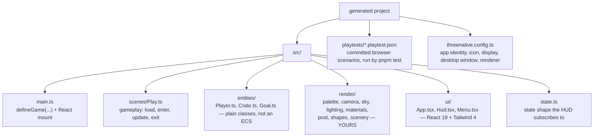

# AGENTS.md — __PROJECT_NAME__

Instructions for the AI agent working in this game. This project was scaffolded with
`create-threenative`. `CLAUDE.md` is a copy of this file; edit this one.

## What the framework owns, and what you own

ThreeNative owns the plumbing: renderer bootstrap and WebGPU fallback, the fixed-step loop,
scene lifecycle, input mapping, asset loading, the physics binding, and the state bridge to
React.

**You own everything a player sees.** `src/render/`, `src/entities/`, `src/scenes/`, and
`src/ui/` are ordinary code in this repository. Nothing in `@threenative/*` reads them.
Rewrite or delete any of it.

<!-- shared: framework-blocks-you -->
### Before you write a system, ask what already exists

You have `engine_search_capabilities` in your tool list. **Call it before writing any entity
system, movement system, pathfinding, attachment, audio bus, particle system, or measurement
helper** — describe the situation in plain words: *"enemy walks around a wall"*, *"put a weapon
in a character's hand"*, *"keep a character's feet on the floor"*.

The engine's public surface is about twenty classes across four packages, and several are
**subpath imports** like `@threenative/physics/navigation` that no amount of grepping this
project will reveal — nothing imports them yet. The tool is the only complete answer; this file
is a summary and always will be.

Treat the returned constraints as binding. For patrol, chase, obstacle-avoidance, or line-of-sight
movement, import `NavigationAgent3D` from exactly `@threenative/physics/navigation`;
`@threenative/physics` is not a valid import for that symbol. For a weapon held in a hand, import
and call `attachToBone` from `@threenative/core`; do not manually parent, position, or rotate the
rifle. If the stock visual has no skeleton, add a portable Three.js `Bone` named `RightHand`
under the character, then call the helper.

This is not a suggestion about tidiness. A previous game hand-wrote 446 lines of navigation and
bone attachment that were installed and importable at the time, and the hand-written grounding
that came with them ran the game at 9 FPS.

## When the framework blocks you, write plain Three.js

**First rule out your machine and your project**: when a build or a playtest fails for a reason that
is not your game code — a browser that will not launch, a blank screenshot, a device that will not
answer, an import that resolves to nothing — run `npx threenative doctor` and
`npx @threenative/playtest doctor`. They check the project and the machine and name the cause; only
after they come back clean is the framework itself the suspect.

**And when the game runs but looks wrong, ask it what it is:**

```sh
npx @threenative/playtest doctor --url http://127.0.0.1:5173 --text
```

One sample from the running game: how many entities exist and how many are visible, the world
extents they occupy, whether their scale is consistent with one unit being one metre, draw calls,
triangles, frame time and frame rate, the states and animation clips actually advancing, and the
console error count. It is the fastest way to tell "nothing is there" from "everything is there and
off-screen", or a stall from a scene that is simply drawing far too much. It reports only what the
bridge observes and names what it cannot see, so treat a missing line as unobserved, never as zero.

An API in `@threenative/*` that is broken, missing, or does not do what you need is **not
something to wait for or to work around from inside its shape.** Drop to vanilla Three.js —
or to the plain code that does the job — for that one thing and keep building. Your `src/`
is ordinary source; nothing in `@threenative/*` reads it, so a hand-written `THREE.*`
implementation sitting beside a framework API is a supported outcome, not a hack.

1. **Scope the fallback to what actually blocked you.** Keep the loop, scenes, input, entity
   registry and playtest bridge; replacing all of them because one node misbehaved costs far
   more than it saves.
2. **Keep the fallback portable.** Plain Three.js and plain math run on native. `document`,
   `window`, `localStorage`, dynamic `import()`, and a raw physics handle do not — reach for
   one of those and this part of the game is web-only from then on.
3. **Report what blocked you**: the API, what you expected, what happened, and what you
   wrote instead. That is how the gap gets fixed for the next game; a silent workaround
   leaves it in place.

Never contort the game to flatter the framework, and never stall on a framework bug. A
finished game carrying a plain Three.js patch beats a blocked one every time.
<!-- /shared -->

## Engine capabilities — use the convention before writing a replacement

These public class and function exports are the discoverability index for imports. The `ctx`
table above covers only ctx properties; this index covers the public exports scanned from
`@threenative/core` and `@threenative/physics`.

| Import surface | Public class/function exports |
|---|---|
| `@threenative/core` | `AnimationPlayer`, `AudioBus`, `CanvasLayer`, `createRandom`, `defineGame`, `getPlatform`, `GPUParticles3D`, `GroundSnap`, `isMobile`, `isNative`, `isTouchscreenAvailable`, `isWeb`, `PathFollow3D`, `ScenePicker`, `createReplayDriver`, `replay`, `Scheduler`, `Scene`, `prewarm`, `normaliseToMetres`, `attachToBone`, `skeletonBones`, `softCircleDataTexture`, `TracerPool3D` |
| `@threenative/core/playtest` | `playtest` |
| `@threenative/core/hot` | `acceptHotUpdate` |
| `@threenative/physics` | `Area3D`, `CharacterBody3D`, `CollisionShape3D`, `Joint3D`, `PhysicsDirectSpaceState3D`, `interactionGroups`, `RigidBody3D`, `rapier` |
| `@threenative/physics/navigation` | `recast`, `NavigationAgent3D`, `NavigationObstacle3D`, `NavigationRegion3D` |

`@threenative/physics/navigation` carries WASM and is browser-only under the current native
portability rule; do not import it in a portable game. For browser-only games, navigation agents
calculate a path but never move your object: write the steering velocity and call
`CharacterBody3D.moveAndSlide()`. A `NavigationRegion3D` is static and must be baked from the
world geometry; changing geometry needs an explicit re-bake. `GroundSnap` keeps `clearance`
truthful when `enabled = false`, `normaliseToMetres` measures a skinned crown for height, and
`prewarm` keeps transient meshes renderable with zero opacity so the first-use frame is not a stall.

The browser-only navigation package is unavailable to portable games. For browser-only games,
navigation agents calculate a path but never move your object: write the steering velocity and
call `CharacterBody3D.moveAndSlide()`. A `NavigationRegion3D` is static and must be baked from
the world geometry; changing geometry needs an explicit re-bake.

## Commands

```sh
pnpm dev                       # Vite dev server
pnpm studio                    # chat, preview and proof in one page; needs claude or codex
pnpm build                     # web build; identical to vite build
pnpm build --target desktop    # native executable; Linux is the only verified host
pnpm test                      # build, start the dev server, and run the committed playtest
```

The normal `@threenative/physics` API selects native Rapier on Android; its source-workspace
APK and emulator scenario are proven without Rapier WASM. A published scaffold still cannot
ship Android or iOS until signed prebuilt runtime assets and their checksum manifest exist,
so those targets fail closed for consumers. Linux desktop is source-machine evidence, not a
clean-machine distribution proof; macOS, Windows, iOS, and physical hardware remain OPEN.

## Playtest assertions

Every `allowTrivial` waiver in `playtests/` must be a reason string with at least 20 non-whitespace
characters explaining why the initial value is intentionally held; `allowTrivial: true` is invalid.
The reason appears in the report. A scenario whose every triviality-eligible assertion is waived
fails with `TN_PLAYTEST_SCENARIO_ASSERTS_NOTHING`, so keep an independent assertion in the scenario.

## Keep the game portable to native

`pnpm build --target desktop` runs this same source on a native host with **no browser**.
Four host differences break there, and `@threenative/physics/navigation` is a separate
browser-only boundary under the current native portability rule:

1. **The native host has no DOM and does not run React.** The starter's single HUD is the
   web-only `src/ui/Hud.tsx`; native builds ship `src/scenes/` and `src/render/` without
   `src/ui/`. Gameplay, scoring and state transitions live in the scene; add a native HUD in
   your game-owned render code only if your game needs one. The win and game-over *decisions*
   are in `Play.ts` for exactly this reason — only the banner that draws them is React, so a
   desktop build still ends its runs, it just ends them without a caption. Pause is the one
   that is genuinely web-only here: it is `game.pause()` from the React menu and there is no
   portable seam for it, so a native build cannot pause.
2. **No `document`, `window`, or `localStorage` reach outside the canvas.** Use `ctx` and
   Three.js. Save games go through your own JSON, not `window.localStorage` directly.
3. **No dynamic `import()`.** The native build is one bundled file.
4. **`.raw` is web-only.** `ctx.physics.world.raw` is a Rapier object in the browser and
   opaque on native. Anything reading it is a web-only code path by contract.

Writing against `ctx`, `three`, and the Godot-named physics nodes keeps all four host differences
correct without thinking about it. The navigation package carries WASM and must not be imported
by a portable game. If you only ever ship to the web, ignore this section.

## The game this ships with

One ledge over a chasm, a pickup on it, a crate that drops onto it, and a gap with a flag on
the far side. Reaching the flag sets `state.status` to `"won"`; falling past the kill plane
costs one of three `state.lives` and returns the character to the spawn, and the third fall
sets `"lost"`. Either ending stops the scene from simulating the character and the React HUD
paints a banner over it; `R` and the restart button rebuild the scene from `initialState`.

That is a whole game loop in about forty lines of `src/scenes/Play.ts`, and it is there to be
replaced. Keep the shape — an outcome in `ctx.state`, the scene stopping itself, a React
component reading the outcome — and change everything else. The flag's pennant is the packaged
`native-proof.glb` and its checker is `native-proof.png`: they are loaded in `Play.load()` and
the console marker that follows is what the desktop asset gate greps for, so if you delete the
flag, keep the load.

## The layout



`threenative.config.ts` is the one game-owned app-shape file. Set the launcher identity and
icon, mobile orientation and display flags, desktop window, renderer preference, and native
entry there. `package.json` may retain only `threenative.nativeEntry` as a compatibility
fallback for older projects.

`src/ui/Hud.tsx` is the starter's single HUD. It reads `game.state` through `useGameState`; keep
gameplay and state transitions in the portable scene rather than in the React component.
Touch controls are not generated yet: add the small pointer-action mapping after the core
multitouch surface from PRD-053 lands.

## Playtest resources

The playtest bridge registers exactly two resource ids for the JSON-safe game state: `state` is the
canonical id, and `GameState` is a compatibility alias for older scenarios. New scenarios,
including the ones shipped here, must use `state`; resource paths address fields from `ctx.state`.
Keep the alias until existing published scenarios have migrated, then remove it in a future
breaking release.

## How to write gameplay here

A scene is a class with optional `load`, `enter`, `update`, `exit`, and `render`. That is
the whole lifecycle — there is nothing else to register.

`ctx` hands you real Three.js objects and backend-neutral physics handles:

```ts
ctx.scene          // THREE.Scene
ctx.camera         // THREE.PerspectiveCamera
ctx.renderer       // the renderer
ctx.physics.world  // PhysicsWorldHandle
player.body        // PhysicsBodyHandle (via CharacterBody3D)
player.mesh        // THREE.Mesh
```

The physics handles expose `.raw` as an explicitly backend-specific escape hatch: Rapier on
web, opaque on native. Code that reads `.raw` is not portable between those targets.

Any Three.js tutorial, StackOverflow answer, or snippet you already know works unchanged
inside a scene. Prefer that over hunting for a framework wrapper — **for anything Three.js
itself does (geometry, materials, lights, math), there is no wrapper and you should write
the Three.js.** The exception is the loop: scene changes, timers and tweens are on `ctx`,
not in an import, so grepping the imports of an existing file will not find them. The
ctx-only table is followed by the public core-and-physics capability index; call
`engine_search_capabilities` for imports.

Physics uses Godot's names: `RigidBody3D`, `Area3D`, `CharacterBody3D`, `CollisionShape3D`.
Every node has `dispose()`. Register disposable entities with `ctx.entities`; the framework
clears registered entities, scene objects, and physics nodes when a scene exits. Dispose a
node explicitly only when removing it during play. **The id is the name a scenario resolves.** A playtest `subject`, and every `movement` or
`visibility` assertion, looks the entity up by that string — an unregistered player fails
`TN_PLAYTEST_VISIBILITY_FAILED` however visible it is on screen.

`input.vector("move").y` is +up; map it to world-space -z for forward with one explicit
`-move.y` conversion in the player movement code.

**A gamepad already drives this game and the bindings do not say so.** `vector` adds the left
stick to the action literally named `move`, and `jump: { buttons: [0] }` in `src/game.ts` is
that pad's south face button — `buttons` is the gamepad, `mouseButtons` is the mouse. Two
consequences worth knowing before you debug either: the stick reaches **only** an action called
`move`, so renaming that action or adding a second stick-driven one (a `look` axis, say) gets
you nothing, and there is no deadzone, so a worn stick's resting drift is added every frame and
the character creeps. Subtract your own deadzone in the entity if that shows up.

`CharacterBody3D.moveAndSlide(dt)` owns gravity through `body.velocity` and queues motion for the
shared bulk physics step rather than moving its object immediately. Because `THREE.Vector3` is
mutable, use `const before = mesh.position.clone()` (or copy its `x`, `y`, and `z` scalars) before
the call, then compare `mesh.position.distanceTo(before)` on the next update, after the step.
Storing `mesh.position` itself aliases the live transform and reports zero. The player keeps the
coyote-time and jump-buffer timers in the entity so jump feel stays game-owned.

<!-- shared: ctx-surface -->
## The `ctx` surface — you already have these, do not rebuild them

`ctx` carries six things that get reimplemented by hand in almost every project, because
they are **properties on `ctx`, never imports** — grepping an existing file's imports will
never surface them. This table covers only the `ctx` properties; call
`engine_search_capabilities` for imports.

| You already have | Rather than | Signature |
|---|---|---|
| `ctx.goto("<scene-name>")` | a hand-written `#reset()` | `(name: string) => Promise<void>` |
| `ctx.tween(obj, { y: 2 }, 0.4)` | a `Math.sin` / `lerp` accumulator | `(target, props, seconds) => Promise<void>` |
| `ctx.after(0.8, fn)` | `elapsed += dt; if (elapsed > 0.8)` | `(seconds, cb) => ScheduleHandle` |
| `ctx.every(fn)` | a per-frame branch in `update` | `(cb: (dt: number) => void) => ScheduleHandle` |
| `ctx.random.range(-1, 1)` | `Math.random()` | deterministic when `seed` is configured; otherwise `Math.random()` |
| `ctx.raycast()` / `ctx.raycastAll()` | `new Raycaster()` + `intersectObject(s)` | `(options?: { screen?, origin?, direction?, far?, targets?, exclude? }) => Intersection \| undefined` / `readonly Intersection[]` |

**`ctx.raycast()` is how you pick geometry under the pointer.** It defaults to the current
pointer position and the whole scene, returns the nearest `THREE.Intersection`, and stays
under a millisecond on meshes large enough that a plain `Raycaster` visibly stutters — it
keeps an acceleration structure per geometry and rebuilds it when that geometry's positions
change. Pass `{ origin, direction }` for a world ray, `{ far }` to cap its distance, `{ exclude }`
to remove subtrees, and `{ targets }` to narrow it. Use `raycastAll` when occlusion or another
query needs every hit; results are sorted nearest first. `{ screen }` tests a point that is not
the pointer. Skinned, instanced and morphed meshes fall back to the stock Three.js path
automatically, so the result always matches `Raycaster.intersectObject`.

When scene collapse runs on a large static scene, a mesh with non-empty `userData` stays as the
original object in the live graph. Put the target or entity metadata you already use for picking on
the mesh; `ctx.raycast()` then still returns that mesh and its metadata. Meshes without `userData`
may be merged into fewer draws.

**`ctx.goto(name)` rebuilds the scene without resetting game state.** Calling
`ctx.goto("<scene-name>")` from inside the matching scene tears it down and rebuilds it: `exit()` runs,
scheduled callbacks are cleared, registered entities are cleared, the Three scene is emptied,
then a fresh instance runs `load()` and `enter()`. Values in `ctx.state` — health, score,
inventory, or any other game-owned state — survive this scene rebuild. When death-and-retry
should reset gameplay, reset your own state explicitly before calling `ctx.goto()`:

```ts
if (player.dead) {
  ctx.state.set({ /* copy this game's initial-state shape */ });
  ctx.state.flush();
  void ctx.goto("<scene-name>");
  return;
}
```

Do **not** write a `#reset()` that walks your entities putting them back. It is ~15 lines
that look right and quietly miss the scheduler and anything you spawned after `enter()`, so
the second playthrough behaves differently from the first — and no gate in this project will
catch that.

**One rule when calling it from a frame function: `goto` and then `return`, immediately.**

```ts
if (player.dead) {
  void ctx.goto("<scene-name>");
  return;              // ← required. Everything below now runs against a torn-down scene.
}
```

From React, `game.goto("<scene-name>")` also rebuilds the scene, but it resets the game's state to its
declared initial state first. Use `game.goto("<scene-name>")` for a full restart button; use
`ctx.goto("<scene-name>")` only when preserving game state across the scene rebuild is intended.

**`ctx.tween` is for timing, not for looks.** Use it for the *when* — a pickup rising over
0.4s, a door opening, a hit flash — and keep the *what* (colour, shape, easing feel) in
`src/render/`. Motion driven by a persistent `Math.sin(elapsed)` in `update()` is still the
right tool for a continuous idle bob; `tween` is for anything that starts, runs once, and
finishes.

**`ctx.random` is deterministic only when `defineGame({ seed })` is configured.** Check
`src/game.ts`: the templates that declare a seed get replayable values for spawn positions,
patrol offsets, and level variation; without a seed, `ctx.random` falls back to `Math.random()`.
Add a fixed seed when a playtest needs replayable randomness. Never use `Math.random()` for a
value the scenario must reproduce.
<!-- /shared -->

## Save and load

Save only the state you declare. The framework does not serialize entities, scene graphs, or
physics handles, and it never will; save those fields in your own object literal:

```ts
const save = JSON.stringify({ state: ctx.state.getState(), playerX: player.mesh.position.x });
const loaded = JSON.parse(save) as { state: GameState; playerX: number };
ctx.state.set(loaded.state);
player.body.teleport({ x: loaded.playerX, y: player.mesh.position.y, z: player.mesh.position.z });
```

## Assets and animation

`AnimationPlayer` is exported by `@threenative/core` for clips from a rigged asset. Put a
`.glb` in `public/`, await `ctx.assets.model("hero.glb")` in `Scene.load()`, then construct
and update the `AnimationPlayer` beside the entity that owns the loaded model. This starter
does not ship a rigged asset; adding one belongs in `public/`, not in the framework.

Before placing an unfamiliar model, inspect what the file already contains:

```sh
npx create-threenative inspect public/assets/hero.glb
npx create-threenative inspect --json public/assets/hero.glb
```

The report is observational: it does not rescale, convert, or rewrite the asset. Treat its
units and forward-axis lines as labelled heuristics, then choose the game-owned placement.

Entities are plain classes. There is no ECS, and adding one is a real decision, not a
default — `pnpm add miniplex` if a game genuinely needs it.

<!-- shared: asset-mcp-loop -->
## Finding assets — you have an MCP server for this

**Reach for it when the asset is conventional; build anything custom yourself.**

- **Textures, materials, HDRIs and sound effects — prefer the tools.** Rusted metal, oak
  planks, a studio HDRI, a UI click: these are well-established and a CC0 one beats what you
  would hand-author.
- **Models — only when the thing is conventional.** A car, a plane, a crate, a barrel, a
  tree, a chair. If this game's main character is a car, fetching a compatible `.glb` is the
  right call.
- **Anything specific to this game — write it in `src/render/`.** A downloaded model standing
  in for a bespoke design reads as a weird asset dropped into the scene, and it looks worse
  than a clean composition of primitives. This is the failure the tools make easy.

When in doubt, build it programmatically. A fetched asset has to match what the game needs,
not merely exist.

`.mcp.json` in this project launches `threenative-asset-mcp` from `node_modules`, so your host
lists its tools alongside your own. It advertises 32; these 8 are the loop you will use for
nearly everything:

1. `asset_search_sources` — start here, never at a provider. It returns every catalogued
   source with its license summary, attribution requirement, browse URL, and whether an agent
   can complete a download from it. **That output is the authority on what is reachable** —
   not this file, and not your memory of some other project.
2. `polyhaven_search_assets` (CC0 models, textures, HDRIs), `ambientcg_search_assets` (CC0
   materials and textures), or `audio_search_assets` (Kenney, Sonniss).
3. `polyhaven_list_files` / `ambientcg_list_files` — the license, official URL, byte size and
   md5 of every resolution and format. **Read this before downloading, not after**, and pick a
   sane one: Poly Haven lists 16k PNGs over 1 GB beside 8k JPEGs at 28 MB. A game does not
   need the 16k.
4. `asset_download_file` for textures and models, `audio_download_asset` for audio. Both take
   `acceptLicense: true` — you are asserting you read step 3. **They ignore any path you pass
   and write to the directories `.mcp.json` sets** (`public/assets/<provider>/<sha>/` and
   `public/audio/<source>/<pack>/`); without that config they would write to `~/Downloads` and
   never reach the game.
5. Append the file, its source, its license and its URL to `CREDITS.md` **before the turn
   ends**. Poly Haven requires a visible Poly Haven credit when its API is used, ambientCG is
   CC0 per asset page, and audio and bundle licenses are per pack.

**Never state a license you did not read off a tool result.** If `polyhaven_list_files` or
`ambientcg_search_assets` did not tell you, you do not know it.

**What arrives is usually a ZIP, not a texture.** ambientCG and Kenney ship archives: unpack
one, keep only the maps you actually use (`_Color`, `_NormalGL`, `_Roughness` — not the
`.blend`, `.usdc` or displacement), and put those beside your code under `public/`. A 1K JPEG
set is right for a game; the 8K set of the same material is 200 MB.

Two argument shapes that will bite you, both learned the hard way: `ambientcg_search_assets`
takes lowercase `type` values (`material`, `hdri`, `3d-model`), and the audio catalog is
**pack-level** — `audio_search_assets` matches pack names, so `query: "pickup coin"` returns
nothing while `kind: "sfx"` returns the seven packs that exist. Pick a pack, download it,
unzip it, and choose a file yourself.

The other tools are narrower, and the directory spells out the conditions on each. The Fab
tools talk to a marketplace: the server never purchases anything, and only directly-free files
download. `smithsonian_search_assets` returns museum scans at scan resolution, which this
project has no pipeline to decimate — that geometry is the wrong shape for a game. When in
doubt check `asset_search_sources` first; its `caution` and license fields are the current
truth for the pinned version, and they change between versions.

Load what you downloaded the ordinary way — `ctx.assets.model("crate.glb")`,
`ctx.assets.texture(...)`, `ctx.assets.audio(...)` — and write your own material and lighting
around it in `src/render/`. The framework ships no asset and picks none for you.
<!-- /shared -->

<!-- shared: sculpt-loop -->
## Building what you cannot download — sculpt from a reference

Choose one branch before writing code:

- **Conventional and downloadable** — a crate, an oak plank texture, a click. Use the asset
  tools. Sculpting one of these is slower and worse.
- **Trivial** — a platform, a wall, a pickup ring. Write it. If `BoxGeometry` finishes the
  job in under 20 lines, that is the answer.
- **Bespoke, with a reference image** — an identity-bearing creature, vehicle, hero prop,
  landmark, scenery composition, or environment set piece whose silhouette must match. Use
  the sculpt tools to turn that reference into editable `src/render/` source.
- **Bespoke, without a reference image** — ask for one, or write it and accept that it will
  be generic. Do not invent a reference: comparison without evidence is unguided iteration.

For a full environment, split the decision: sculpt the signature landmark or bounded scene
kit that makes the reference recognisable; use the asset tools for interchangeable trees,
rocks, textures, HDRIs, and sounds around it. Do not sculpt an entire world as one object.

`.mcp.json` launches `threenative-sculpt-mcp` beside the asset server. It does not generate
or ship runtime code; it guides the source you write:

1. Call `sculpt_plan` with the image path and a one-line intent, then read the returned
   grimoire resources.
2. Write the returned object contract and loop on `sculpt_spec_gate` until every named
   region and depth requirement passes. Do not write geometry before this gate is green.
3. For each ordered pass, write or extend one factory in `src/render/`. Capture the real
   frame with `npx @threenative/playtest`; the sculpt server never launches a browser.
4. Call `sculpt_compare` with the reference and captured frame, then give that evidence to
   `sculpt_pass_gate`. Advance only when it says advance; ambiguity means retry.
5. Use `sculpt_grimoire` for a named technique topic. It rejects pages containing concrete
   paste-ready material or shader recipes so the tool never owns this game's look.

A missing or blank capture is a failed run, never a finished model. Add the reference image,
its creator, license, and source URL to `CREDITS.md` before the turn ends.
<!-- /shared -->


## Visuals

Edit everything in `src/render/` directly. The six baseline files are `palette.ts`,
`camera.ts`, `sky.ts`, `lighting.ts`, `materials.ts`, and `postprocessing.ts`; `shapes.ts`
is an additional helper. These are ordinary Three.js source in this project,
not a framework look or a config option. Keep the palette to six named colours with one
`accent`; import it from materials and sky. Set tonemapping and exposure deliberately, use a
rim light with soft shadows and `normalBias`, derive fog from the sky, and route bloom through
`renderer.setOutputNode()` so midtones remain readable.

What is already there, so you do not rebuild it:

- `shapes.ts` — `roundedBox`, `block`, `ball`, `tube`, `spike`, `makeRandom`. **Build props
  out of these, not raw `BoxGeometry`.** A sharp box reads as Minecraft; the same box with
  a 0.14 corner radius reads as a toy, and that is most of the difference between a scene
  that looks designed and one that looks like a test harness.
- `lighting.ts` — key, sky/ground bounce, **rim**, ambient, with soft shadows and a
  `normalBias` tuned for rounded geometry. The rim is what stops silhouettes reading as
  flat cut-outs; do not delete it while "simplifying".
- `camera.ts` — `createSpringArm`, a frame-rate-independent follow camera. Its offset and its
  **lead** are the framing: the default aims ahead of the character rather than centring it,
  because a level that runs one way puts half the picture behind the player otherwise.
- `postprocessing.ts` — ACES tone mapping and the WebGPU render pipeline.
- `scenery.ts` — `createScenery`, the collider-free half of the world: columns under the
  ledge, spires in the middle distance, an unlit ridge on the horizon. **Keep something in
  all three bands.** A lit floor alone in black reads as a test fixture no matter how good
  the floor is, and it is the single cheapest thing to fix in a first screenshot.

Three traps, all of which cost real debugging time before they were written down:

1. **`CanvasTexture` samples black under `WebGPURenderer`.** Procedurally painting a canvas
   and using it as a `map` produces a black surface, silently. Get variety from alternating
   material colours across a run of meshes instead — that is what `makeRandom` is for.
2. **`flatShading` fights `roundedBox`,** which welds its seams precisely so normals
   interpolate across them. Do not set both.
3. **Import a render module and then call it.** `setupPost` and `setupLighting` are inert
   if `Play.ts` only imports them, and nothing in typecheck, lint, or a playtest will fail.

Nothing in the toolchain can see your game. `pnpm test` proves behaviour, never the look —
so when you change something visual, actually look at it before reporting it done.

## UI

React renders the HUD, menus, and overlays. **React never touches the scene graph** — no
JSX for meshes, lights, or cameras.

The bridge is a throttled store, not a per-frame render: it flushes every 100 ms by default.

```ts
ctx.state.set({ score });        // in update(), at loop rate — it coalesces
const { score } = useGameState(); // in a component, ~10Hz
```

`ctx.state` is for values a human reads, such as score, ammo, and health. Per-frame visual feedback
belongs in scene-owned Three.js objects. Anything shorter than about 100 ms must not go through
React; if an event must appear in the HUD, give it a decay longer than one flush interval.

The start scene owns the initial state in `static initialState`; omit a duplicate
`initialState` literal from `defineGame`. Update only the fields that changed:
`ctx.state.set({ score })`.

`main.ts` calls `acceptHotUpdate(game, import.meta.hot)` for development reloads. The
framework preserves only JSON-shaped store state, so `Play.enter()` must seed entities
from the carried values such as `playerX`; the scene graph, physics world, audio voices,
particles, and renderer are rebuilt on every update.
The keyboard and React restart paths reset `Play.initialState` before rebuilding the scene.

## Register entities you want to inspect or test

```ts
ctx.entities.add("player", this.player);
```

A registered entity's `debug()` shows up in the dev overlay, in `window.__THREENATIVE__`,
and in playtest assertions. That is how a scenario checks the game state rather than
guessing from pixels.

## Playtests

`playtests/survives.playtest.json` is the durable smoke proof. Keep it when replacing the
starter gameplay: it checks boot, diagnostics, a nonblank frame, and player movement without
depending on pickups, score, coyote time, or respawns. `playtests/odometer.playtest.json` is the
deferred-motion example: it asserts `state.odometer`, which only increases when the player compares
the cloned pre-step position on a later update. `playtests/goal.playtest.json` and
`playtests/gameover.playtest.json` are the two outcome proofs — one runs at the gap, jumps, and
asserts `state.status` reaches `"won"`; the other walks off the edge until `state.lives` reaches
zero and asserts `"lost"`. Rewrite both when you replace the win and fail conditions, and keep the
pairing: an outcome nothing asserts is an outcome that quietly stops happening.
`playtests/play.playtest.json` and the other scenarios are starter-game examples that you may
delete or rewrite. Steps count fixed-step ticks,
not milliseconds — use `holdTicks`, `waitTicks`. The deprecated `holdFrames` and `waitFrames` aliases
remain accepted for compatibility and are treated as ticks on a fixed-step bridge;
`warmupFrames` remains a genuine requestAnimationFrame warmup.

A scenario fails closed: a missing entity, an absent observation, or a scenario with no
assertions is a failure, never a quiet pass. When you add a feature, add the assertion that
would catch its absence, and run the scenario before reporting the feature works.

<!-- shared: look-at-it-and-budget-the-look -->
## Budget real time for the look

Read this as an instruction about **where your effort goes**, not as a style tip.

Every automated gate in this project — `typecheck`, `lint`, `pnpm test`, every playtest
scenario — is blind to how the game looks. All of them pass on a game that is grey boxes on
a black screen. If you let the gates define "done", you will ship grey boxes on a black
screen and the gates will tell you that you succeeded.

So the rule here is: **a feature is not done when its assertion passes. It is done when you
have looked at it and it reads well.** Plan for roughly as much work on presentation as on
mechanics. That is not gold-plating; it is the majority of what a player experiences, and
it is the part nothing else in this repo will catch.

Concretely, when you add anything a player sees, do all of these before calling it done:

1. **Look at it.** Boot the game, get the thing on screen, take a screenshot, open the
   screenshot. Reading your own diff is not looking at it.
2. **Silhouette first.** Can you tell what it is from its outline alone? Break up long
   straight edges — overhangs, fringes, props crossing the line. A shape that reads at a
   glance beats a detailed shape that does not.
3. **Give it depth.** Something bright behind it, something dark under it. Contact shadows
   and a rim make a prop sit in the world instead of floating on top of it.
4. **Make it move.** Idle bob, a squash on impact, a particle on pickup, a screen shake on
   damage. A few frames of motion is the cheapest quality-per-line in the whole project.
5. **Finish the HUD too.** Spacing, hierarchy, a transition on every number that changes.
   An unstyled HUD makes a good-looking game look unfinished.

### How to actually look at it

Run `pnpm dev`, then get eyes on it. In rough order of preference:

1. **Browser automation against the user's real Chrome**, if you have it — Claude in Chrome
   or any equivalent MCP browser tool. This is the best option by a wide margin: it runs on
   a real GPU, so WebGPU works, and you can navigate, press keys, screenshot, and read the
   console in the same loop you are already coding in. Drive the game, do not just load the
   menu.
2. **`npx @threenative/playtest <scenario> --browser-recipe webgpu --headed`.** The recipe
   carries the Chromium flags a WebGPU capture needs, including `--enable-features=Vulkan`.
   Do not hand-roll the flag list: without that one flag Chromium never reaches the Linux
   Vulkan driver and serves WebGPU from SwiftShader, its CPU rasteriser — no error, healthy
   limits, and a software renderer's picture. The runner now fails such a run with
   `TN_PLAYTEST_SOFTWARE_ADAPTER` and prints the adapter it got; `--allow-software` accepts
   the fallback if you truly want it.
3. **Ask the user to look**, and say specifically what you want them to check.

On a machine with no screen, run any of those under a virtual display. **Do not use
`xvfb-run`:** on `xorg-server-xvfb` 21.1.x its cleanup `kill` fails after Xvfb has already
exited and that failing kill's status replaces the real one, so
`xvfb-run -a -s '-screen 0 1600x900x24' true` exits `1`. Every gate wrapped in it reports
failure whether it passed or not. Start `Xvfb` yourself on a free display and export
`DISPLAY`, or check the command's own exit code separately.

What does *not* work: **headless Chromium usually cannot render WebGPU.** The page loads,
the HUD paints, and the 3D canvas comes out blank or black. That looks exactly like a bug
in your scene, and it is not. Symptoms are `Instance dropped in popErrorScope` and
`createBuffer failed, size (N) is too large for the implementation` in the console.

So: if a screenshot comes back black or empty, suspect the capture before you rewrite the
scene. Confirm the renderer works at all before you go debugging your materials.

### When you think you are done

Ask yourself, honestly: *would a player screenshot this?* If the answer is no, you are not
finished — and no command in this repo is going to tell you that.
<!-- /shared -->
