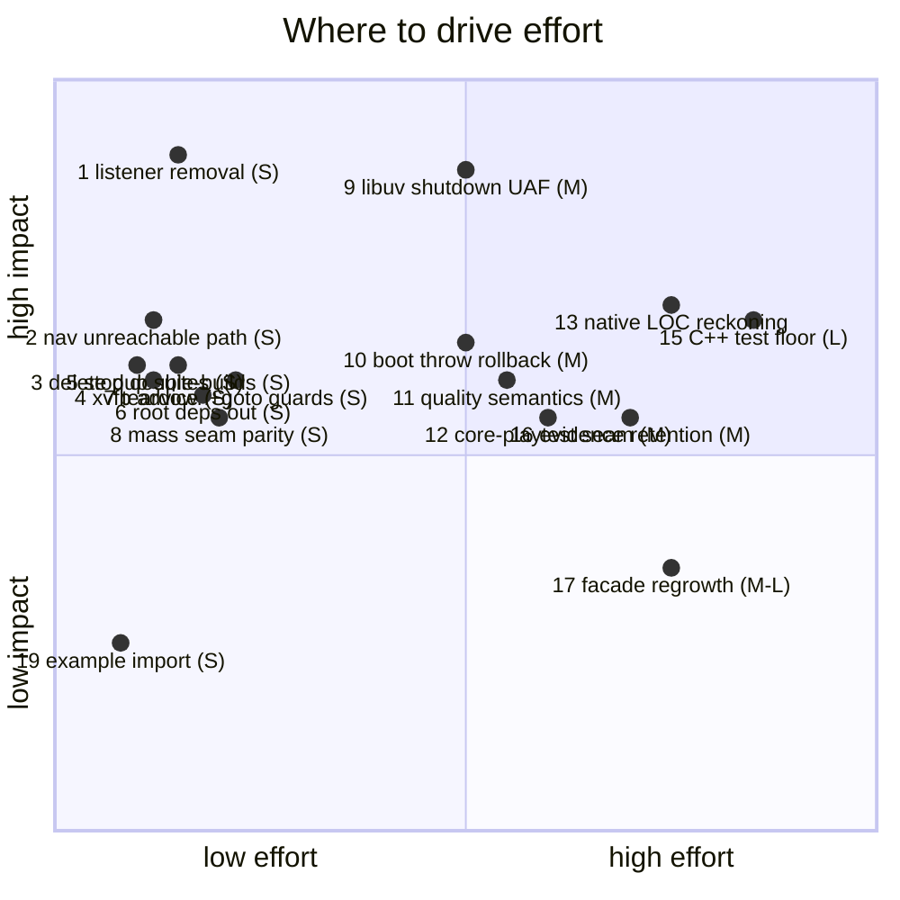

# ThreeNative area scorecard — 2026-08-22 · FINAL

**Audited commit:** `a84f08da` (main). Method: every finding verified in code at this commit; the
2026-08-20 audit (`d75f4644`) reconciled against the 61 commits since it; live runs today (`pnpm
budgets`, `pnpm quality`, git size measurements, `pnpm audit --prod`); four parallel category audits
(correctness/security, tests/architecture, perf/deps/DX, direction) completed and folded in.
Score 0–100 = area health: open defects, evidence completeness against the charter, debt trend.
100 = nothing owed.

**Where the project says it is:** ROADMAP (reconciled 2026-08-20) — Phase 1 passed, Phase 2 active
(gate executed twice, red only on its instrument-exclusivity condition), Phase 3 platform work
largely executed ahead of its formal gate. `pnpm alpha:bar`: **"Not alpha" — 2 of 7 rows failed,
3 unmeasured.**

## Area scores — sorted descending

| Rank | Area | Score | Why it scores there |
|---:|---|---:|---|
| 1 | `packages/ui` | **95** | Deliberately tiny (43 LOC churn/8wk), budget trigger repaired (`689f284f`), charter says do-not-grow and it obeys. Nothing owed. |
| 2 | `packages/engine-mcp` | **90** | Ships with the library (`74e5213b`); manifest parsing verified fail-closed field-by-field; docs gate enforces primary-docs accuracy. Small surface, no open findings. Not yet on npm (see direction 5). |
| 3 | `packages/physics` | **82** | Placement/rotation parity at both seams verified fixed (`host.ts:310-313` ⇄ `simulation.ts:739-741`); disposed-sim guards, navmesh double-free fix, bulk-transform allocation fix; hot paths statically clean. Docked: a live regression — NavigationAgent3D stores unreachable paths and re-sends them (below), and mass validation diverges across seams. |
| 4 | `create-threenative` + templates | **83→82**\* | Payload budget gate live and CI-enforced (AGENTS.md down to 2,313 L / 19,787 w, per-template ceilings, mandatory-inline probes); scaffold input handling verified safe (regex-pinned names, ./-only download dirs); shooter look/aim/fire proven web+desktop. \*Docked 1 for templates/docs being the fixed side of the xvfb advice split while harness diagnostics lag. |
| 5 | `examples/` | **74** | 8 workspaces, starter got a game, abyss draw-call scenario proves observation end-to-end, frozen control intact. Blemishes: one deep-import of package internals by relative path; example count long past the original 3-workspace budget frame without a re-baseline. |
| 6 | docs / PRD process | **71** | Filing discipline real and enforced; all 78 files added since Aug 20 are markdown records; blocked-folder hygiene rule exists and works. Docked: sweep archives unbounded (268 MB tracked under `docs/benchmark/sweeps`, manifest adds tamper-evidence not retention); two finished batches sit unarchived (`batch-26-08-18/` all-closed, empty `technical-debt-p2-2026-08-21/`). |
| 7 | `packages/core` | **70** | Abort-time boot atomicity landed and is tested (dispose-once, leaked-scene check fails closed); renderer.info gated; fixed-step validation hardened; per-step framework paths cleaned, perf audit clean. Docked by verification: **throw-paths still leak** — plugin setup / scene.load / enterScene rejects leave a half-booted game (only the abort path rolls back); teardown cleanup chain is first-throw-wins; `goto()` resets the store *before* validating the scene name; published dist inlines a hidden playtest copy with a hardcoded stale version const. |
| 8 | scripts / CI / DX | **62** | Round loop repaired, worktree lifecycle landed, instruction-budget gate live, README commands all resolve, CI jobs all invoke real scripts, `pnpm audit` clean. Docked: quality instrument keys findings by position ignoring values (42 fake-"new" today, baseline 11 days stale); test pipeline double-builds every package and double-runs root vitest daily; gate status/resume contract has exactly one participant while six long chains stay opaque. |
| 9 | `packages/playtest` | **60** | Assertions decomposition genuine but produced `assertion-evaluators.ts` at 2,312 lines — largest module in the repo; `scenario.ts` grew post-split to 1,867; `runner.ts` steady at 1,800 and top-churn (35 commits/8wk). Four stale node:test duplicates run in no gate. Coverage moderate, concentrated exactly on those modules. Four silent validator drops fixed. Server-spawn surface verified safe (documented operator flag, argv-controlled substitution). |
| 10 | `packages/runtime-native` | **54** | Idle workers verified clean of busy-waits (condition-variable wait with shared-mutex predicate); instrument counting fixed twice; PRD-175 ladder measured on physical hardware; SDL audio close verified race-free; worker registry joins before engine destruction. Docked hardest: the libuv close-ownership trio (now **three** sites incl. FileWatcher); window/document listener removal still no-op while the canvas slice was properly fixed; ~36,750 C++ LOC against 275 direct test LOC with top-churn files untested; LOC 79,139/50,000 (+58%) neither justified nor cut. |

## Findings — sorted by leverage (impact ÷ effort), descending

Impact HIGH = breaks games or trust in green gates; MED = recurring friction or bounded risk;
LOW = hygiene. Effort: S ≤ half a day, M ≤ 2 days, L = multi-day or decision-heavy. All evidence
verified at HEAD by at least one auditor pass plus spot-checks.

| # | Finding | Area | Impact | Effort | Conf | Evidence |
|---:|---|---|---|---|---|---|
| 1 | Native window/document `removeEventListener` no-op — after `game.stop()` disposed InputMap closures keep receiving SDL events; a second InputMap gets ghost events; protected handles leak | runtime-native | HIGH | S | HIGH | `runtime.cpp:3982-3987` window returns undefined unconditionally; `:3785-3801` document loop body empty ("we don't properly compare") and even mints spurious map entries per failed removal; the correct identity-compare path already exists for canvas (`removeEventListenerFromTarget`, `:4594-4618`) — reuse it |
| 2 | NavigationAgent3D stores unreachable paths then `syncCrowd` re-sends the just-declared-unreachable target to Recast — crowd steers into walls, `targetReached` never fires; regression from `8a5104cc` breaking the `path.length>0 ⇒ crowd-has-target` invariant | physics | MED | S | HIGH | `NavigationAgent3D.ts:159-165` stores path before judging reachability, `resetMoveTarget` leaves `#path` set; `syncCrowd` gate `:256-259` trusts it; same contradiction in same-polygon branch `:149-158`. Likely IS the abyss-navigation red recorded at HEAD on this machine |
| 3 | Four stale duplicate node:test suites run in NO gate — older smaller twins of gated specs, silently drifting since `4da02e62`, teaching agents the wrong convention | playtest | MED | S | HIGH | `reachability.test.ts` 65 vs gated spec 69; `bridgeClient.test.ts` 80 vs 177; `scenario.test.ts` 101 vs 753; `three/bridge.test.ts` 82 vs 331. Fix: delete |
| 4 | Harness diagnostics prescribe forbidden `xvfb-run` — following the tool's own advice fabricates a failing exit status (exit 144), the repo's worst failure mode | DX | MED | S | HIGH | `assertion-evaluators.ts:76`, `runner/cli.ts:96`, `runner.ts:590-593`, `conformance/run-conformance.mjs:618`, `profile-native-cpu.ts:353,755`; template/doc side already fixed with an enforcing spec — these five are the residue |
| 5 | Test pipeline double-builds every package and double-runs root vitest — multi-minute waste paid on every local and CI run | CI/DX | MED | S | HIGH | `run-test-suite.sh` builds workspace; 6 packages' test scripts each build again; playtest's test script invokes the entire root suite before the unit phase repeats it |
| 6 | Root `argon2` + `pg` with zero importers anywhere — installs approve a native-addon build script for nothing; Windows consumers can fail pre-compile | deps | MED | S | HIGH | `package.json:63,70-76` incl. `onlyBuiltDependencies`; repo-wide grep clean; hosting moved out per `docs/README.md` |
| 7 | Teardown cleanup chain is first-throw-wins, and `goto()` resets the store *before* validating the scene name — one throwing dispose skips all later releases; a typo'd goto silently wipes live state | core | MED | S | HIGH | `game.ts` cleanup loops unguarded (`:667-670`); `goto()` store reset precedes validation (`:336-344`) |
| 8 | Physics mass validated on the web seam only — NaN/negative mass throws clearly on web, is forwarded raw into the C++ ABI on native; the exact divergence class `b7891481` closed for placement, reopened via another field | physics | MED | S | HIGH | `simulation.ts:737-738` validates; `native/host.ts:312-322` claims "same seam rule", validates position/rotation only, forwards mass raw |
| 9 | libuv close-then-clear on shutdown at THREE sites — handles freed while libuv's closing list still references them (embedded-by-value poll/timer/fs_event contexts); unconditional timer site compiles into every build; drain loop then walks freed storage → use-after-free crash-at-exit, heap corruption | runtime-native | HIGH | M | HIGH | `async_http_client.cpp:386-391` (correct pattern exists in-file at `:249-258`); `runtime.cpp:568-579` timers (contrast correct `clearAllTimers` `:707-718`); `fs/file_watcher.cpp:143-155`; all precede `EventLoop::shutdown` walk `event_loop.cpp:79-88`; `MYSTRAL_USE_LIBUV_TIMERS` unconditional (`runtime.cpp:59`) |
| 10 | Game boot throw-paths leak partial state — rejected plugin setup / scene load / scene entry leave mounted canvas, live listeners, running store; retry double-allocates. (Abort-time rollback IS landed and tested — this is the throw-path gap.) | core | MED | M | HIGH | `game.ts` awaits at plugin-setup/scene-load/enter-scene uncaught; only `#aborted` checks roll back (tested `game.spec.ts:326-354`) |
| 11 | Quality instrument keys findings by `file:line:signal`, ignores measured value — hotspots grow while "inherited"; any line shift mints fake-"new" (42 today) | DX | MED | M | HIGH | `check-quality.ts:219-220`; classification never compares values; baseline generatedAt 2026-08-11 |
| 12 | Published core inlines a hidden copy of playtest to mask a devDep-only runtime import; hardcoded `CORE_VERSION "0.1.0"` vs actual 0.2.0 | core | MED | M | HIGH | `replay.ts:1` value-import; `tsup.config.ts` `noExternal`; co-installed playtest can skew from the inlined twin |
| 13 | Native runtime LOC 79,139 vs 50,000 review trigger (+58%) — rule requires justification in the owning PRD or the kill switch; neither happened | runtime-native | MED | M | HIGH | `pnpm budgets`: `79139/50000`; framework side healthy 13,724/15,000 |
| 14 | Six long chains emit no gate records — `gate:status/resume/doctor` see only `pnpm test`; exactly the stall-prone lanes (device, xvfb, browser) stay opaque | DX | MED | M | HIGH | sole `TN_GATE_STATUS_PATH` writer is `run-test-suite.sh`; zero emission in sweep-capture, template-baseline, visual-gate, profile-native-cpu, profile-production, run-conformance |
| 15 | C++ host: ~36,750 source LOC against 275 LOC of direct tests; top-churn files (`runtime.cpp` 18 commits/8wk, `webgpu/bindings.cpp` 15, `physics/native_bindings.cpp` 10) directly untested; regressions surface late as whole-frame diffs | runtime-native | MED | L | MED-HIGH | `src/**` 36,751 lines vs two test cpp files; TS gpu tests self-skip without a built binary |
| 16 | Sweep archives unbounded in git — 268 MB tracked under `docs/benchmark/sweeps`, two single-night archives weigh 140 MB; next benchmark night re-adds tens of MB permanently | docs | MED | M | HIGH | `sweep-archive.ts:51,102,231` copy whole trees; manifest verifies bytes, bounds nothing; pack 149.15 MiB |
| 17 | God modules regrowing behind facades — evaluators now the largest module; scenario grew post-split; runner is top-churn | playtest | MED | M–L | HIGH | `assertion-evaluators.ts` 2,312; `scenario.ts` 1,867 (was 1,799); `runner.ts` 1,800, 35 commits/8wk |
| 18 | Conformance registry lags newer surface — AudioBus routing, worker blocking receive, deterministic restart ride unproven on native while the parity ledger passes | native parity | MED | M | MED | `registry.json` 67 cases; audio generic-only (case 94), worker generic-only (92), no restart case |
| 19 | Example deep-imports package internals by relative path — breaks outside the workspace; models the wrong idiom for copying agents | examples | LOW | S | HIGH | `native-cpu-load-test/src/main.ts:32` bypasses the exported `adviseThreeRenderWorkload` |
| 20 | Catalog nits: `zustand: 5.x` floats amid exact pins; `monaco-editor` referenced by nothing | deps | LOW | S | HIGH | `pnpm-workspace.yaml`; lockfile masks both |

**Verified fixed at HEAD (prior leads):** census coupling moved out of physics specs into the
budgets gate; collapse.ts deleted; idle-worker polling; round-loop archive shapes; payload budgets
(CI-enforced); placement/rotation parity; canvas listener removal; boot-abort atomicity; template
xvfb advice; worktree lifecycle; primary-docs gate. Twelve-plus Aug-20 findings executed in 61
commits.

**Swept clean (considered, no finding):** security posture strong end-to-end — spawn surfaces argv-
controlled, scaffold inputs regex-pinned, engine-mcp fail-closed, sandbox/conformance scripts safe,
SDL audio close race-free, worker lifecycle sound, replay counters fail closed. Dependency
directions have no cycles; capabilities manifest healthy (115 entries, spot-checks pass); coverage
ratios adequate-to-strong everywhere except playtest (moderate) and native C++ (thin). Perf-by-
default residuals: none at high confidence. `pnpm audit --prod`: clean. Version pins sane (exact-pin
of 0.x three.js is the correct migration control).

## Effort / impact matrix

**Quick wins (#1–#8, ~2–3 days total):** eight S-effort fixes covering both halves of the native
restart defect, a physics regression, and the whole "green means green" hygiene set.
**Big bets:** #9 (one owner reconciles shutdown ordering across the three sites, ASan-verified),
#15 (C++ test floor — seed it with shutdown/restart lifetime cases that also prove #1/#9),
#13 (owner decision: justify a re-baselined trigger with the PRD-069/175 evidence, or cut).
**Watch, don't schedule:** #17; land #11 first so trend reporting becomes honest.

## Where to drive effort next — merged ranking (code debt × strategy)

The direction audit reconstructed the roadmap from the repo's own records; the code audits supply
the debt. Ranked:

1. **Native lifetime hardening** (#1 + #9 + #10 + first slice of #15): the only HIGH-impact open
   defects share one theme — ownership across shutdown/restart. Every game restarts; "same source
   on native" is the charter promise this most directly breaks. ~3–5 days incl. ASan and a restart
   conformance case that seeds the C++ test floor. Directly serves PRD-064 (Tier-1 native
   reliability, currently NOT REACHED).
2. **Verification-trust quick-win batch** (#2–#8, #11): ~2–3 days, eight S fixes. Green gates that
   mean what they say are the precondition for trusting every measurement below — including the
   alpha bar.
3. **Run the cold-agent test** (the framework's own decisive experiment): METRICS.md names it the
   north star and records it has never run — the subject always read the repo. Packages went public
   2026-08-16, so `npx create-threenative` + sealed brief + sandbox is now a complete cold apparatus.
   Its friction rows become the evidence-based backlog that should direct all subsequent framework
   work. ~M effort; validity risk disclosed-protocol handles.
4. **Clear the two named parity reds** (PRD-166 harness kill-vs-scene-failure; PRD-077 multitouch
   injector — built to the kernel boundary, unblocked by seating X or adding the user to `input`):
   the only items between the parity matrix and a clean aggregate rerun, both lanes runnable today.
   S–M. Converts beta row 4 green and unblocks Tier-1 exit.
5. **Owner-decision pair**: (a) Phase-2 exclusivity condition — ratify that "the control arm has no
   native runtime" satisfies it, redesign the instrument, or amend the gate; rerunning undecided
   repeats the v1 never-conclusive shape. (b) Native LOC trigger — re-baseline with justification
   or kill-switch. Neither is code; both block honest accounting of everything else.
6. **Then**: physical-mobile lane restart (the "no physical device" blocker expired when the Pixel 8
   ran PRD-175's ladder; scope strictly to Android measurement rows, thermal windows cap throughput),
   consumer-lane finish (publish engine-mcp, clear five stale publish findings, first surviving
   hosted release — ten tags, zero survivors so far), evidence-retention policy (#16) before the
   next benchmark night.

**Explicitly not worth doing** (direction audit, agreeing with filed records): asset-pipeline build
step (neither deferral trigger fired), bounded eight-tool asset-MCP republication (needs an
owner-approved experiment to earn it), Studio-hosting microVM/deploy halves (barred pre-stranger-
test), native navmesh (closed, zero measured demand), agent-leverage corpus PRDs 123/124 as builds
(the cold-agent test yields the same signal far cheaper).

## Coverage statement

All nine categories audited; all four category sweeps completed and folded in. Not executed today:
native build/device lanes, browser playtests, visual gates, the full test suite — claims rest on
source reads, recorded verification evidence, and today's read-only gate runs, per the repo's own
reporting rule. Findings #2 and #10 carry a residual uncertainty flag each (whether the nav
regression is the recorded browser-lane red; whether throw-path rollback is considered in-contract).
